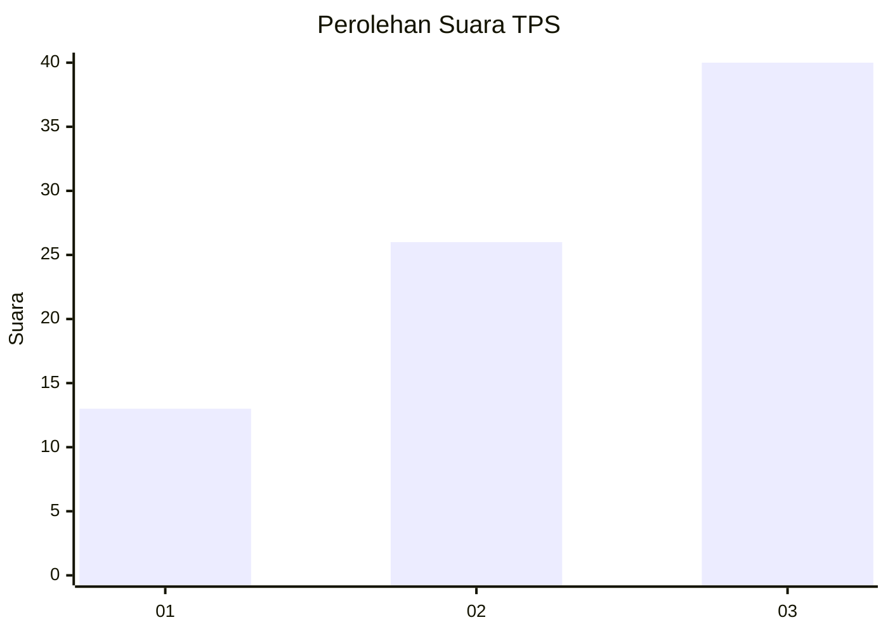
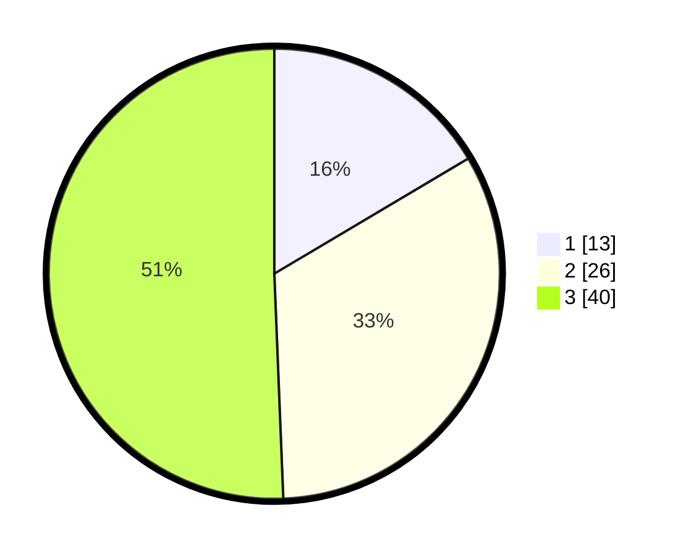

# Hasil

## Grafik

## Tabel

| No. | Nama Paslon    | Suara | Suara (raw) | Persentase |
|:--- |:-------------- | -----:| -----------:| ----------:|
| 1   | ANIES MUHAIMIN | 13    | [13][p-1]   | 16,46      |
| 2   | PRABOWO GIBRAN | 26    | [26][p-2]   | 32,91      |
| 3   | GANJAR MAHFUD  | 40    | [40][p-3]   | 50,63      |

[p-1]: https://github.com/gigit-pemilu/pemilu-2024-35-jawa-timur/blob/main/pilpres/hitung-suara/sub/35-jawa-timur/sub/22-bojonegoro/sub/09-kepohbaru/sub/2023-karangan/sub/005-tps/sub/paslon-1.txt
[p-2]: https://github.com/gigit-pemilu/pemilu-2024-35-jawa-timur/blob/main/pilpres/hitung-suara/sub/35-jawa-timur/sub/22-bojonegoro/sub/09-kepohbaru/sub/2023-karangan/sub/005-tps/sub/paslon-2.txt
[p-3]: https://github.com/gigit-pemilu/pemilu-2024-35-jawa-timur/blob/main/pilpres/hitung-suara/sub/35-jawa-timur/sub/22-bojonegoro/sub/09-kepohbaru/sub/2023-karangan/sub/005-tps/sub/paslon-3.txt

## Foto C Plano

https://sirekap-obj-formc.kpu.go.id/841f/pemilu/ppwp/35/22/09/20/23/3522092023005-20240214-140937--c874c5a5-6595-4ebf-901c-6ed19b4c18b4.jpg

https://sirekap-obj-formc.kpu.go.id/841f/pemilu/ppwp/35/22/09/20/23/3522092023005-20240214-141006--5521b26e-9925-445e-89b9-01632c478c3b.jpg

https://sirekap-obj-formc.kpu.go.id/841f/pemilu/ppwp/35/22/09/20/23/3522092023005-20240214-141214--ef2369ad-35cb-4ffc-8b16-aa412d2d70c2.jpg

## Metadata

| Key        | Value               |
| ---------- | ------------------- |
| Time Stamp | 2024-02-25 18:00:00 |

