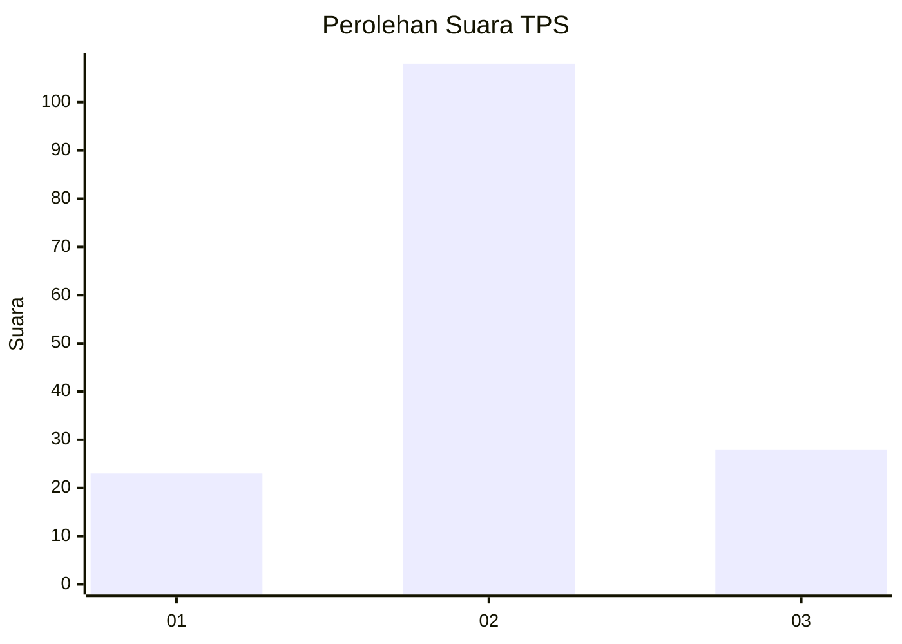
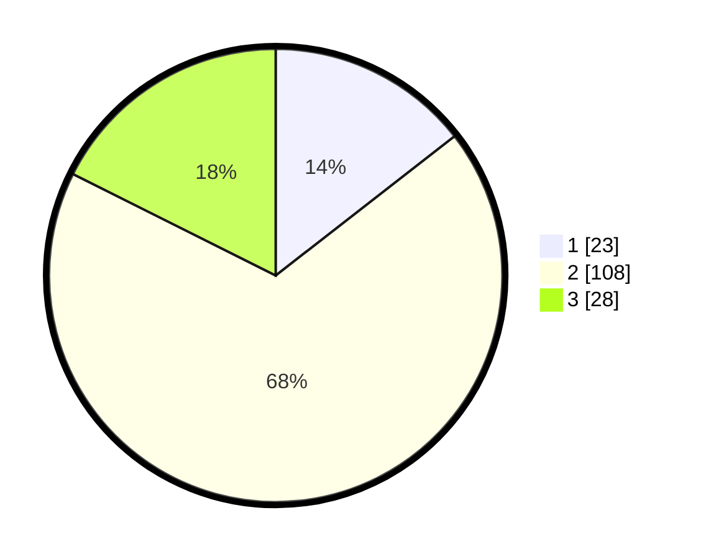

# Hasil

## Grafik

## Tabel

| No. | Nama Paslon    | Suara | Suara (raw) | Persentase |
|:--- |:-------------- | -----:| -----------:| ----------:|
| 1   | ANIES MUHAIMIN | 23    | [23][p-1]   | 14,47      |
| 2   | PRABOWO GIBRAN | 108   | [108][p-2]  | 67,92      |
| 3   | GANJAR MAHFUD  | 28    | [28][p-3]   | 17,61      |

[p-1]: https://github.com/gigit-pemilu/pemilu-2024-35-jawa-timur/blob/main/pilpres/hitung-suara/sub/35-jawa-timur/sub/22-bojonegoro/sub/09-kepohbaru/sub/2023-karangan/sub/010-tps/sub/paslon-1.txt
[p-2]: https://github.com/gigit-pemilu/pemilu-2024-35-jawa-timur/blob/main/pilpres/hitung-suara/sub/35-jawa-timur/sub/22-bojonegoro/sub/09-kepohbaru/sub/2023-karangan/sub/010-tps/sub/paslon-2.txt
[p-3]: https://github.com/gigit-pemilu/pemilu-2024-35-jawa-timur/blob/main/pilpres/hitung-suara/sub/35-jawa-timur/sub/22-bojonegoro/sub/09-kepohbaru/sub/2023-karangan/sub/010-tps/sub/paslon-3.txt

## Foto C Plano

https://sirekap-obj-formc.kpu.go.id/5d46/pemilu/ppwp/35/22/09/20/23/3522092023010-20240214-221735--6a13dd5e-b363-4a0b-8fcd-ef4017fddbab.jpg

https://sirekap-obj-formc.kpu.go.id/5d46/pemilu/ppwp/35/22/09/20/23/3522092023010-20240214-222208--cc930759-2fac-428c-a9ef-14991f502376.jpg

https://sirekap-obj-formc.kpu.go.id/5d46/pemilu/ppwp/35/22/09/20/23/3522092023010-20240214-222348--e8527b76-7f53-4c91-9095-a4d9f8841fdc.jpg

## Metadata

| Key        | Value               |
| ---------- | ------------------- |
| Time Stamp | 2024-02-24 22:31:28 |

