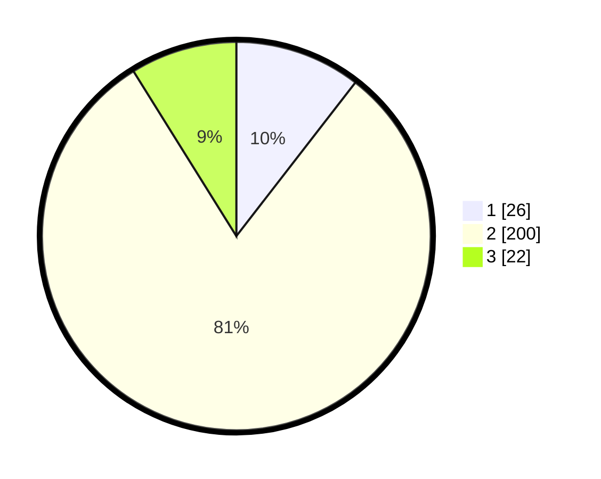

# Hasil

## Grafik

## Tabel

| No. | Nama Paslon    | Suara | Suara (raw) | Persentase |
|:--- |:-------------- | -----:| -----------:| ----------:|
| 1   | ANIES MUHAIMIN | 26    | [26][p-1]   | 10,48      |
| 2   | PRABOWO GIBRAN | 200   | [200][p-2]  | 80,65      |
| 3   | GANJAR MAHFUD  | 22    | [22][p-3]   | 8,87       |

[p-1]: https://github.com/gigit-pemilu/pemilu-2024-35-jawa-timur/blob/main/pilpres/hitung-suara/sub/35-jawa-timur/sub/22-bojonegoro/sub/09-kepohbaru/sub/2025-sumbergede/sub/003-tps/sub/paslon-1.txt
[p-2]: https://github.com/gigit-pemilu/pemilu-2024-35-jawa-timur/blob/main/pilpres/hitung-suara/sub/35-jawa-timur/sub/22-bojonegoro/sub/09-kepohbaru/sub/2025-sumbergede/sub/003-tps/sub/paslon-2.txt
[p-3]: https://github.com/gigit-pemilu/pemilu-2024-35-jawa-timur/blob/main/pilpres/hitung-suara/sub/35-jawa-timur/sub/22-bojonegoro/sub/09-kepohbaru/sub/2025-sumbergede/sub/003-tps/sub/paslon-3.txt

## Foto C Plano

https://sirekap-obj-formc.kpu.go.id/8d89/pemilu/ppwp/35/22/09/20/25/3522092025003-20240214-141125--9ae46351-8ede-49ec-92e3-ff92d302d7e5.jpg

https://sirekap-obj-formc.kpu.go.id/8d89/pemilu/ppwp/35/22/09/20/25/3522092025003-20240214-141109--f01bb3ac-cf4d-4ea3-afd3-4d91cbf6168b.jpg

https://sirekap-obj-formc.kpu.go.id/8d89/pemilu/ppwp/35/22/09/20/25/3522092025003-20240215-010356--dddf7eeb-a904-43fb-96c2-d60f7baed40f.jpg

## Metadata

| Key        | Value               |
| ---------- | ------------------- |
| Time Stamp | 2024-02-15 01:47:43 |

