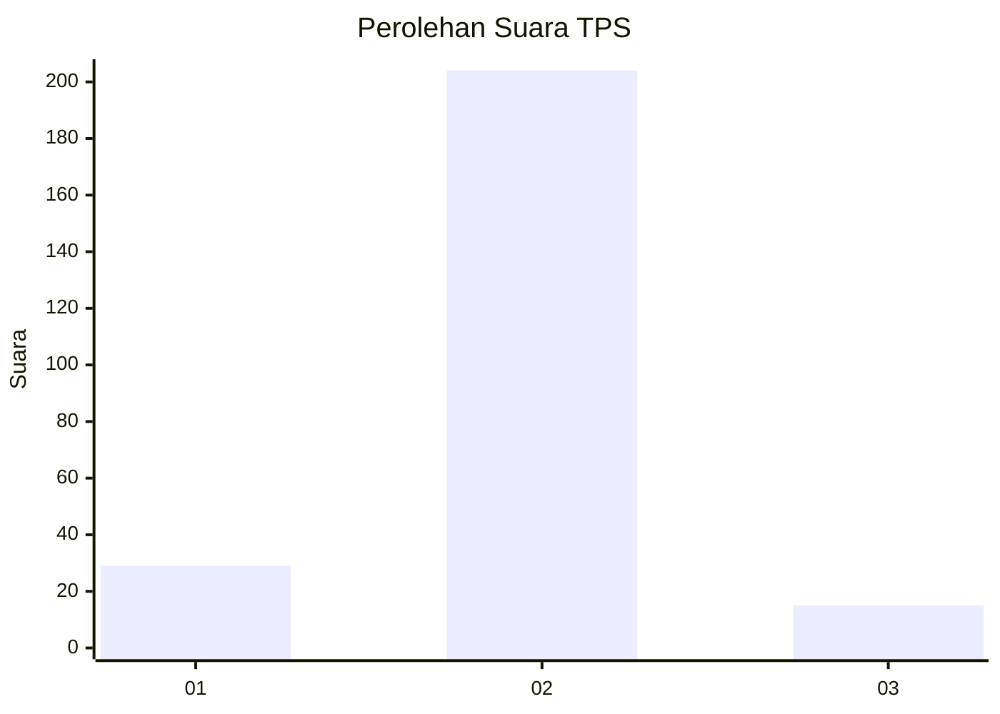
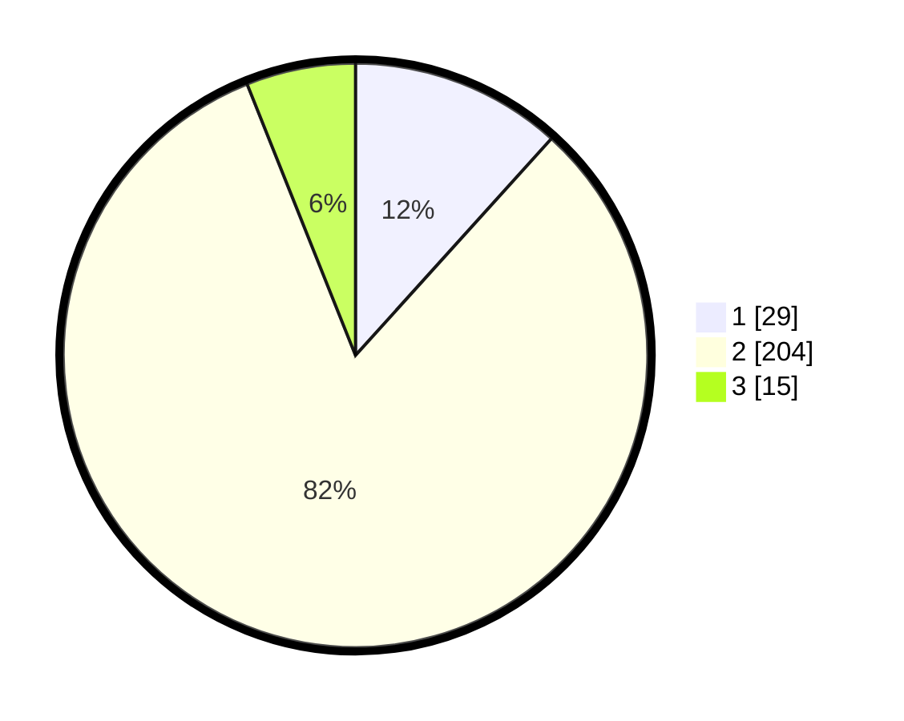

# Hasil

## Grafik

## Tabel

| No. | Nama Paslon    | Suara | Suara (raw) | Persentase |
|:--- |:-------------- | -----:| -----------:| ----------:|
| 1   | ANIES MUHAIMIN | 29    | [29][p-1]   | 11,69      |
| 2   | PRABOWO GIBRAN | 204   | [204][p-2]  | 82,26      |
| 3   | GANJAR MAHFUD  | 15    | [15][p-3]   | 6,05       |

[p-1]: https://github.com/gigit-pemilu/pemilu-2024-35-jawa-timur/blob/main/pilpres/hitung-suara/sub/35-jawa-timur/sub/22-bojonegoro/sub/09-kepohbaru/sub/2025-sumbergede/sub/004-tps/sub/paslon-1.txt
[p-2]: https://github.com/gigit-pemilu/pemilu-2024-35-jawa-timur/blob/main/pilpres/hitung-suara/sub/35-jawa-timur/sub/22-bojonegoro/sub/09-kepohbaru/sub/2025-sumbergede/sub/004-tps/sub/paslon-2.txt
[p-3]: https://github.com/gigit-pemilu/pemilu-2024-35-jawa-timur/blob/main/pilpres/hitung-suara/sub/35-jawa-timur/sub/22-bojonegoro/sub/09-kepohbaru/sub/2025-sumbergede/sub/004-tps/sub/paslon-3.txt

## Foto C Plano

https://sirekap-obj-formc.kpu.go.id/fb6a/pemilu/ppwp/35/22/09/20/25/3522092025004-20240214-155414--62700144-06b9-4fa4-bf0a-ffbaa7d74f83.jpg

https://sirekap-obj-formc.kpu.go.id/fb6a/pemilu/ppwp/35/22/09/20/25/3522092025004-20240214-155559--c4cd0839-e2ef-464e-a327-47ca375e8f1b.jpg

https://sirekap-obj-formc.kpu.go.id/fb6a/pemilu/ppwp/35/22/09/20/25/3522092025004-20240214-160106--35ff92a6-c9b9-4507-9876-d2f296595eaf.jpg

## Metadata

| Key        | Value               |
| ---------- | ------------------- |
| Time Stamp | 2024-02-25 16:00:00 |

