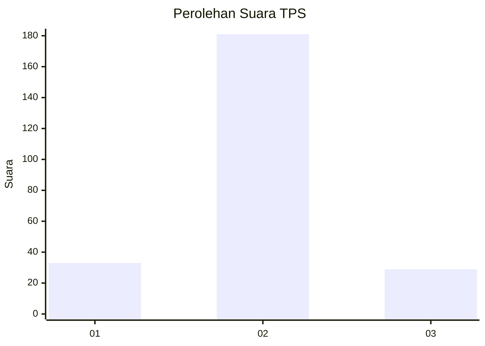
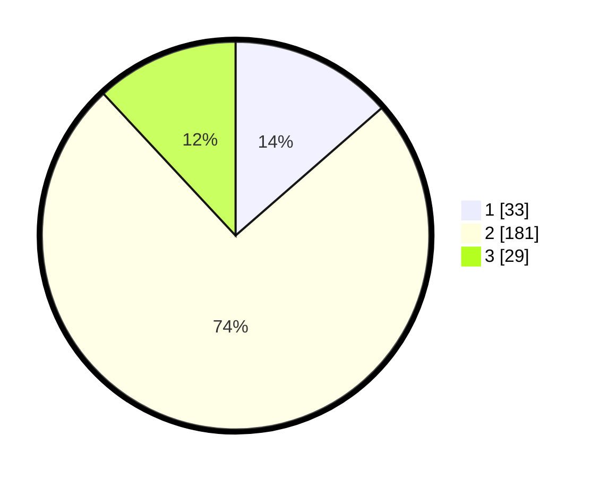

# Hasil

## Grafik

## Tabel

| No. | Nama Paslon    | Suara | Suara (raw) | Persentase |
|:--- |:-------------- | -----:| -----------:| ----------:|
| 1   | ANIES MUHAIMIN | 33    | [33][p-1]   | 13,58      |
| 2   | PRABOWO GIBRAN | 181   | [181][p-2]  | 74,49      |
| 3   | GANJAR MAHFUD  | 29    | [29][p-3]   | 11,93      |

[p-1]: https://github.com/gigit-pemilu/pemilu-2024-35-jawa-timur/blob/main/pilpres/hitung-suara/sub/35-jawa-timur/sub/22-bojonegoro/sub/10-baureno/sub/2001-drajat/sub/003-tps/sub/paslon-1.txt
[p-2]: https://github.com/gigit-pemilu/pemilu-2024-35-jawa-timur/blob/main/pilpres/hitung-suara/sub/35-jawa-timur/sub/22-bojonegoro/sub/10-baureno/sub/2001-drajat/sub/003-tps/sub/paslon-2.txt
[p-3]: https://github.com/gigit-pemilu/pemilu-2024-35-jawa-timur/blob/main/pilpres/hitung-suara/sub/35-jawa-timur/sub/22-bojonegoro/sub/10-baureno/sub/2001-drajat/sub/003-tps/sub/paslon-3.txt

## Foto C Plano

https://sirekap-obj-formc.kpu.go.id/dc12/pemilu/ppwp/35/22/10/20/01/3522102001003-20240214-235600--07668fee-3ec4-4b39-a4bd-7a56143c0e6b.jpg

https://sirekap-obj-formc.kpu.go.id/dc12/pemilu/ppwp/35/22/10/20/01/3522102001003-20240215-000005--5a4549a0-2e2b-424d-97df-602bb1862b2d.jpg

https://sirekap-obj-formc.kpu.go.id/dc12/pemilu/ppwp/35/22/10/20/01/3522102001003-20240215-000421--03450e8c-b439-4dee-9240-4eba22f6c511.jpg

## Metadata

| Key        | Value               |
| ---------- | ------------------- |
| Time Stamp | 2024-02-20 17:00:00 |

