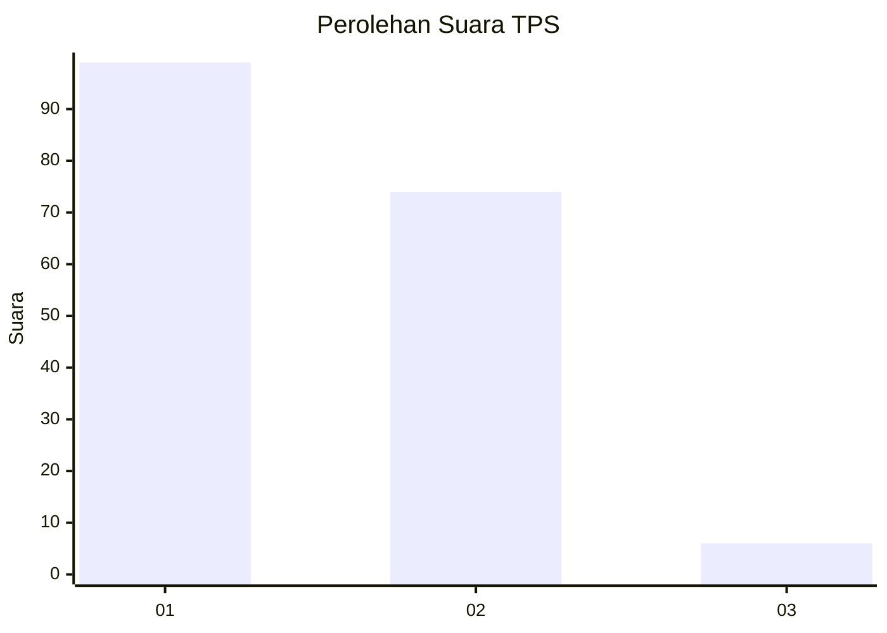
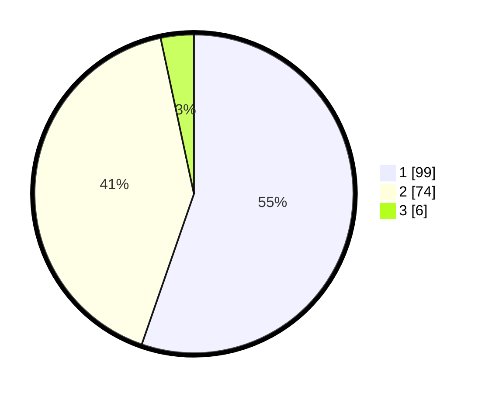

# Hasil

## Grafik

## Tabel

| No. | Nama Paslon    | Suara | Suara (raw) | Persentase |
|:--- |:-------------- | -----:| -----------:| ----------:|
| 1   | ANIES MUHAIMIN | 99    | [99][p-1]   | 55,31      |
| 2   | PRABOWO GIBRAN | 74    | [74][p-2]   | 41,34      |
| 3   | GANJAR MAHFUD  | 6     | [6][p-3]    | 3,35       |

[p-1]: https://github.com/gigit-pemilu/pemilu-2024/blob/main/pilpres/hitung-suara/sub/35-jawa-timur/sub/22-bojonegoro/sub/10-baureno/sub/2001-drajat/sub/008-tps/sub/paslon-1.txt
[p-2]: https://github.com/gigit-pemilu/pemilu-2024/blob/main/pilpres/hitung-suara/sub/35-jawa-timur/sub/22-bojonegoro/sub/10-baureno/sub/2001-drajat/sub/008-tps/sub/paslon-2.txt
[p-3]: https://github.com/gigit-pemilu/pemilu-2024/blob/main/pilpres/hitung-suara/sub/35-jawa-timur/sub/22-bojonegoro/sub/10-baureno/sub/2001-drajat/sub/008-tps/sub/paslon-3.txt

## Foto C Plano

https://sirekap-obj-formc.kpu.go.id/4df7/pemilu/ppwp/35/22/10/20/01/3522102001008-20240215-020507--e264aae6-184f-4b2c-9682-f8b397828ea6.jpg

https://sirekap-obj-formc.kpu.go.id/4df7/pemilu/ppwp/35/22/10/20/01/3522102001008-20240215-020531--71ca731a-e327-4d27-b7d8-8180b93d0e7c.jpg

https://sirekap-obj-formc.kpu.go.id/4df7/pemilu/ppwp/35/22/10/20/01/3522102001008-20240215-020553--7a8df25a-850c-4460-9fb5-cc5fd0b7dd47.jpg

## Metadata

| Key        | Value               |
| ---------- | ------------------- |
| Time Stamp | 2024-02-20 17:00:00 |

