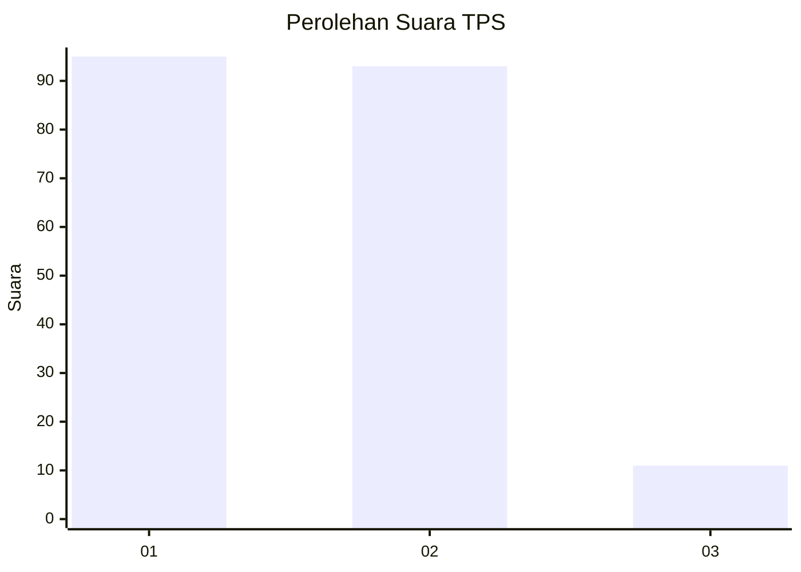
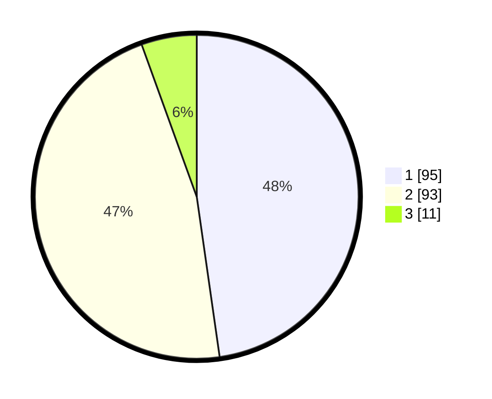

# Hasil

## Grafik

## Tabel

| No. | Nama Paslon    | Suara | Suara (raw) | Persentase |
|:--- |:-------------- | -----:| -----------:| ----------:|
| 1   | ANIES MUHAIMIN | 95    | [95][p-1]   | 47,74      |
| 2   | PRABOWO GIBRAN | 93    | [93][p-2]   | 46,73      |
| 3   | GANJAR MAHFUD  | 11    | [11][p-3]   | 5,53       |

[p-1]: https://github.com/gigit-pemilu/pemilu-2024/blob/main/pilpres/hitung-suara/sub/35-jawa-timur/sub/22-bojonegoro/sub/10-baureno/sub/2001-drajat/sub/009-tps/sub/paslon-1.txt
[p-2]: https://github.com/gigit-pemilu/pemilu-2024/blob/main/pilpres/hitung-suara/sub/35-jawa-timur/sub/22-bojonegoro/sub/10-baureno/sub/2001-drajat/sub/009-tps/sub/paslon-2.txt
[p-3]: https://github.com/gigit-pemilu/pemilu-2024/blob/main/pilpres/hitung-suara/sub/35-jawa-timur/sub/22-bojonegoro/sub/10-baureno/sub/2001-drajat/sub/009-tps/sub/paslon-3.txt

## Foto C Plano

https://sirekap-obj-formc.kpu.go.id/f1a2/pemilu/ppwp/35/22/10/20/01/3522102001009-20240214-210456--557120be-6b56-415d-9aa2-b30e6ead989c.jpg

https://sirekap-obj-formc.kpu.go.id/f1a2/pemilu/ppwp/35/22/10/20/01/3522102001009-20240214-210610--10384a61-147b-45ca-8d52-72db527a1948.jpg

https://sirekap-obj-formc.kpu.go.id/f1a2/pemilu/ppwp/35/22/10/20/01/3522102001009-20240214-210720--2d227830-02e1-4385-ac67-6fd71e73ba6d.jpg

## Metadata

| Key        | Value               |
| ---------- | ------------------- |
| Time Stamp | 2024-02-15 21:30:27 |

