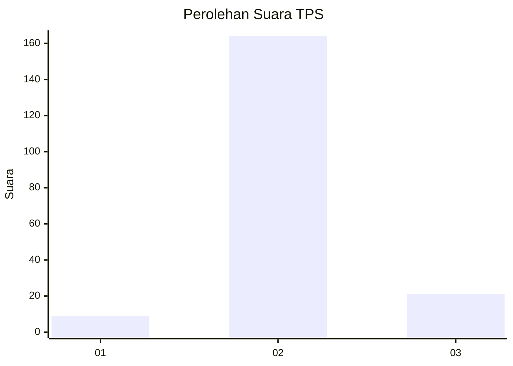
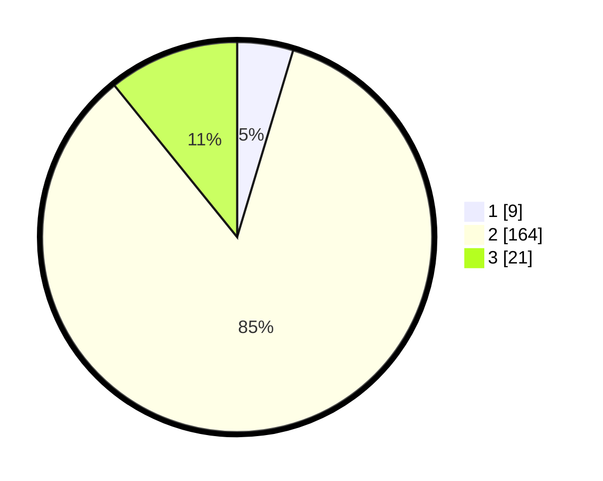

# Hasil

## Grafik

## Tabel

| No. | Nama Paslon    | Suara | Suara (raw) | Persentase |
|:--- |:-------------- | -----:| -----------:| ----------:|
| 1   | ANIES MUHAIMIN | 9     | [9][p-1]    | 4,64       |
| 2   | PRABOWO GIBRAN | 164   | [164][p-2]  | 84,54      |
| 3   | GANJAR MAHFUD  | 21    | [21][p-3]   | 10,82      |

[p-1]: https://github.com/gigit-pemilu/pemilu-2024/blob/main/pilpres/hitung-suara/sub/35-jawa-timur/sub/22-bojonegoro/sub/10-baureno/sub/2003-ngemplak/sub/003-tps/sub/paslon-1.txt
[p-2]: https://github.com/gigit-pemilu/pemilu-2024/blob/main/pilpres/hitung-suara/sub/35-jawa-timur/sub/22-bojonegoro/sub/10-baureno/sub/2003-ngemplak/sub/003-tps/sub/paslon-2.txt
[p-3]: https://github.com/gigit-pemilu/pemilu-2024/blob/main/pilpres/hitung-suara/sub/35-jawa-timur/sub/22-bojonegoro/sub/10-baureno/sub/2003-ngemplak/sub/003-tps/sub/paslon-3.txt

## Foto C Plano

https://sirekap-obj-formc.kpu.go.id/ed81/pemilu/ppwp/35/22/10/20/03/3522102003003-20240215-105024--83e783e0-acab-4b92-a387-e05eee700558.jpg

https://sirekap-obj-formc.kpu.go.id/ed81/pemilu/ppwp/35/22/10/20/03/3522102003003-20240215-105123--5fe8fcfa-531b-42dd-9701-8f113d465b43.jpg

https://sirekap-obj-formc.kpu.go.id/ed81/pemilu/ppwp/35/22/10/20/03/3522102003003-20240215-021638--3a17b1de-f1b3-4ec7-ae59-058cbf4737de.jpg

## Metadata

| Key        | Value               |
| ---------- | ------------------- |
| Time Stamp | 2024-02-20 17:00:00 |

