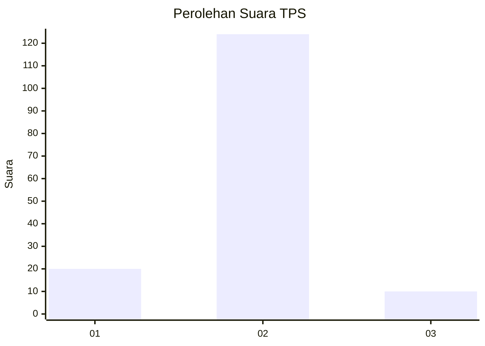
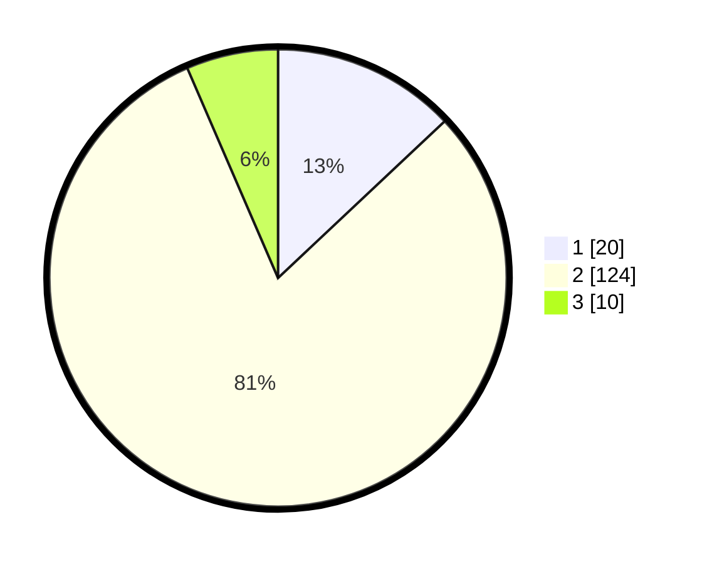

# Hasil

## Grafik

## Tabel

| No. | Nama Paslon    | Suara | Suara (raw) | Persentase |
|:--- |:-------------- | -----:| -----------:| ----------:|
| 1   | ANIES MUHAIMIN | 20    | [20][p-1]   | 12,99      |
| 2   | PRABOWO GIBRAN | 124   | [124][p-2]  | 80,52      |
| 3   | GANJAR MAHFUD  | 10    | [10][p-3]   | 6,49       |

[p-1]: https://github.com/gigit-pemilu/pemilu-2024/blob/main/pilpres/hitung-suara/sub/35-jawa-timur/sub/22-bojonegoro/sub/10-baureno/sub/2003-ngemplak/sub/009-tps/sub/paslon-1.txt
[p-2]: https://github.com/gigit-pemilu/pemilu-2024/blob/main/pilpres/hitung-suara/sub/35-jawa-timur/sub/22-bojonegoro/sub/10-baureno/sub/2003-ngemplak/sub/009-tps/sub/paslon-2.txt
[p-3]: https://github.com/gigit-pemilu/pemilu-2024/blob/main/pilpres/hitung-suara/sub/35-jawa-timur/sub/22-bojonegoro/sub/10-baureno/sub/2003-ngemplak/sub/009-tps/sub/paslon-3.txt

## Foto C Plano

https://sirekap-obj-formc.kpu.go.id/5c59/pemilu/ppwp/35/22/10/20/03/3522102003009-20240214-233634--a00d47ea-7dd1-43f9-b165-e223bc23e24c.jpg

https://sirekap-obj-formc.kpu.go.id/5c59/pemilu/ppwp/35/22/10/20/03/3522102003009-20240214-233803--d79408c6-14a6-486e-af0a-56924fa87632.jpg

https://sirekap-obj-formc.kpu.go.id/5c59/pemilu/ppwp/35/22/10/20/03/3522102003009-20240214-233951--08aadc22-d95a-476a-a1c7-2bf394e11c28.jpg

## Metadata

| Key        | Value               |
| ---------- | ------------------- |
| Time Stamp | 2024-02-20 17:00:00 |

