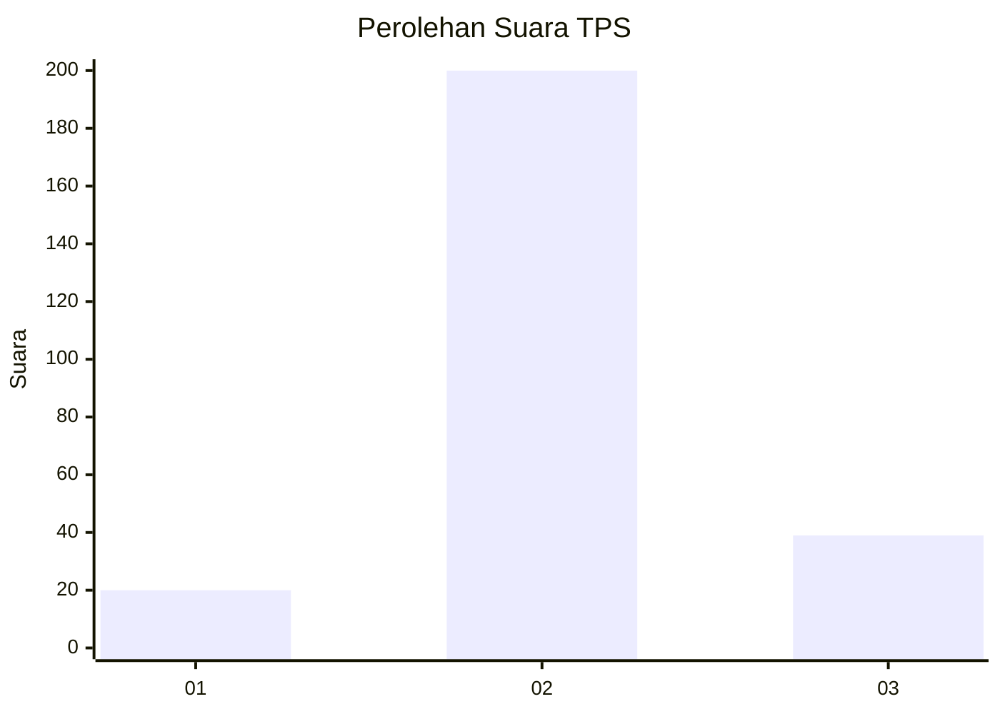

# Hasil

## Grafik

## Tabel

| No. | Nama Paslon    | Suara | Suara (raw) | Persentase |
|:--- |:-------------- | -----:| -----------:| ----------:|
| 1   | ANIES MUHAIMIN | 20    | [20][p-1]   | 7,72       |
| 2   | PRABOWO GIBRAN | 200   | [200][p-2]  | 77,22      |
| 3   | GANJAR MAHFUD  | 39    | [39][p-3]   | 15,06      |

[p-1]: https://github.com/gigit-pemilu/pemilu-2024/blob/main/pilpres/hitung-suara/sub/35-jawa-timur/sub/22-bojonegoro/sub/10-baureno/sub/2004-sraturejo/sub/015-tps/sub/paslon-1.txt
[p-2]: https://github.com/gigit-pemilu/pemilu-2024/blob/main/pilpres/hitung-suara/sub/35-jawa-timur/sub/22-bojonegoro/sub/10-baureno/sub/2004-sraturejo/sub/015-tps/sub/paslon-2.txt
[p-3]: https://github.com/gigit-pemilu/pemilu-2024/blob/main/pilpres/hitung-suara/sub/35-jawa-timur/sub/22-bojonegoro/sub/10-baureno/sub/2004-sraturejo/sub/015-tps/sub/paslon-3.txt

## Foto C Plano

https://sirekap-obj-formc.kpu.go.id/1208/pemilu/ppwp/35/22/10/20/04/3522102004015-20240214-231712--1f2e0612-6674-4018-a1ea-d124c608af50.jpg

https://sirekap-obj-formc.kpu.go.id/1208/pemilu/ppwp/35/22/10/20/04/3522102004015-20240214-231833--bee9627a-5742-472f-9366-0e82b489eff6.jpg

https://sirekap-obj-formc.kpu.go.id/1208/pemilu/ppwp/35/22/10/20/04/3522102004015-20240214-231930--011d75e1-4d89-4c97-9f6e-452986f23aae.jpg

## Metadata

| Key        | Value               |
| ---------- | ------------------- |
| Time Stamp | 2024-02-20 17:00:00 |

