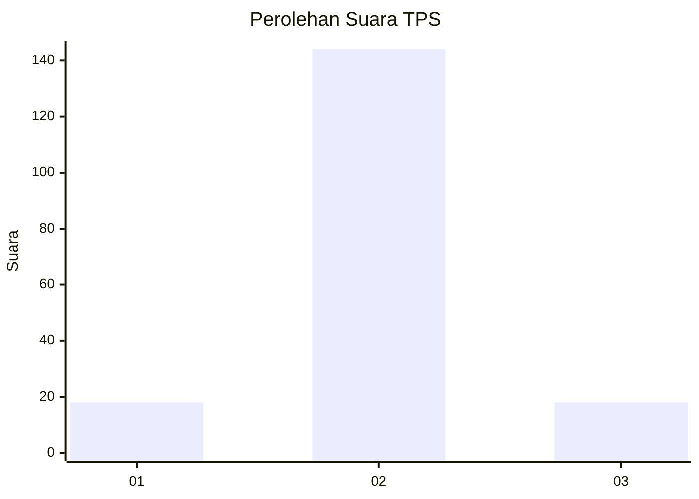
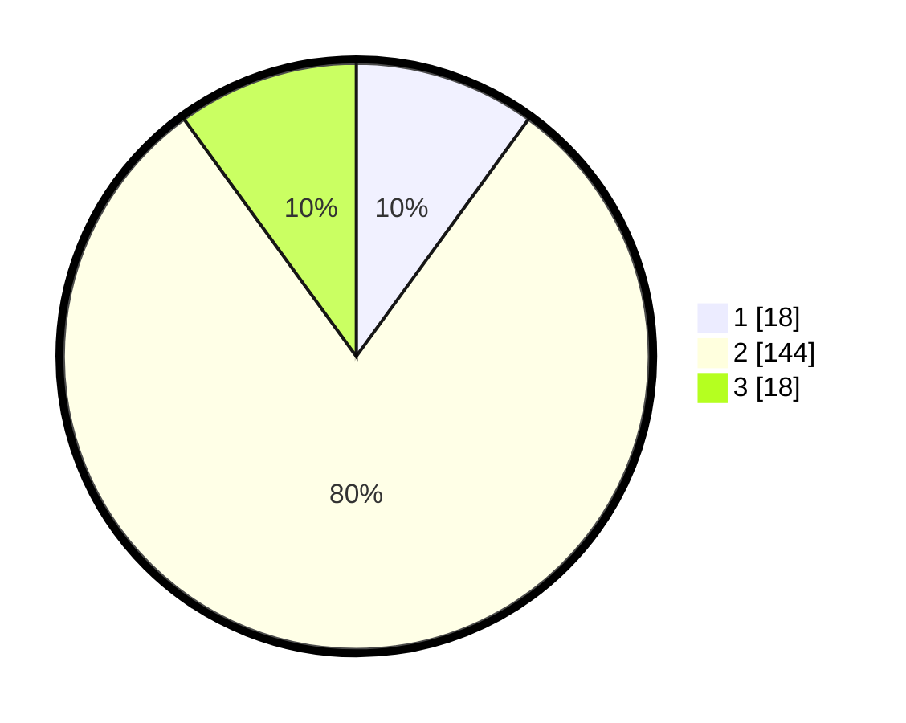

# Hasil

## Grafik

## Tabel

| No. | Nama Paslon    | Suara | Suara (raw) | Persentase |
|:--- |:-------------- | -----:| -----------:| ----------:|
| 1   | ANIES MUHAIMIN | 18    | [18][p-1]   | 10,00      |
| 2   | PRABOWO GIBRAN | 144   | [144][p-2]  | 80,00      |
| 3   | GANJAR MAHFUD  | 18    | [18][p-3]   | 10,00      |

[p-1]: https://github.com/gigit-pemilu/pemilu-2024/blob/main/pilpres/hitung-suara/sub/35-jawa-timur/sub/22-bojonegoro/sub/10-baureno/sub/2005-blongsong/sub/006-tps/sub/paslon-1.txt
[p-2]: https://github.com/gigit-pemilu/pemilu-2024/blob/main/pilpres/hitung-suara/sub/35-jawa-timur/sub/22-bojonegoro/sub/10-baureno/sub/2005-blongsong/sub/006-tps/sub/paslon-2.txt
[p-3]: https://github.com/gigit-pemilu/pemilu-2024/blob/main/pilpres/hitung-suara/sub/35-jawa-timur/sub/22-bojonegoro/sub/10-baureno/sub/2005-blongsong/sub/006-tps/sub/paslon-3.txt

## Foto C Plano

https://sirekap-obj-formc.kpu.go.id/0516/pemilu/ppwp/35/22/10/20/05/3522102005006-20240215-021846--e2432cd5-3041-458b-ae8b-944618f8babb.jpg

https://sirekap-obj-formc.kpu.go.id/0516/pemilu/ppwp/35/22/10/20/05/3522102005006-20240215-022011--ccddbcb2-0e1f-41aa-9636-8883456049bb.jpg

https://sirekap-obj-formc.kpu.go.id/0516/pemilu/ppwp/35/22/10/20/05/3522102005006-20240215-022111--6d8fbbab-c9af-4eb4-8e2d-ceb0c5a076e2.jpg

## Metadata

| Key        | Value               |
| ---------- | ------------------- |
| Time Stamp | 2024-02-25 11:00:00 |

