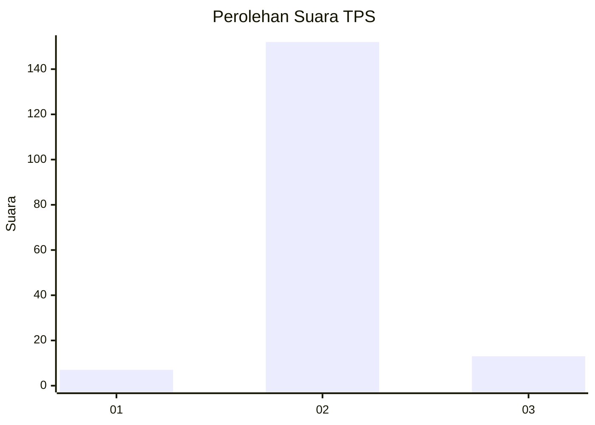
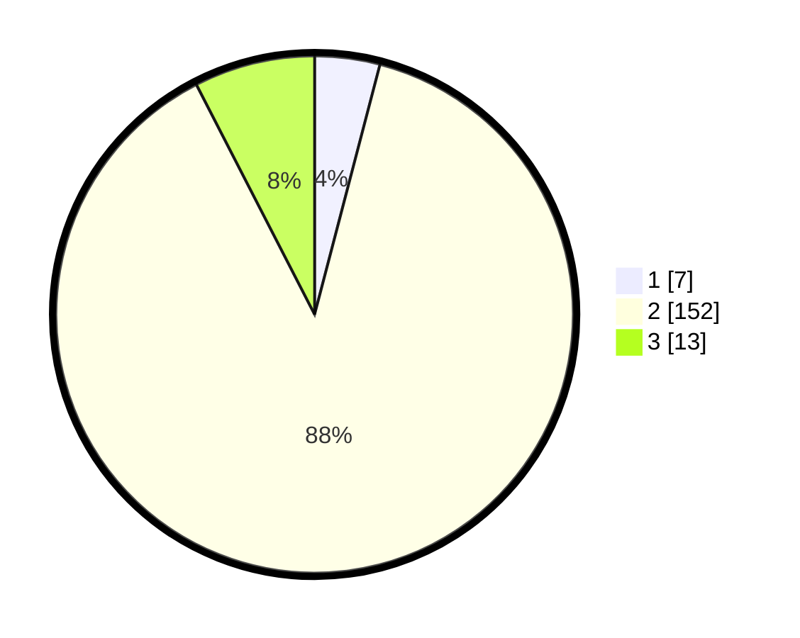

# Hasil

## Grafik

## Tabel

| No. | Nama Paslon    | Suara | Suara (raw) | Persentase |
|:--- |:-------------- | -----:| -----------:| ----------:|
| 1   | ANIES MUHAIMIN | 7     | [7][p-1]    | 4,07       |
| 2   | PRABOWO GIBRAN | 152   | [152][p-2]  | 88,37      |
| 3   | GANJAR MAHFUD  | 13    | [13][p-3]   | 7,56       |

[p-1]: https://github.com/gigit-pemilu/pemilu-2024/blob/main/pilpres/hitung-suara/sub/35-jawa-timur/sub/22-bojonegoro/sub/10-baureno/sub/2013-kalisari/sub/006-tps/sub/paslon-1.txt
[p-2]: https://github.com/gigit-pemilu/pemilu-2024/blob/main/pilpres/hitung-suara/sub/35-jawa-timur/sub/22-bojonegoro/sub/10-baureno/sub/2013-kalisari/sub/006-tps/sub/paslon-2.txt
[p-3]: https://github.com/gigit-pemilu/pemilu-2024/blob/main/pilpres/hitung-suara/sub/35-jawa-timur/sub/22-bojonegoro/sub/10-baureno/sub/2013-kalisari/sub/006-tps/sub/paslon-3.txt

## Foto C Plano

https://sirekap-obj-formc.kpu.go.id/6ae3/pemilu/ppwp/35/22/10/20/13/3522102013006-20240215-001104--acad65dc-03f3-4d09-af65-8cacf6429121.jpg

https://sirekap-obj-formc.kpu.go.id/6ae3/pemilu/ppwp/35/22/10/20/13/3522102013006-20240215-013756--8d0a505a-d680-46f8-b4c2-4d293c5b72c4.jpg

https://sirekap-obj-formc.kpu.go.id/6ae3/pemilu/ppwp/35/22/10/20/13/3522102013006-20240217-222004--9251f5ff-2167-4a0c-96d7-8ed19dfaae9e.jpg

## Metadata

| Key        | Value               |
| ---------- | ------------------- |
| Time Stamp | 2024-02-19 06:16:00 |

