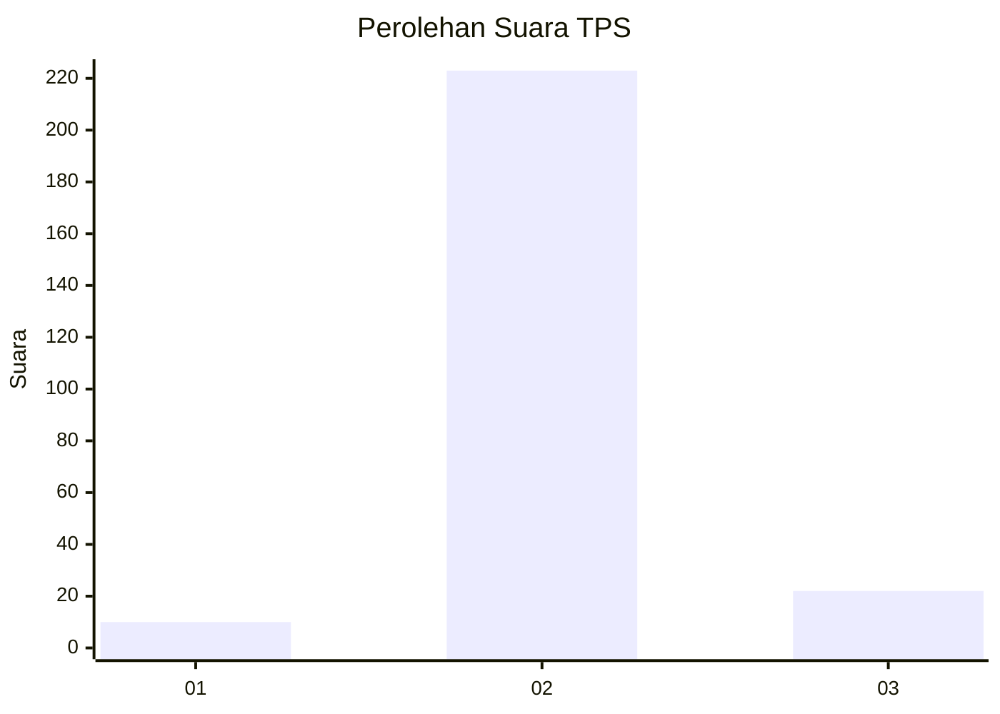
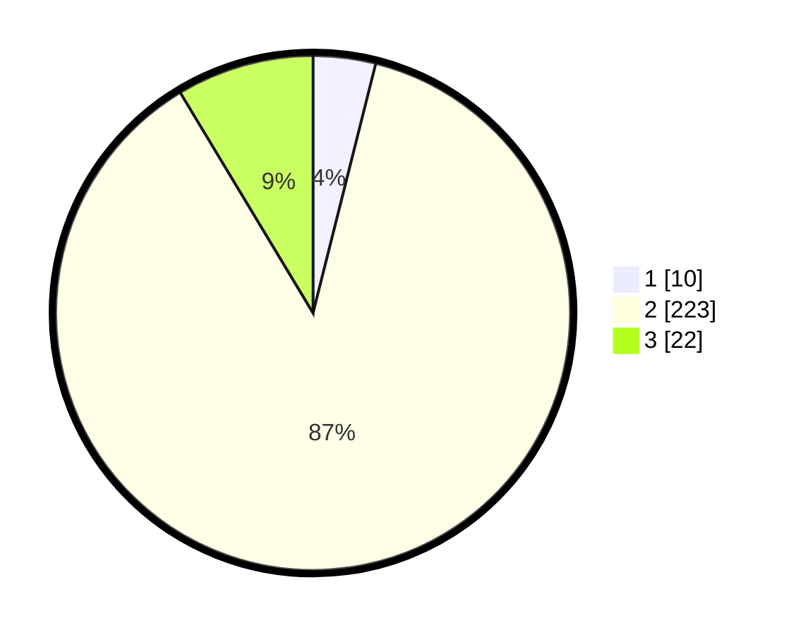

# Hasil

## Grafik

## Tabel

| No. | Nama Paslon    | Suara | Suara (raw) | Persentase |
|:--- |:-------------- | -----:| -----------:| ----------:|
| 1   | ANIES MUHAIMIN | 10    | [10][p-1]   | 3,92       |
| 2   | PRABOWO GIBRAN | 223   | [223][p-2]  | 87,45      |
| 3   | GANJAR MAHFUD  | 22    | [22][p-3]   | 8,63       |

[p-1]: https://github.com/gigit-pemilu/pemilu-2024/blob/main/pilpres/hitung-suara/sub/35-jawa-timur/sub/22-bojonegoro/sub/10-baureno/sub/2016-bumiayu/sub/002-tps/sub/paslon-1.txt
[p-2]: https://github.com/gigit-pemilu/pemilu-2024/blob/main/pilpres/hitung-suara/sub/35-jawa-timur/sub/22-bojonegoro/sub/10-baureno/sub/2016-bumiayu/sub/002-tps/sub/paslon-2.txt
[p-3]: https://github.com/gigit-pemilu/pemilu-2024/blob/main/pilpres/hitung-suara/sub/35-jawa-timur/sub/22-bojonegoro/sub/10-baureno/sub/2016-bumiayu/sub/002-tps/sub/paslon-3.txt

## Foto C Plano

https://sirekap-obj-formc.kpu.go.id/5332/pemilu/ppwp/35/22/10/20/16/3522102016002-20240215-000844--d8a1434b-01f7-46ca-8033-4ffbc998b06d.jpg

https://sirekap-obj-formc.kpu.go.id/5332/pemilu/ppwp/35/22/10/20/16/3522102016002-20240215-003003--d3f3dca3-ef1b-4349-8146-19f4a3b53861.jpg

https://sirekap-obj-formc.kpu.go.id/5332/pemilu/ppwp/35/22/10/20/16/3522102016002-20240215-002731--1d00e03a-6a7b-44eb-b6ef-5eb42cdfe765.jpg

## Metadata

| Key        | Value               |
| ---------- | ------------------- |
| Time Stamp | 2024-02-25 15:00:00 |

