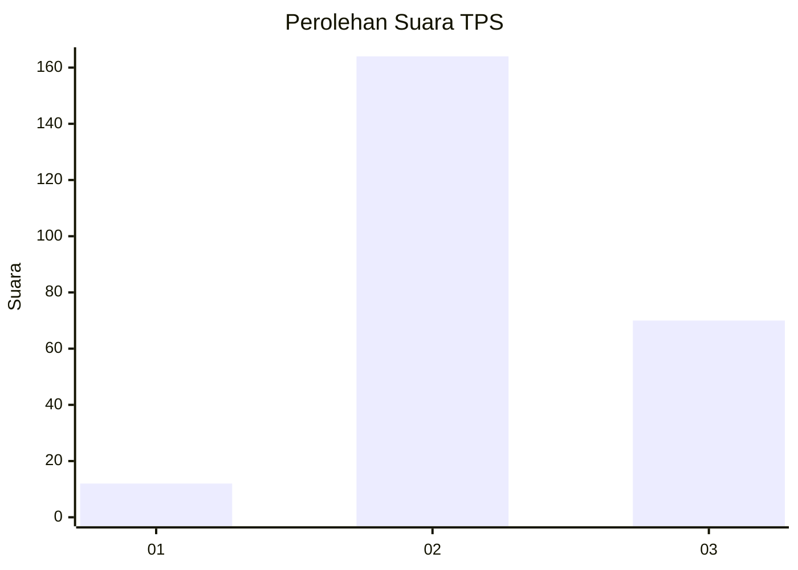
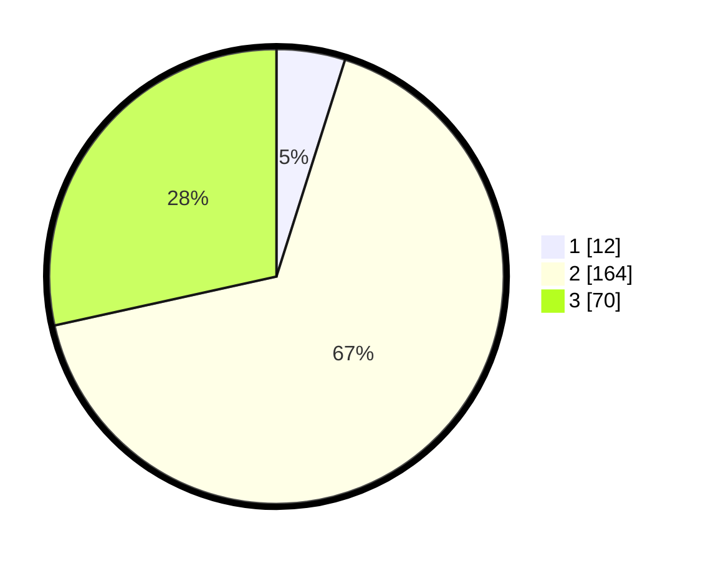

# Hasil

## Grafik

## Tabel

| No. | Nama Paslon    | Suara | Suara (raw) | Persentase |
|:--- |:-------------- | -----:| -----------:| ----------:|
| 1   | ANIES MUHAIMIN | 12    | [12][p-1]   | 4,88       |
| 2   | PRABOWO GIBRAN | 164   | [164][p-2]  | 66,67      |
| 3   | GANJAR MAHFUD  | 70    | [70][p-3]   | 28,46      |

[p-1]: https://github.com/gigit-pemilu/pemilu-2024/blob/main/pilpres/hitung-suara/sub/35-jawa-timur/sub/22-bojonegoro/sub/10-baureno/sub/2018-karangdayu/sub/001-tps/sub/paslon-1.txt
[p-2]: https://github.com/gigit-pemilu/pemilu-2024/blob/main/pilpres/hitung-suara/sub/35-jawa-timur/sub/22-bojonegoro/sub/10-baureno/sub/2018-karangdayu/sub/001-tps/sub/paslon-2.txt
[p-3]: https://github.com/gigit-pemilu/pemilu-2024/blob/main/pilpres/hitung-suara/sub/35-jawa-timur/sub/22-bojonegoro/sub/10-baureno/sub/2018-karangdayu/sub/001-tps/sub/paslon-3.txt

## Foto C Plano

https://sirekap-obj-formc.kpu.go.id/983c/pemilu/ppwp/35/22/10/20/18/3522102018001-20240214-212120--76828af5-e093-49a3-a142-412e78c91b71.jpg

https://sirekap-obj-formc.kpu.go.id/983c/pemilu/ppwp/35/22/10/20/18/3522102018001-20240214-211909--e6f81a96-bba1-4fe0-857d-f4d69023ec72.jpg

https://sirekap-obj-formc.kpu.go.id/983c/pemilu/ppwp/35/22/10/20/18/3522102018001-20240214-211736--95c9dfed-c922-4cb1-8209-632107e4e49f.jpg

## Metadata

| Key        | Value               |
| ---------- | ------------------- |
| Time Stamp | 2024-02-24 22:31:28 |

