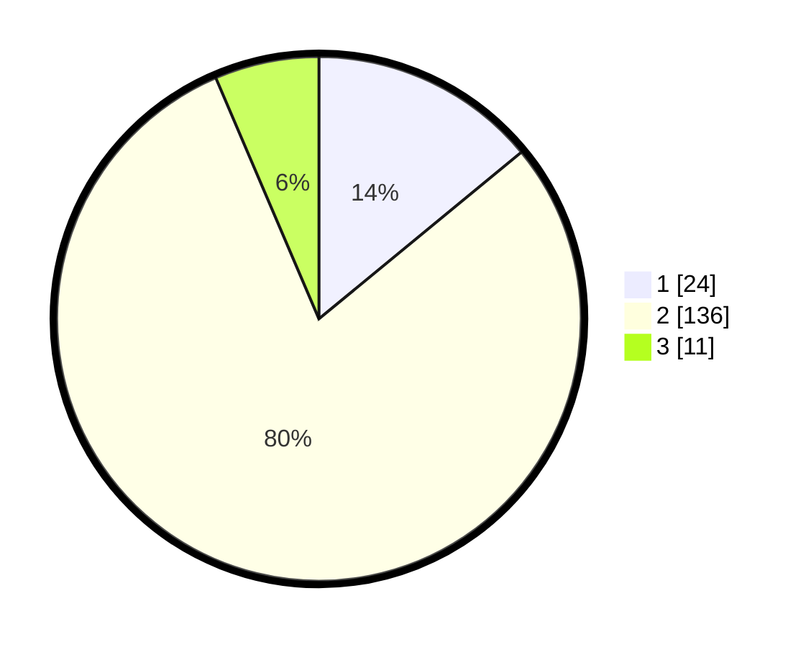

# Hasil

## Grafik

## Tabel

| No. | Nama Paslon    | Suara | Suara (raw) | Persentase |
|:--- |:-------------- | -----:| -----------:| ----------:|
| 1   | ANIES MUHAIMIN | 24    | [24][p-1]   | 14,04      |
| 2   | PRABOWO GIBRAN | 136   | [136][p-2]  | 79,53      |
| 3   | GANJAR MAHFUD  | 11    | [11][p-3]   | 6,43       |

[p-1]: https://github.com/gigit-pemilu/pemilu-2024-35-jawa-timur/blob/main/pilpres/hitung-suara/sub/35-jawa-timur/sub/22-bojonegoro/sub/10-baureno/sub/2018-karangdayu/sub/005-tps/sub/paslon-1.txt
[p-2]: https://github.com/gigit-pemilu/pemilu-2024-35-jawa-timur/blob/main/pilpres/hitung-suara/sub/35-jawa-timur/sub/22-bojonegoro/sub/10-baureno/sub/2018-karangdayu/sub/005-tps/sub/paslon-2.txt
[p-3]: https://github.com/gigit-pemilu/pemilu-2024-35-jawa-timur/blob/main/pilpres/hitung-suara/sub/35-jawa-timur/sub/22-bojonegoro/sub/10-baureno/sub/2018-karangdayu/sub/005-tps/sub/paslon-3.txt

## Foto C Plano

https://sirekap-obj-formc.kpu.go.id/c294/pemilu/ppwp/35/22/10/20/18/3522102018005-20240214-215000--6bec6216-36ed-4f73-975b-58cc5aa3f4f5.jpg

https://sirekap-obj-formc.kpu.go.id/c294/pemilu/ppwp/35/22/10/20/18/3522102018005-20240214-225332--715e32e8-3125-4b1f-8b8a-946edbac2fff.jpg

https://sirekap-obj-formc.kpu.go.id/c294/pemilu/ppwp/35/22/10/20/18/3522102018005-20240214-225636--c91ea4fa-266b-4500-8e9e-d0d202796797.jpg

## Metadata

| Key        | Value               |
| ---------- | ------------------- |
| Time Stamp | 2024-02-24 22:31:28 |

