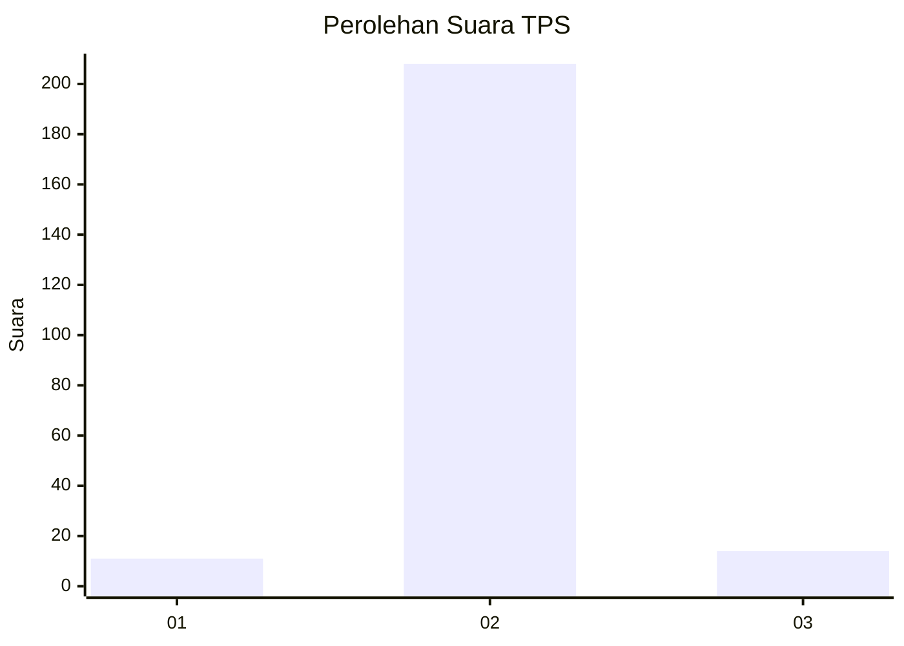
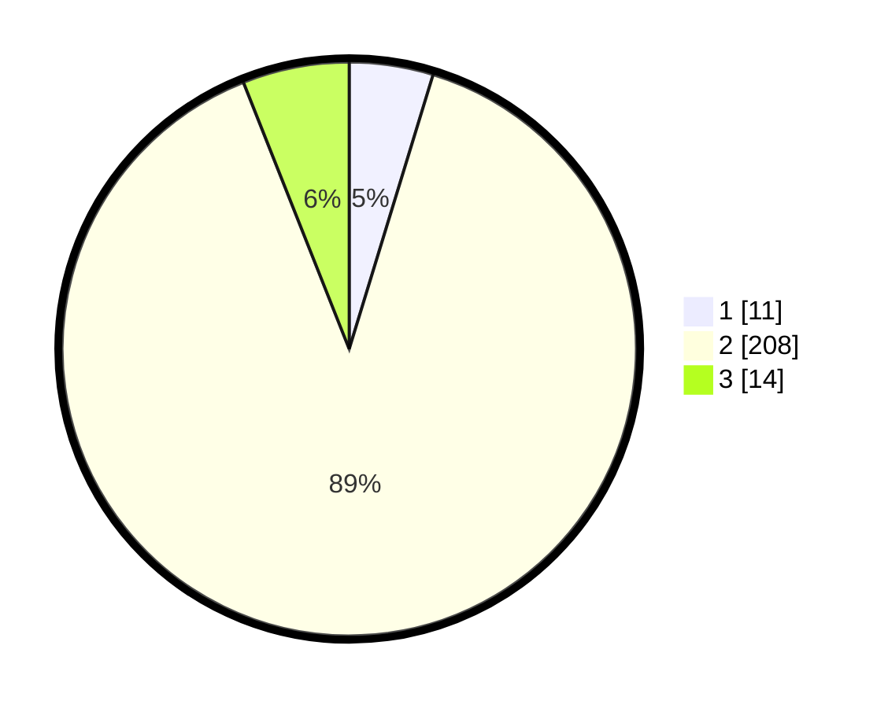

# Hasil

## Grafik

## Tabel

| No. | Nama Paslon    | Suara | Suara (raw) | Persentase |
|:--- |:-------------- | -----:| -----------:| ----------:|
| 1   | ANIES MUHAIMIN | 11    | [11][p-1]   | 4,72       |
| 2   | PRABOWO GIBRAN | 208   | [208][p-2]  | 89,27      |
| 3   | GANJAR MAHFUD  | 14    | [14][p-3]   | 6,01       |

[p-1]: https://github.com/gigit-pemilu/pemilu-2024/blob/main/pilpres/hitung-suara/sub/35-jawa-timur/sub/22-bojonegoro/sub/10-baureno/sub/2025-lebaksari/sub/001-tps/sub/paslon-1.txt
[p-2]: https://github.com/gigit-pemilu/pemilu-2024/blob/main/pilpres/hitung-suara/sub/35-jawa-timur/sub/22-bojonegoro/sub/10-baureno/sub/2025-lebaksari/sub/001-tps/sub/paslon-2.txt
[p-3]: https://github.com/gigit-pemilu/pemilu-2024/blob/main/pilpres/hitung-suara/sub/35-jawa-timur/sub/22-bojonegoro/sub/10-baureno/sub/2025-lebaksari/sub/001-tps/sub/paslon-3.txt

## Foto C Plano

https://sirekap-obj-formc.kpu.go.id/4f5b/pemilu/ppwp/35/22/10/20/25/3522102025001-20240218-130145--732e1f09-6ca2-46bb-9c33-751cbca959d2.jpg

https://sirekap-obj-formc.kpu.go.id/4f5b/pemilu/ppwp/35/22/10/20/25/3522102025001-20240214-202144--5efa7d16-d488-4fad-a560-5bccee7b8a59.jpg

https://sirekap-obj-formc.kpu.go.id/4f5b/pemilu/ppwp/35/22/10/20/25/3522102025001-20240214-202217--92d714d5-9e49-4bf5-888b-84539bbb8b08.jpg

## Metadata

| Key        | Value               |
| ---------- | ------------------- |
| Time Stamp | 2024-02-24 22:31:28 |

