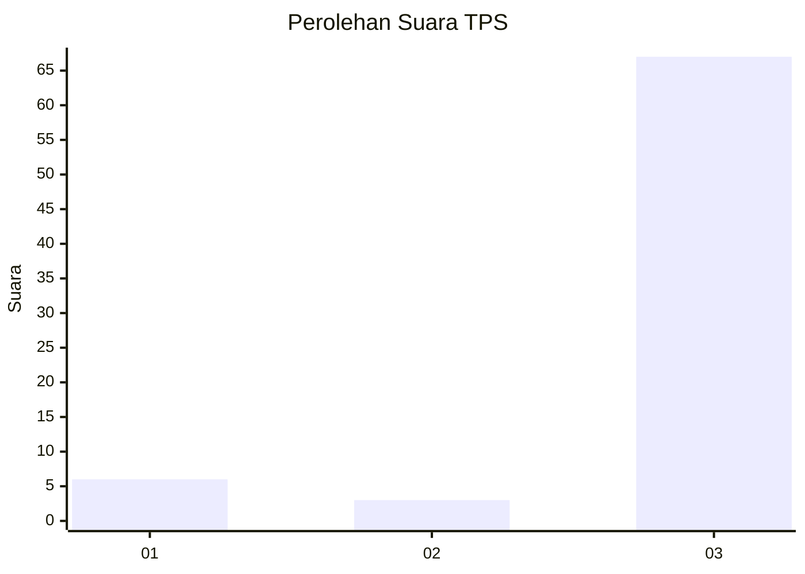
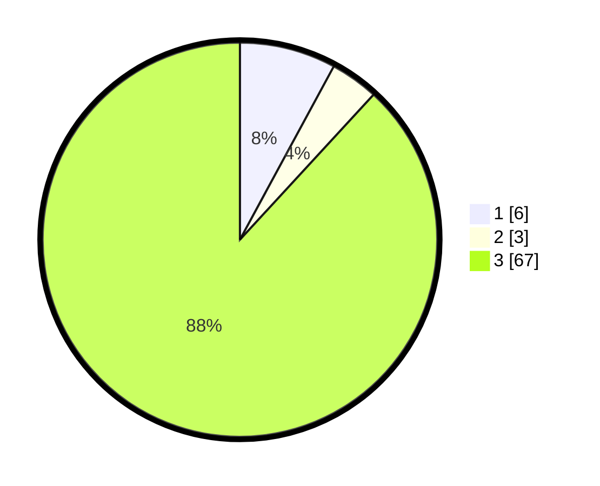

# Hasil

## Grafik

## Tabel

| No. | Nama Paslon    | Suara | Suara (raw) | Persentase |
|:--- |:-------------- | -----:| -----------:| ----------:|
| 1   | ANIES MUHAIMIN | 6     | [6][p-1]    | 7,89       |
| 2   | PRABOWO GIBRAN | 3     | [3][p-2]    | 3,95       |
| 3   | GANJAR MAHFUD  | 67    | [67][p-3]   | 88,16      |

[p-1]: https://github.com/gigit-pemilu/pemilu-2024-35-jawa-timur/blob/main/pilpres/hitung-suara/sub/35-jawa-timur/sub/22-bojonegoro/sub/10-baureno/sub/2025-lebaksari/sub/006-tps/sub/paslon-1.txt
[p-2]: https://github.com/gigit-pemilu/pemilu-2024-35-jawa-timur/blob/main/pilpres/hitung-suara/sub/35-jawa-timur/sub/22-bojonegoro/sub/10-baureno/sub/2025-lebaksari/sub/006-tps/sub/paslon-2.txt
[p-3]: https://github.com/gigit-pemilu/pemilu-2024-35-jawa-timur/blob/main/pilpres/hitung-suara/sub/35-jawa-timur/sub/22-bojonegoro/sub/10-baureno/sub/2025-lebaksari/sub/006-tps/sub/paslon-3.txt

## Foto C Plano

https://sirekap-obj-formc.kpu.go.id/5097/pemilu/ppwp/35/22/10/20/25/3522102025006-20240215-001045--bcb9423a-1193-4775-9876-34e9bed46f57.jpg

https://sirekap-obj-formc.kpu.go.id/5097/pemilu/ppwp/35/22/10/20/25/3522102025006-20240215-001221--12a3b6a0-fc36-47e2-b657-2fcae9be5c09.jpg

https://sirekap-obj-formc.kpu.go.id/5097/pemilu/ppwp/35/22/10/20/25/3522102025006-20240215-001312--f98bb436-318b-4df4-86ee-39d7c36b3c15.jpg

## Metadata

| Key        | Value               |
| ---------- | ------------------- |
| Time Stamp | 2024-02-25 16:00:00 |

