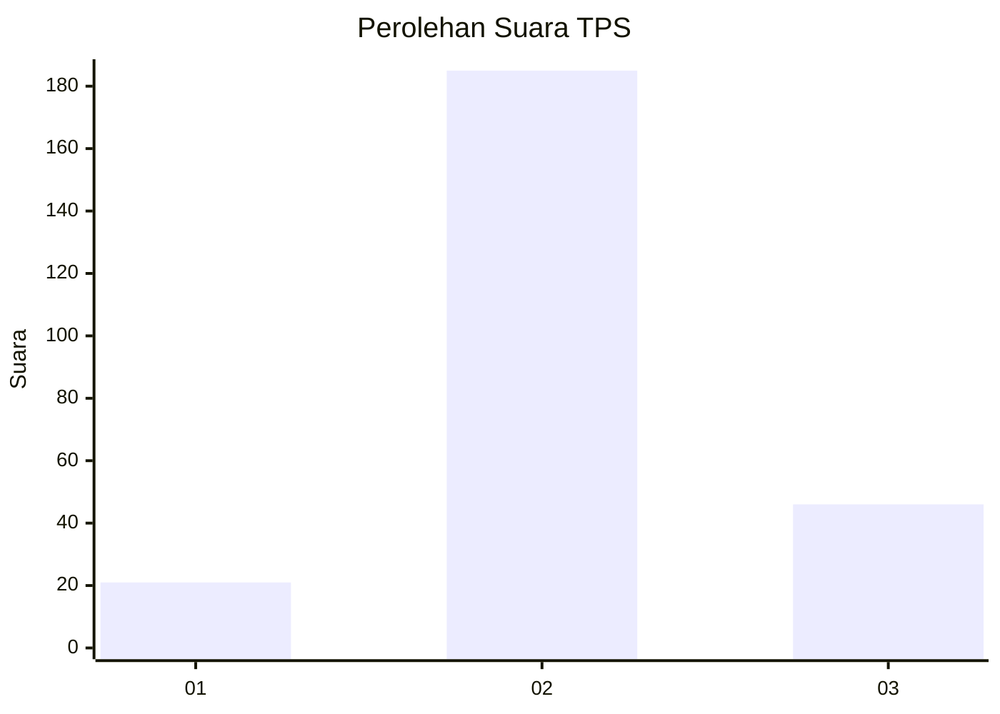
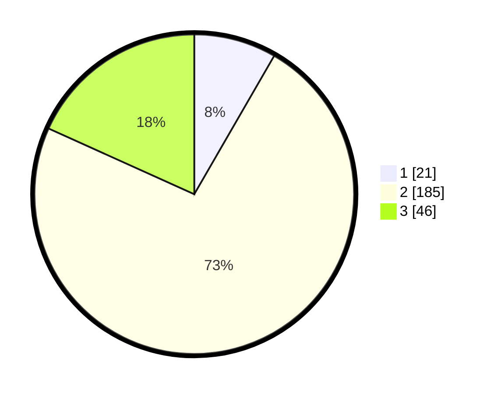

# Hasil

## Grafik

## Tabel

| No. | Nama Paslon    | Suara | Suara (raw) | Persentase |
|:--- |:-------------- | -----:| -----------:| ----------:|
| 1   | ANIES MUHAIMIN | 21    | [21][p-1]   | 8,33       |
| 2   | PRABOWO GIBRAN | 185   | [185][p-2]  | 73,41      |
| 3   | GANJAR MAHFUD  | 46    | [46][p-3]   | 18,25      |

[p-1]: https://github.com/gigit-pemilu/pemilu-2024/blob/main/pilpres/hitung-suara/sub/35-jawa-timur/sub/22-bojonegoro/sub/11-kanor/sub/2002-kanor/sub/001-tps/sub/paslon-1.txt
[p-2]: https://github.com/gigit-pemilu/pemilu-2024/blob/main/pilpres/hitung-suara/sub/35-jawa-timur/sub/22-bojonegoro/sub/11-kanor/sub/2002-kanor/sub/001-tps/sub/paslon-2.txt
[p-3]: https://github.com/gigit-pemilu/pemilu-2024/blob/main/pilpres/hitung-suara/sub/35-jawa-timur/sub/22-bojonegoro/sub/11-kanor/sub/2002-kanor/sub/001-tps/sub/paslon-3.txt

## Foto C Plano

https://sirekap-obj-formc.kpu.go.id/3f4b/pemilu/ppwp/35/22/11/20/02/3522112002001-20240215-003211--69019da6-c6f1-42e0-b3a5-e882d72f5ebe.jpg

https://sirekap-obj-formc.kpu.go.id/3f4b/pemilu/ppwp/35/22/11/20/02/3522112002001-20240215-003314--7d9c2a35-e1ef-4c4d-aee0-f8d92c904665.jpg

https://sirekap-obj-formc.kpu.go.id/3f4b/pemilu/ppwp/35/22/11/20/02/3522112002001-20240215-003401--38b0ae66-b5b4-4f88-bf9b-f85084d3493a.jpg

## Metadata

| Key        | Value               |
| ---------- | ------------------- |
| Time Stamp | 2024-02-25 13:00:00 |

