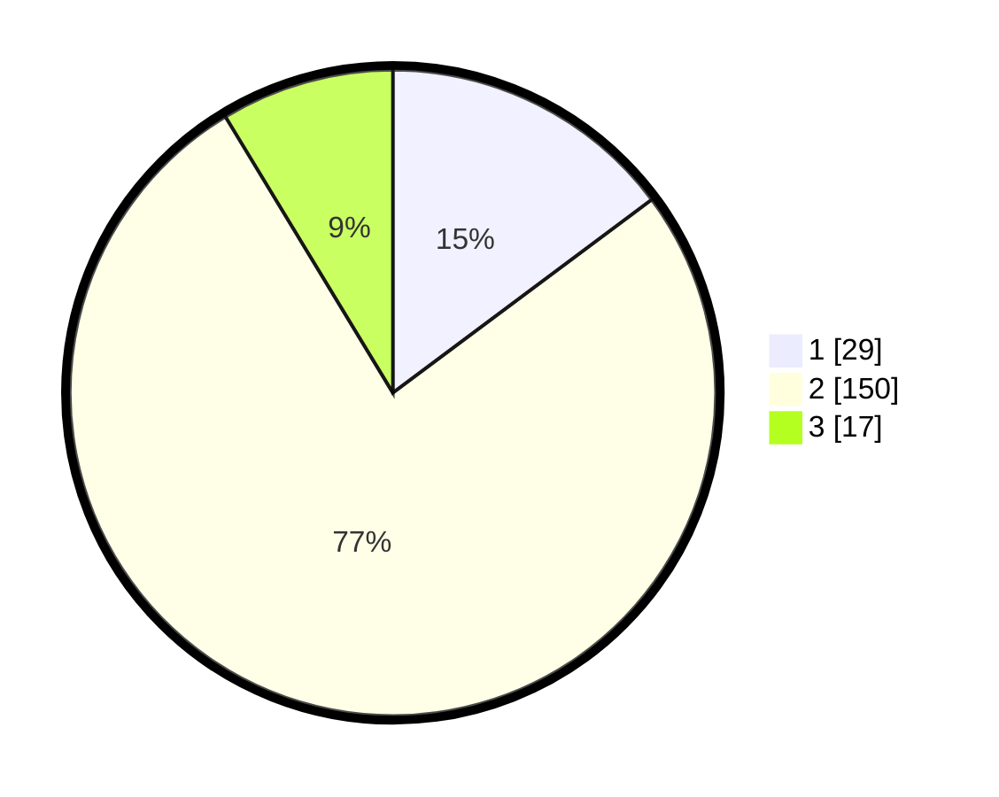

# Hasil

## Grafik

## Tabel

| No. | Nama Paslon    | Suara | Suara (raw) | Persentase |
|:--- |:-------------- | -----:| -----------:| ----------:|
| 1   | ANIES MUHAIMIN | 29    | [29][p-1]   | 14,80      |
| 2   | PRABOWO GIBRAN | 150   | [150][p-2]  | 76,53      |
| 3   | GANJAR MAHFUD  | 17    | [17][p-3]   | 8,67       |

[p-1]: https://github.com/gigit-pemilu/pemilu-2024-35-jawa-timur/blob/main/pilpres/hitung-suara/sub/35-jawa-timur/sub/22-bojonegoro/sub/11-kanor/sub/2002-kanor/sub/004-tps/sub/paslon-1.txt
[p-2]: https://github.com/gigit-pemilu/pemilu-2024-35-jawa-timur/blob/main/pilpres/hitung-suara/sub/35-jawa-timur/sub/22-bojonegoro/sub/11-kanor/sub/2002-kanor/sub/004-tps/sub/paslon-2.txt
[p-3]: https://github.com/gigit-pemilu/pemilu-2024-35-jawa-timur/blob/main/pilpres/hitung-suara/sub/35-jawa-timur/sub/22-bojonegoro/sub/11-kanor/sub/2002-kanor/sub/004-tps/sub/paslon-3.txt

## Foto C Plano

https://sirekap-obj-formc.kpu.go.id/d45c/pemilu/ppwp/35/22/11/20/02/3522112002004-20240214-232225--64e8c702-5424-4bb6-92e4-f2e5a96e6a2f.jpg

https://sirekap-obj-formc.kpu.go.id/d45c/pemilu/ppwp/35/22/11/20/02/3522112002004-20240214-232356--9e5f26ac-e328-4823-a308-d8eb43cbe2d2.jpg

https://sirekap-obj-formc.kpu.go.id/d45c/pemilu/ppwp/35/22/11/20/02/3522112002004-20240214-233008--f0a32d54-d541-4584-8a9e-4c0661a2e01f.jpg

## Metadata

| Key        | Value               |
| ---------- | ------------------- |
| Time Stamp | 2024-02-15 15:00:29 |

