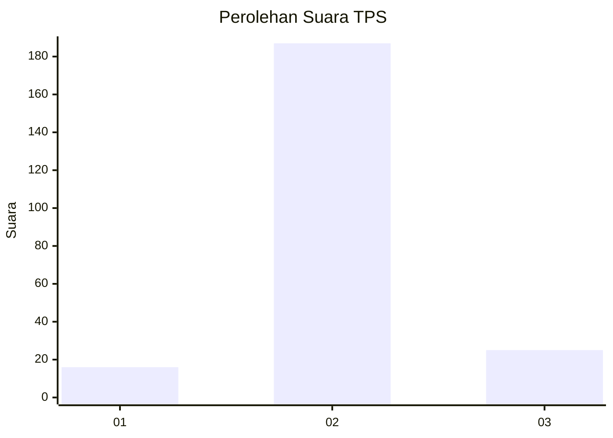
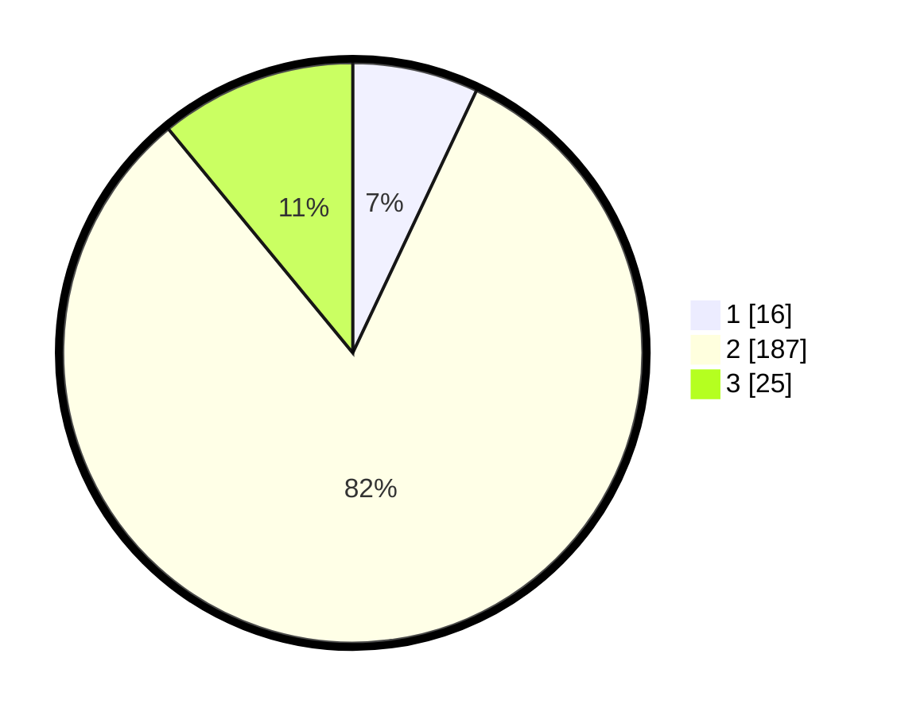

# Hasil

## Grafik

## Tabel

| No. | Nama Paslon    | Suara | Suara (raw) | Persentase |
|:--- |:-------------- | -----:| -----------:| ----------:|
| 1   | ANIES MUHAIMIN | 16    | [16][p-1]   | 7,02       |
| 2   | PRABOWO GIBRAN | 187   | [187][p-2]  | 82,02      |
| 3   | GANJAR MAHFUD  | 25    | [25][p-3]   | 10,96      |

[p-1]: https://github.com/gigit-pemilu/pemilu-2024/blob/main/pilpres/hitung-suara/sub/35-jawa-timur/sub/22-bojonegoro/sub/11-kanor/sub/2003-tambahrejo/sub/006-tps/sub/paslon-1.txt
[p-2]: https://github.com/gigit-pemilu/pemilu-2024/blob/main/pilpres/hitung-suara/sub/35-jawa-timur/sub/22-bojonegoro/sub/11-kanor/sub/2003-tambahrejo/sub/006-tps/sub/paslon-2.txt
[p-3]: https://github.com/gigit-pemilu/pemilu-2024/blob/main/pilpres/hitung-suara/sub/35-jawa-timur/sub/22-bojonegoro/sub/11-kanor/sub/2003-tambahrejo/sub/006-tps/sub/paslon-3.txt

## Foto C Plano

https://sirekap-obj-formc.kpu.go.id/7a37/pemilu/ppwp/35/22/11/20/03/3522112003006-20240214-204510--9104e004-8626-46ef-b08a-b6634bcee40c.jpg

https://sirekap-obj-formc.kpu.go.id/7a37/pemilu/ppwp/35/22/11/20/03/3522112003006-20240214-205056--5cffb2ef-0842-4cde-b5fa-22f204a4fb77.jpg

https://sirekap-obj-formc.kpu.go.id/7a37/pemilu/ppwp/35/22/11/20/03/3522112003006-20240214-205244--f1105b0a-9bd6-4a11-81d4-eb91ae548898.jpg

## Metadata

| Key        | Value               |
| ---------- | ------------------- |
| Time Stamp | 2024-02-19 22:00:00 |

