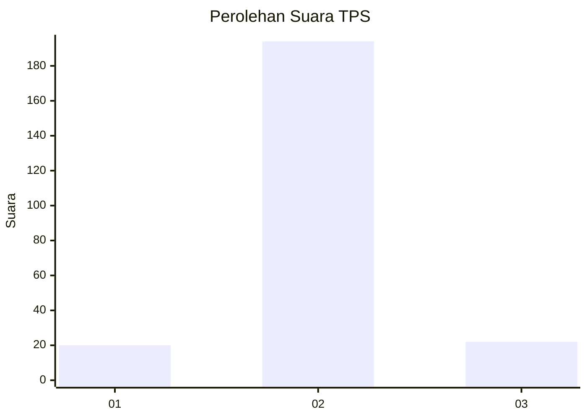
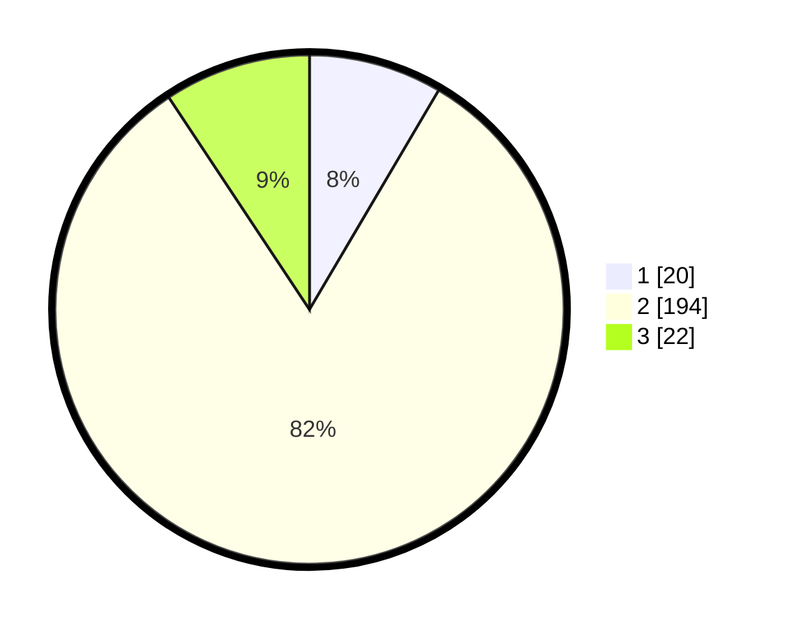

# Hasil

## Grafik

## Tabel

| No. | Nama Paslon    | Suara | Suara (raw) | Persentase |
|:--- |:-------------- | -----:| -----------:| ----------:|
| 1   | ANIES MUHAIMIN | 20    | [20][p-1]   | 8,47       |
| 2   | PRABOWO GIBRAN | 194   | [194][p-2]  | 82,20      |
| 3   | GANJAR MAHFUD  | 22    | [22][p-3]   | 9,32       |

[p-1]: https://github.com/gigit-pemilu/pemilu-2024/blob/main/pilpres/hitung-suara/sub/35-jawa-timur/sub/22-bojonegoro/sub/12-sumberejo/sub/2001-tlogohaji/sub/001-tps/sub/paslon-1.txt
[p-2]: https://github.com/gigit-pemilu/pemilu-2024/blob/main/pilpres/hitung-suara/sub/35-jawa-timur/sub/22-bojonegoro/sub/12-sumberejo/sub/2001-tlogohaji/sub/001-tps/sub/paslon-2.txt
[p-3]: https://github.com/gigit-pemilu/pemilu-2024/blob/main/pilpres/hitung-suara/sub/35-jawa-timur/sub/22-bojonegoro/sub/12-sumberejo/sub/2001-tlogohaji/sub/001-tps/sub/paslon-3.txt

## Foto C Plano

https://sirekap-obj-formc.kpu.go.id/8658/pemilu/ppwp/35/22/12/20/01/3522122001001-20240215-034206--c7addde8-4655-427c-8a6f-54d52d382f89.jpg

https://sirekap-obj-formc.kpu.go.id/8658/pemilu/ppwp/35/22/12/20/01/3522122001001-20240215-034335--8948889c-2521-4b57-bcdb-ad4008e4648e.jpg

https://sirekap-obj-formc.kpu.go.id/8658/pemilu/ppwp/35/22/12/20/01/3522122001001-20240215-034435--a276b4b5-d3f5-4495-899f-355859f959d4.jpg

## Metadata

| Key        | Value               |
| ---------- | ------------------- |
| Time Stamp | 2024-02-25 14:00:00 |

