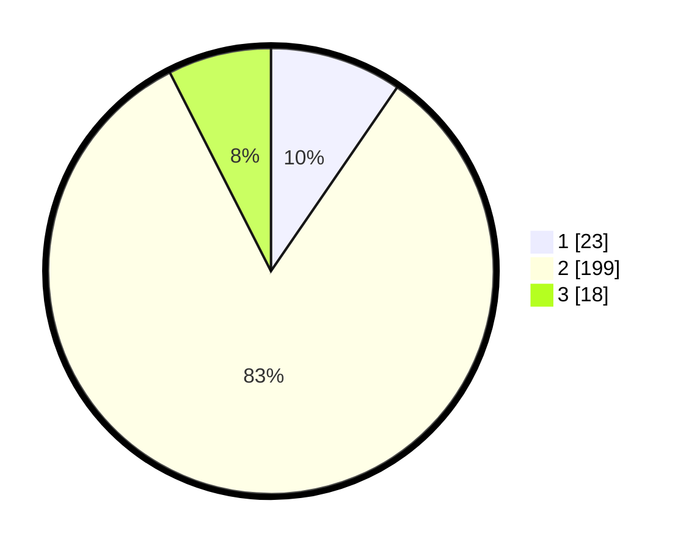

# Hasil

## Grafik

## Tabel

| No. | Nama Paslon    | Suara | Suara (raw) | Persentase |
|:--- |:-------------- | -----:| -----------:| ----------:|
| 1   | ANIES MUHAIMIN | 23    | [23][p-1]   | 9,58       |
| 2   | PRABOWO GIBRAN | 199   | [199][p-2]  | 82,92      |
| 3   | GANJAR MAHFUD  | 18    | [18][p-3]   | 7,50       |

[p-1]: https://github.com/gigit-pemilu/pemilu-2024/blob/main/pilpres/hitung-suara/sub/35-jawa-timur/sub/22-bojonegoro/sub/12-sumberejo/sub/2001-tlogohaji/sub/003-tps/sub/paslon-1.txt
[p-2]: https://github.com/gigit-pemilu/pemilu-2024/blob/main/pilpres/hitung-suara/sub/35-jawa-timur/sub/22-bojonegoro/sub/12-sumberejo/sub/2001-tlogohaji/sub/003-tps/sub/paslon-2.txt
[p-3]: https://github.com/gigit-pemilu/pemilu-2024/blob/main/pilpres/hitung-suara/sub/35-jawa-timur/sub/22-bojonegoro/sub/12-sumberejo/sub/2001-tlogohaji/sub/003-tps/sub/paslon-3.txt

## Foto C Plano

https://sirekap-obj-formc.kpu.go.id/0bf6/pemilu/ppwp/35/22/12/20/01/3522122001003-20240215-013109--086a7f94-49ed-4d00-b015-35f7b7c10ae2.jpg

https://sirekap-obj-formc.kpu.go.id/0bf6/pemilu/ppwp/35/22/12/20/01/3522122001003-20240215-013234--7c4a18b6-90fe-4aed-affc-fa57715978c8.jpg

https://sirekap-obj-formc.kpu.go.id/0bf6/pemilu/ppwp/35/22/12/20/01/3522122001003-20240215-013327--576c265f-d94d-4421-8add-0c9a4907c580.jpg

## Metadata

| Key        | Value               |
| ---------- | ------------------- |
| Time Stamp | 2024-02-25 21:00:00 |

