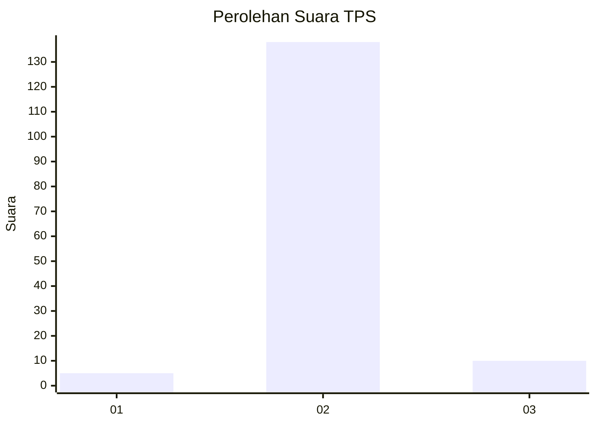
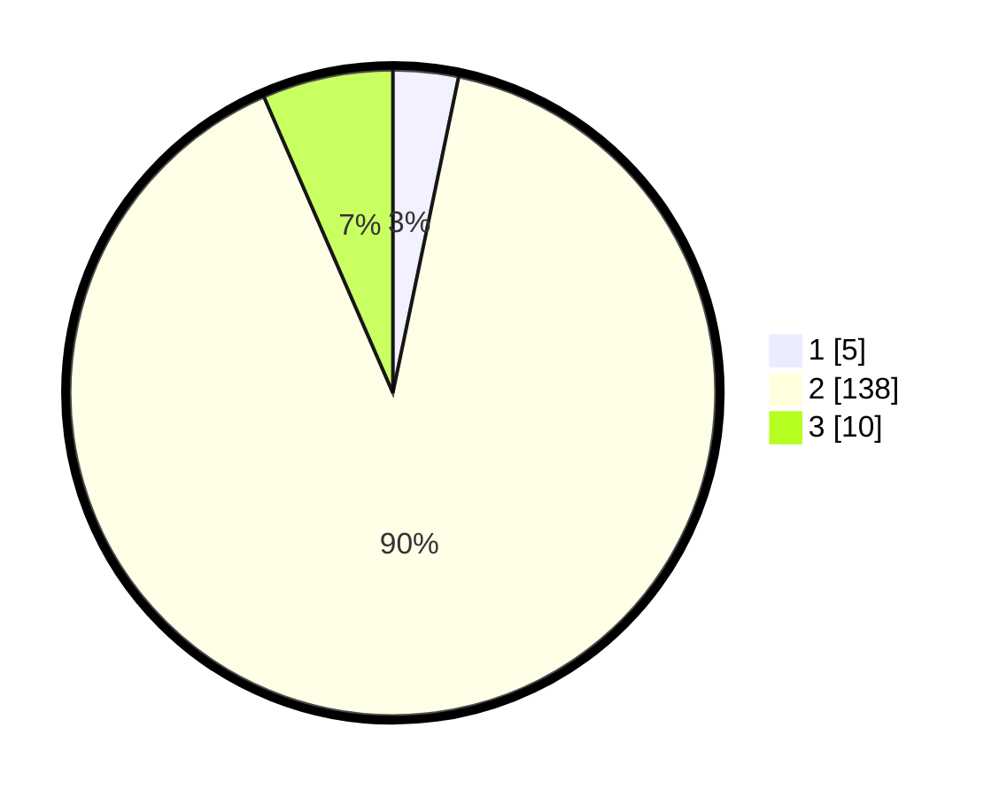

# Hasil

## Grafik

## Tabel

| No. | Nama Paslon    | Suara | Suara (raw) | Persentase |
|:--- |:-------------- | -----:| -----------:| ----------:|
| 1   | ANIES MUHAIMIN | 5     | [5][p-1]    | 3,27       |
| 2   | PRABOWO GIBRAN | 138   | [138][p-2]  | 90,20      |
| 3   | GANJAR MAHFUD  | 10    | [10][p-3]   | 6,54       |

[p-1]: https://github.com/gigit-pemilu/pemilu-2024/blob/main/pilpres/hitung-suara/sub/35-jawa-timur/sub/22-bojonegoro/sub/12-sumberejo/sub/2001-tlogohaji/sub/005-tps/sub/paslon-1.txt
[p-2]: https://github.com/gigit-pemilu/pemilu-2024/blob/main/pilpres/hitung-suara/sub/35-jawa-timur/sub/22-bojonegoro/sub/12-sumberejo/sub/2001-tlogohaji/sub/005-tps/sub/paslon-2.txt
[p-3]: https://github.com/gigit-pemilu/pemilu-2024/blob/main/pilpres/hitung-suara/sub/35-jawa-timur/sub/22-bojonegoro/sub/12-sumberejo/sub/2001-tlogohaji/sub/005-tps/sub/paslon-3.txt

## Foto C Plano

https://sirekap-obj-formc.kpu.go.id/19fd/pemilu/ppwp/35/22/12/20/01/3522122001005-20240215-011522--4005b883-bb9d-41c1-86a4-b08422687ec6.jpg

https://sirekap-obj-formc.kpu.go.id/19fd/pemilu/ppwp/35/22/12/20/01/3522122001005-20240215-011711--37b74774-d2ab-41a9-81a2-7a47e99ff118.jpg

https://sirekap-obj-formc.kpu.go.id/19fd/pemilu/ppwp/35/22/12/20/01/3522122001005-20240215-011855--22ac3781-a0e1-411d-996b-6c202416147e.jpg

## Metadata

| Key        | Value               |
| ---------- | ------------------- |
| Time Stamp | 2024-02-24 22:31:28 |

