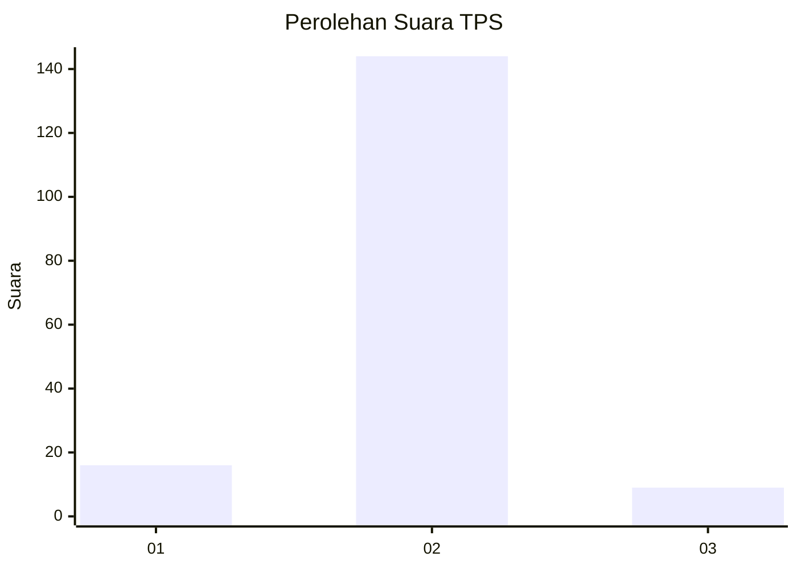
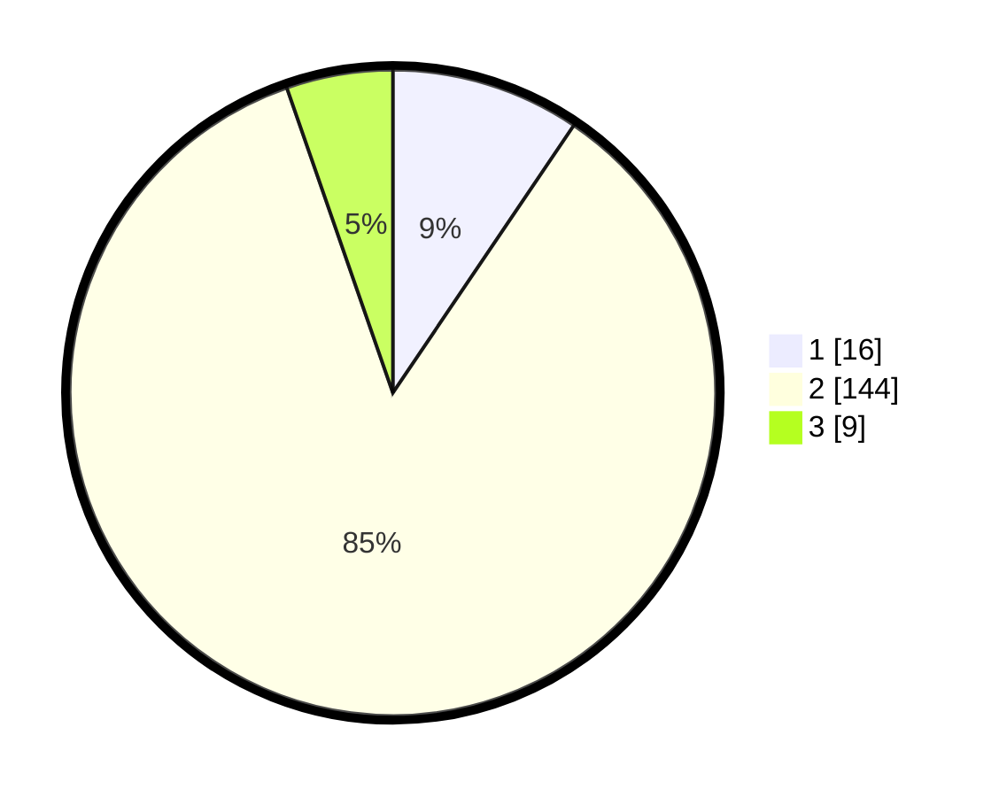

# Hasil

## Grafik

## Tabel

| No. | Nama Paslon    | Suara | Suara (raw) | Persentase |
|:--- |:-------------- | -----:| -----------:| ----------:|
| 1   | ANIES MUHAIMIN | 16    | [16][p-1]   | 9,47       |
| 2   | PRABOWO GIBRAN | 144   | [144][p-2]  | 85,21      |
| 3   | GANJAR MAHFUD  | 9     | [9][p-3]    | 5,33       |

[p-1]: https://github.com/gigit-pemilu/pemilu-2024/blob/main/pilpres/hitung-suara/sub/35-jawa-timur/sub/22-bojonegoro/sub/12-sumberejo/sub/2002-ngampal/sub/006-tps/sub/paslon-1.txt
[p-2]: https://github.com/gigit-pemilu/pemilu-2024/blob/main/pilpres/hitung-suara/sub/35-jawa-timur/sub/22-bojonegoro/sub/12-sumberejo/sub/2002-ngampal/sub/006-tps/sub/paslon-2.txt
[p-3]: https://github.com/gigit-pemilu/pemilu-2024/blob/main/pilpres/hitung-suara/sub/35-jawa-timur/sub/22-bojonegoro/sub/12-sumberejo/sub/2002-ngampal/sub/006-tps/sub/paslon-3.txt

## Foto C Plano

https://sirekap-obj-formc.kpu.go.id/20c3/pemilu/ppwp/35/22/12/20/02/3522122002006-20240214-214426--006b2757-737c-43fe-bf80-456f2477ee98.jpg

https://sirekap-obj-formc.kpu.go.id/20c3/pemilu/ppwp/35/22/12/20/02/3522122002006-20240214-215302--3fa0c5ab-1ead-4f24-82ad-5eb5c4fdc6d3.jpg

https://sirekap-obj-formc.kpu.go.id/20c3/pemilu/ppwp/35/22/12/20/02/3522122002006-20240214-215604--5d8023a0-4f27-4d60-8897-4277f88f1ac7.jpg

## Metadata

| Key        | Value               |
| ---------- | ------------------- |
| Time Stamp | 2024-02-24 22:31:28 |

