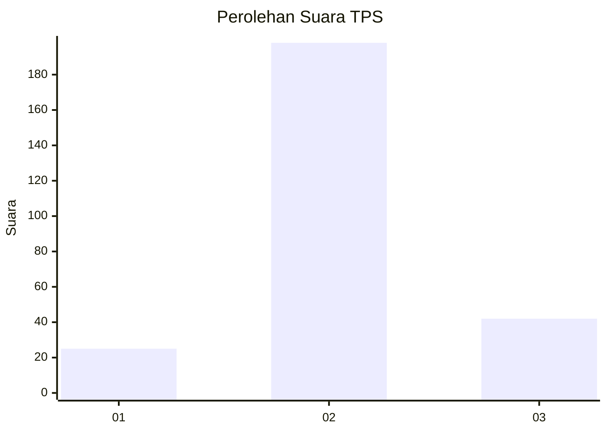
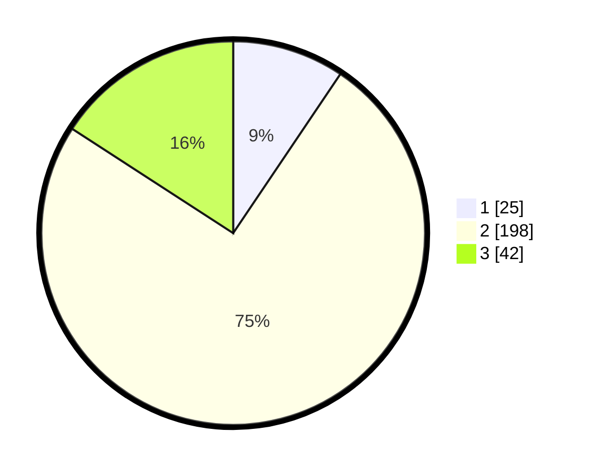

# Hasil

## Grafik

## Tabel

| No. | Nama Paslon    | Suara | Suara (raw) | Persentase |
|:--- |:-------------- | -----:| -----------:| ----------:|
| 1   | ANIES MUHAIMIN | 25    | [25][p-1]   | 9,43       |
| 2   | PRABOWO GIBRAN | 198   | [198][p-2]  | 74,72      |
| 3   | GANJAR MAHFUD  | 42    | [42][p-3]   | 15,85      |

[p-1]: https://github.com/gigit-pemilu/pemilu-2024/blob/main/pilpres/hitung-suara/sub/35-jawa-timur/sub/22-bojonegoro/sub/12-sumberejo/sub/2003-kedungrejo/sub/003-tps/sub/paslon-1.txt
[p-2]: https://github.com/gigit-pemilu/pemilu-2024/blob/main/pilpres/hitung-suara/sub/35-jawa-timur/sub/22-bojonegoro/sub/12-sumberejo/sub/2003-kedungrejo/sub/003-tps/sub/paslon-2.txt
[p-3]: https://github.com/gigit-pemilu/pemilu-2024/blob/main/pilpres/hitung-suara/sub/35-jawa-timur/sub/22-bojonegoro/sub/12-sumberejo/sub/2003-kedungrejo/sub/003-tps/sub/paslon-3.txt

## Foto C Plano

https://sirekap-obj-formc.kpu.go.id/65be/pemilu/ppwp/35/22/12/20/03/3522122003003-20240214-224149--5b691be7-d2c1-4ea1-9981-42a0e1e8fa1f.jpg

https://sirekap-obj-formc.kpu.go.id/65be/pemilu/ppwp/35/22/12/20/03/3522122003003-20240214-221947--2f7cc1b3-9cd0-4917-99fe-1a5926e57368.jpg

https://sirekap-obj-formc.kpu.go.id/65be/pemilu/ppwp/35/22/12/20/03/3522122003003-20240214-222134--02dbf487-3fd6-4c46-9ac0-33485959a756.jpg

## Metadata

| Key        | Value               |
| ---------- | ------------------- |
| Time Stamp | 2024-02-25 00:00:00 |

