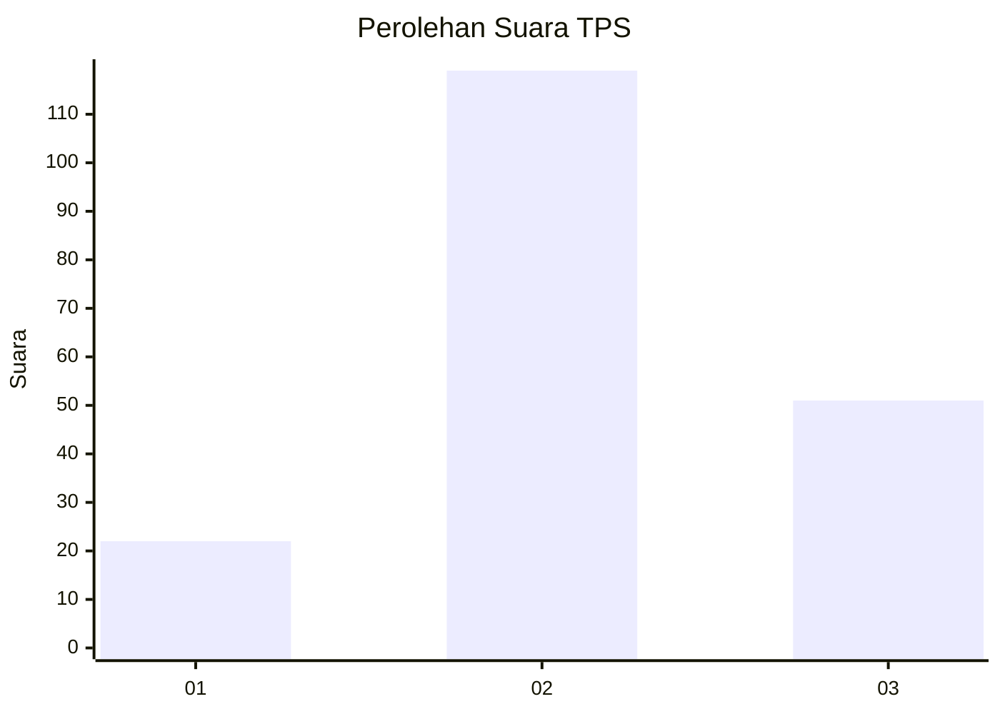
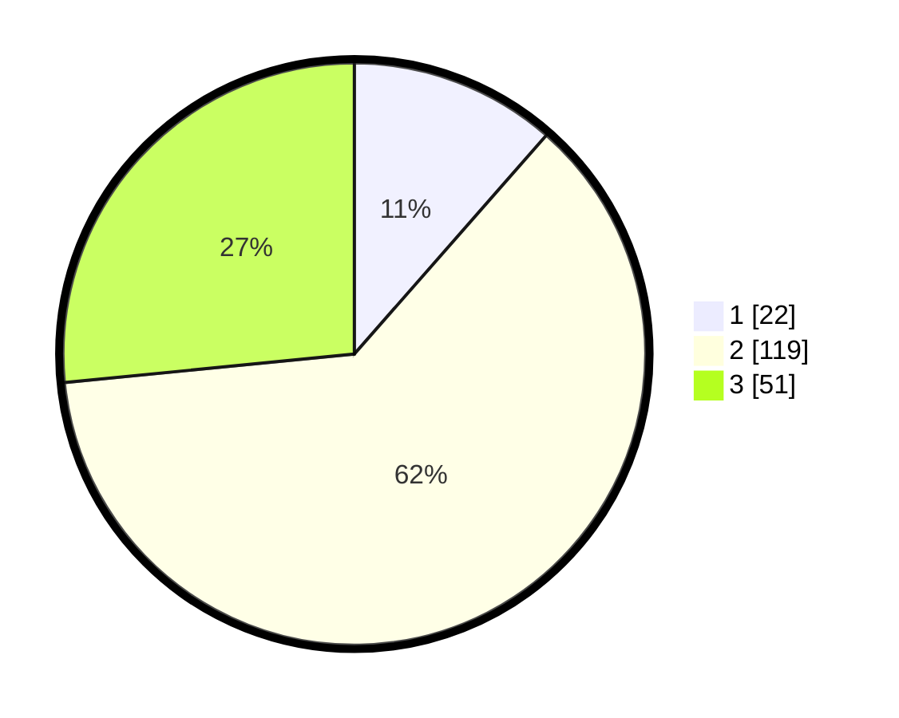

# Hasil

## Grafik

## Tabel

| No. | Nama Paslon    | Suara | Suara (raw) | Persentase |
|:--- |:-------------- | -----:| -----------:| ----------:|
| 1   | ANIES MUHAIMIN | 22    | [22][p-1]   | 11,46      |
| 2   | PRABOWO GIBRAN | 119   | [119][p-2]  | 61,98      |
| 3   | GANJAR MAHFUD  | 51    | [51][p-3]   | 26,56      |

[p-1]: https://github.com/gigit-pemilu/pemilu-2024/blob/main/pilpres/hitung-suara/sub/35-jawa-timur/sub/22-bojonegoro/sub/12-sumberejo/sub/2004-mlinjeng/sub/004-tps/sub/paslon-1.txt
[p-2]: https://github.com/gigit-pemilu/pemilu-2024/blob/main/pilpres/hitung-suara/sub/35-jawa-timur/sub/22-bojonegoro/sub/12-sumberejo/sub/2004-mlinjeng/sub/004-tps/sub/paslon-2.txt
[p-3]: https://github.com/gigit-pemilu/pemilu-2024/blob/main/pilpres/hitung-suara/sub/35-jawa-timur/sub/22-bojonegoro/sub/12-sumberejo/sub/2004-mlinjeng/sub/004-tps/sub/paslon-3.txt

## Foto C Plano

https://sirekap-obj-formc.kpu.go.id/b3f7/pemilu/ppwp/35/22/12/20/04/3522122004004-20240214-212551--22701b33-4ef3-4f40-8453-26813632b784.jpg

https://sirekap-obj-formc.kpu.go.id/b3f7/pemilu/ppwp/35/22/12/20/04/3522122004004-20240214-212728--13d222f2-174e-476e-b4d9-c32aaf536c21.jpg

https://sirekap-obj-formc.kpu.go.id/b3f7/pemilu/ppwp/35/22/12/20/04/3522122004004-20240214-212951--0ef1a699-aa02-4bb2-8b6a-83ffa09d1876.jpg

## Metadata

| Key        | Value               |
| ---------- | ------------------- |
| Time Stamp | 2024-02-25 12:00:00 |

