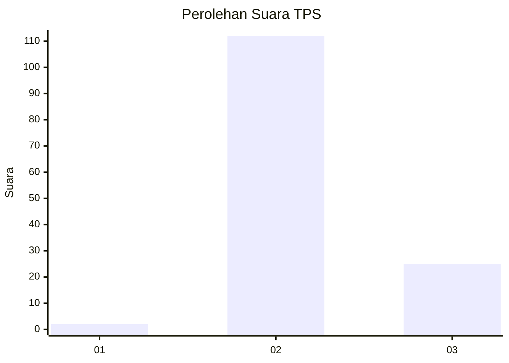
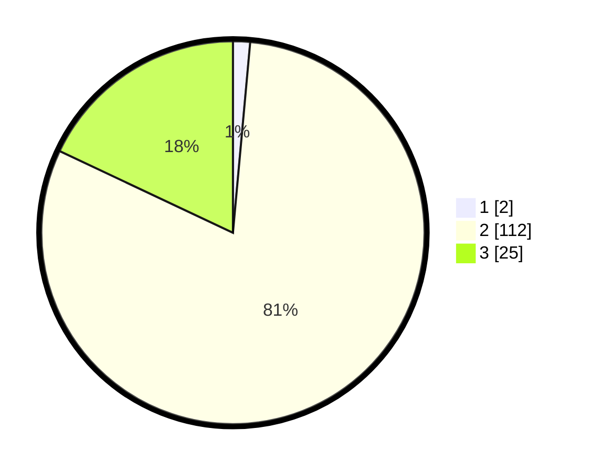

# Hasil

## Grafik

## Tabel

| No. | Nama Paslon    | Suara | Suara (raw) | Persentase |
|:--- |:-------------- | -----:| -----------:| ----------:|
| 1   | ANIES MUHAIMIN | 2     | [2][p-1]    | 1,44       |
| 2   | PRABOWO GIBRAN | 112   | [112][p-2]  | 80,58      |
| 3   | GANJAR MAHFUD  | 25    | [25][p-3]   | 17,99      |

[p-1]: https://github.com/gigit-pemilu/pemilu-2024/blob/main/pilpres/hitung-suara/sub/35-jawa-timur/sub/22-bojonegoro/sub/12-sumberejo/sub/2004-mlinjeng/sub/005-tps/sub/paslon-1.txt
[p-2]: https://github.com/gigit-pemilu/pemilu-2024/blob/main/pilpres/hitung-suara/sub/35-jawa-timur/sub/22-bojonegoro/sub/12-sumberejo/sub/2004-mlinjeng/sub/005-tps/sub/paslon-2.txt
[p-3]: https://github.com/gigit-pemilu/pemilu-2024/blob/main/pilpres/hitung-suara/sub/35-jawa-timur/sub/22-bojonegoro/sub/12-sumberejo/sub/2004-mlinjeng/sub/005-tps/sub/paslon-3.txt

## Foto C Plano

https://sirekap-obj-formc.kpu.go.id/244e/pemilu/ppwp/35/22/12/20/04/3522122004005-20240214-203818--45e9f4ba-f675-4b46-b68d-176dd8e6d117.jpg

https://sirekap-obj-formc.kpu.go.id/244e/pemilu/ppwp/35/22/12/20/04/3522122004005-20240214-203904--a1cf573b-9f30-41a1-bf35-0e865e6c6452.jpg

https://sirekap-obj-formc.kpu.go.id/244e/pemilu/ppwp/35/22/12/20/04/3522122004005-20240214-203953--408e4d53-4dc8-45c4-9f57-b8efccada06e.jpg

## Metadata

| Key        | Value               |
| ---------- | ------------------- |
| Time Stamp | 2024-02-25 13:00:00 |

