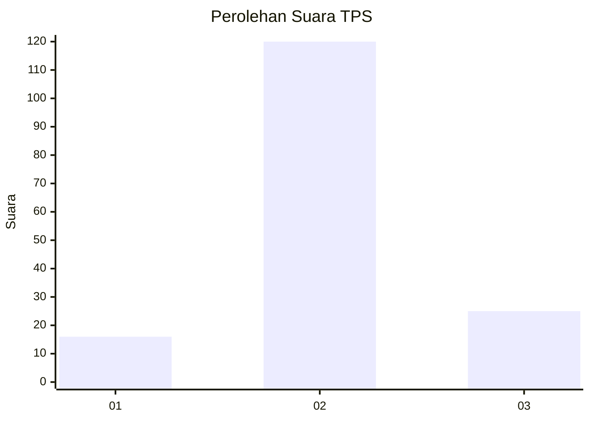
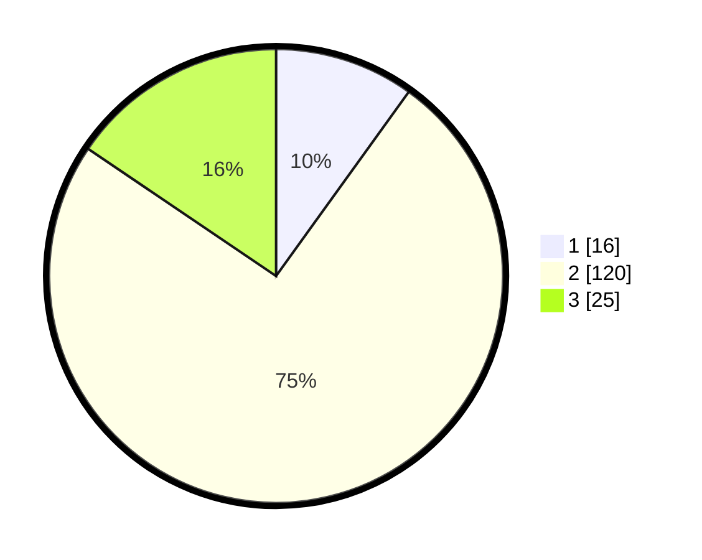

# Hasil

## Grafik

## Tabel

| No. | Nama Paslon    | Suara | Suara (raw) | Persentase |
|:--- |:-------------- | -----:| -----------:| ----------:|
| 1   | ANIES MUHAIMIN | 16    | [16][p-1]   | 9,94       |
| 2   | PRABOWO GIBRAN | 120   | [120][p-2]  | 74,53      |
| 3   | GANJAR MAHFUD  | 25    | [25][p-3]   | 15,53      |

[p-1]: https://github.com/gigit-pemilu/pemilu-2024/blob/main/pilpres/hitung-suara/sub/35-jawa-timur/sub/22-bojonegoro/sub/12-sumberejo/sub/2004-mlinjeng/sub/006-tps/sub/paslon-1.txt
[p-2]: https://github.com/gigit-pemilu/pemilu-2024/blob/main/pilpres/hitung-suara/sub/35-jawa-timur/sub/22-bojonegoro/sub/12-sumberejo/sub/2004-mlinjeng/sub/006-tps/sub/paslon-2.txt
[p-3]: https://github.com/gigit-pemilu/pemilu-2024/blob/main/pilpres/hitung-suara/sub/35-jawa-timur/sub/22-bojonegoro/sub/12-sumberejo/sub/2004-mlinjeng/sub/006-tps/sub/paslon-3.txt

## Foto C Plano

https://sirekap-obj-formc.kpu.go.id/9911/pemilu/ppwp/35/22/12/20/04/3522122004006-20240214-221436--21df6abc-316a-4d79-9a9b-8a901babdb21.jpg

https://sirekap-obj-formc.kpu.go.id/9911/pemilu/ppwp/35/22/12/20/04/3522122004006-20240215-040222--372cf107-427f-48dc-90ec-a0c468e13be4.jpg

https://sirekap-obj-formc.kpu.go.id/9911/pemilu/ppwp/35/22/12/20/04/3522122004006-20240215-040239--beb4a8ed-a92a-4f1f-becd-bd7a286f3f97.jpg

## Metadata

| Key        | Value               |
| ---------- | ------------------- |
| Time Stamp | 2024-02-24 22:31:28 |

