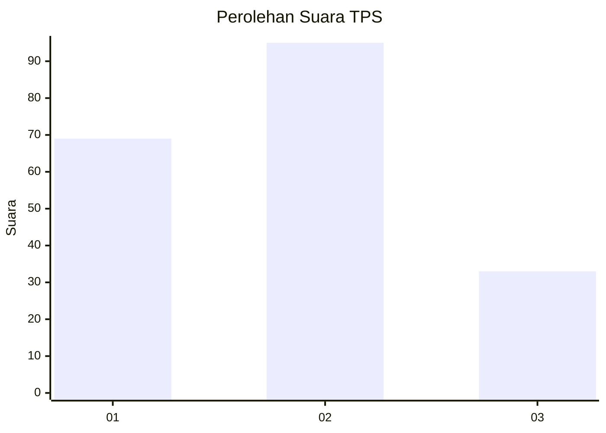
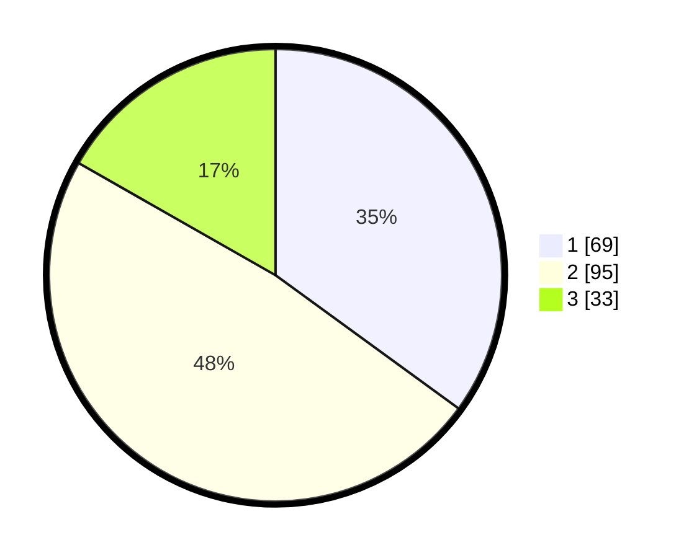

# Hasil

## Grafik

## Tabel

| No. | Nama Paslon    | Suara | Suara (raw) | Persentase |
|:--- |:-------------- | -----:| -----------:| ----------:|
| 1   | ANIES MUHAIMIN | 69    | [69][p-1]   | 35,03      |
| 2   | PRABOWO GIBRAN | 95    | [95][p-2]   | 48,22      |
| 3   | GANJAR MAHFUD  | 33    | [33][p-3]   | 16,75      |

[p-1]: https://github.com/gigit-pemilu/pemilu-2024-35-jawa-timur/blob/main/pilpres/hitung-suara/sub/35-jawa-timur/sub/22-bojonegoro/sub/12-sumberejo/sub/2006-sumberrejo/sub/006-tps/sub/paslon-1.txt
[p-2]: https://github.com/gigit-pemilu/pemilu-2024-35-jawa-timur/blob/main/pilpres/hitung-suara/sub/35-jawa-timur/sub/22-bojonegoro/sub/12-sumberejo/sub/2006-sumberrejo/sub/006-tps/sub/paslon-2.txt
[p-3]: https://github.com/gigit-pemilu/pemilu-2024-35-jawa-timur/blob/main/pilpres/hitung-suara/sub/35-jawa-timur/sub/22-bojonegoro/sub/12-sumberejo/sub/2006-sumberrejo/sub/006-tps/sub/paslon-3.txt

## Foto C Plano

https://sirekap-obj-formc.kpu.go.id/029e/pemilu/ppwp/35/22/12/20/06/3522122006006-20240214-205710--3f7871f3-1ba6-4225-a14a-1b1efa010dad.jpg

https://sirekap-obj-formc.kpu.go.id/029e/pemilu/ppwp/35/22/12/20/06/3522122006006-20240214-205718--f1b2912f-88f1-4354-8847-63acda91f70c.jpg

https://sirekap-obj-formc.kpu.go.id/029e/pemilu/ppwp/35/22/12/20/06/3522122006006-20240214-205727--7a12319c-f8fc-4bab-9f6f-21228f36bc86.jpg

## Metadata

| Key        | Value               |
| ---------- | ------------------- |
| Time Stamp | 2024-02-25 22:00:00 |

