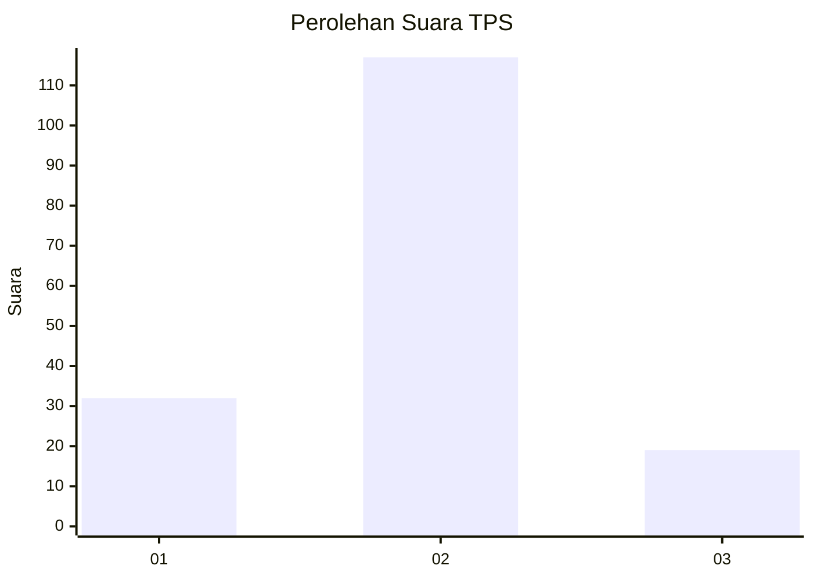
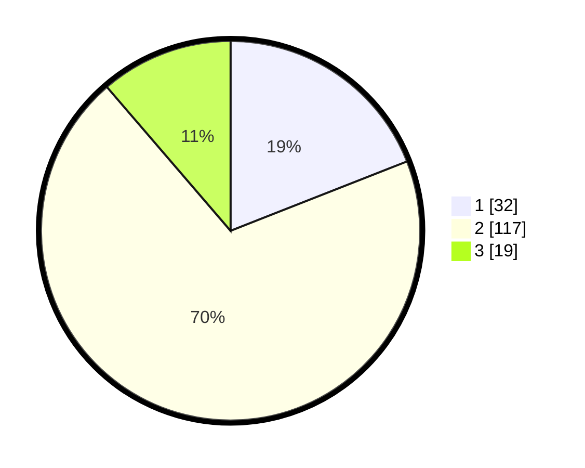

# Hasil

## Grafik

## Tabel

| No. | Nama Paslon    | Suara | Suara (raw) | Persentase |
|:--- |:-------------- | -----:| -----------:| ----------:|
| 1   | ANIES MUHAIMIN | 32    | [32][p-1]   | 19,05      |
| 2   | PRABOWO GIBRAN | 117   | [117][p-2]  | 69,64      |
| 3   | GANJAR MAHFUD  | 19    | [19][p-3]   | 11,31      |

[p-1]: https://github.com/gigit-pemilu/pemilu-2024/blob/main/pilpres/hitung-suara/sub/35-jawa-timur/sub/22-bojonegoro/sub/12-sumberejo/sub/2013-pekuwon/sub/008-tps/sub/paslon-1.txt
[p-2]: https://github.com/gigit-pemilu/pemilu-2024/blob/main/pilpres/hitung-suara/sub/35-jawa-timur/sub/22-bojonegoro/sub/12-sumberejo/sub/2013-pekuwon/sub/008-tps/sub/paslon-2.txt
[p-3]: https://github.com/gigit-pemilu/pemilu-2024/blob/main/pilpres/hitung-suara/sub/35-jawa-timur/sub/22-bojonegoro/sub/12-sumberejo/sub/2013-pekuwon/sub/008-tps/sub/paslon-3.txt

## Foto C Plano

https://sirekap-obj-formc.kpu.go.id/e041/pemilu/ppwp/35/22/12/20/13/3522122013008-20240215-004422--e8879471-997b-4891-9f81-e59e5b20fa12.jpg

https://sirekap-obj-formc.kpu.go.id/e041/pemilu/ppwp/35/22/12/20/13/3522122013008-20240215-004523--65bb386b-5920-467d-8b73-a5d2e5f7419d.jpg

https://sirekap-obj-formc.kpu.go.id/e041/pemilu/ppwp/35/22/12/20/13/3522122013008-20240215-004537--5d6ff74d-1165-4838-a58d-58bcbb1e6777.jpg

## Metadata

| Key        | Value               |
| ---------- | ------------------- |
| Time Stamp | 2024-02-25 12:00:00 |

