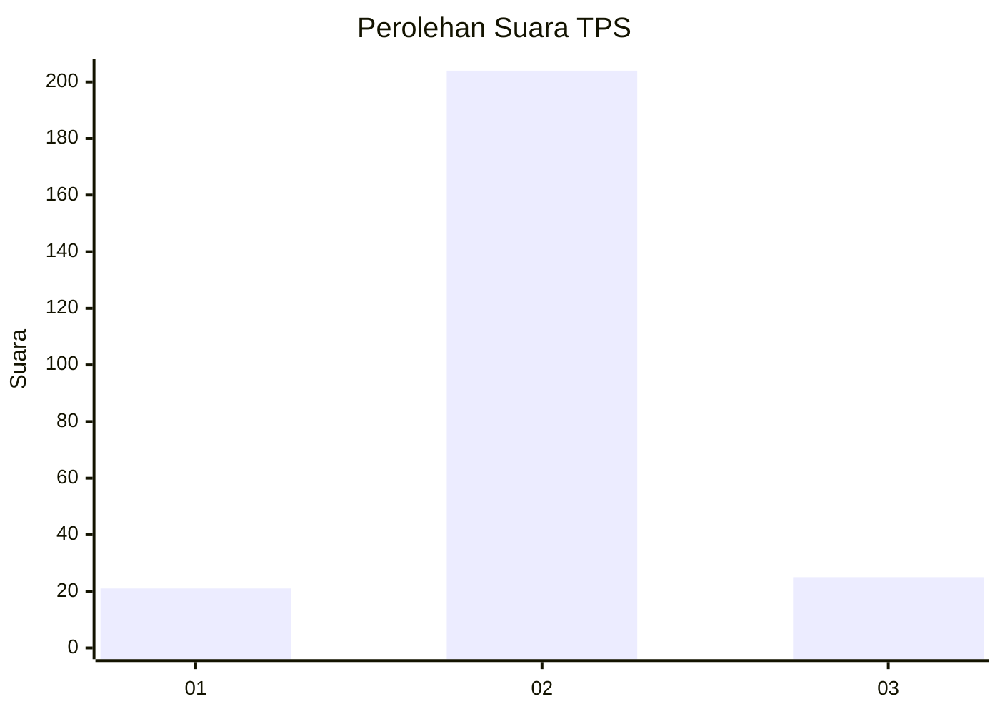
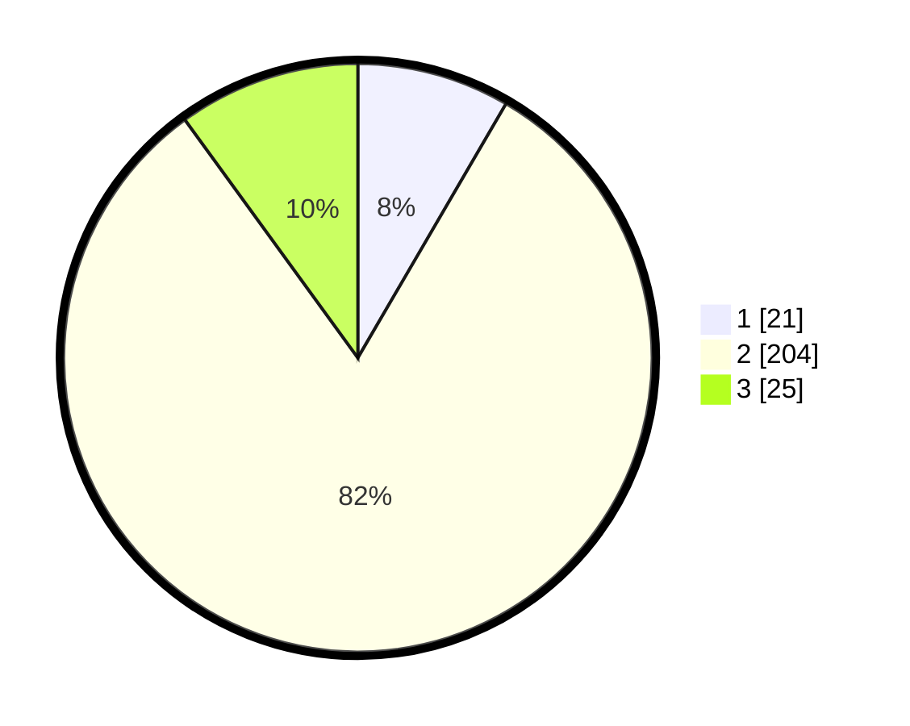

# Hasil

## Grafik

## Tabel

| No. | Nama Paslon    | Suara | Suara (raw) | Persentase |
|:--- |:-------------- | -----:| -----------:| ----------:|
| 1   | ANIES MUHAIMIN | 21    | [21][p-1]   | 8,40       |
| 2   | PRABOWO GIBRAN | 204   | [204][p-2]  | 81,60      |
| 3   | GANJAR MAHFUD  | 25    | [25][p-3]   | 10,00      |

[p-1]: https://github.com/gigit-pemilu/pemilu-2024/blob/main/pilpres/hitung-suara/sub/35-jawa-timur/sub/22-bojonegoro/sub/12-sumberejo/sub/2017-karangdinoyo/sub/001-tps/sub/paslon-1.txt
[p-2]: https://github.com/gigit-pemilu/pemilu-2024/blob/main/pilpres/hitung-suara/sub/35-jawa-timur/sub/22-bojonegoro/sub/12-sumberejo/sub/2017-karangdinoyo/sub/001-tps/sub/paslon-2.txt
[p-3]: https://github.com/gigit-pemilu/pemilu-2024/blob/main/pilpres/hitung-suara/sub/35-jawa-timur/sub/22-bojonegoro/sub/12-sumberejo/sub/2017-karangdinoyo/sub/001-tps/sub/paslon-3.txt

## Foto C Plano

https://sirekap-obj-formc.kpu.go.id/9be6/pemilu/ppwp/35/22/12/20/17/3522122017001-20240215-010054--fc84a85e-ad28-4a3b-afe4-aa9d99a9d8cb.jpg

https://sirekap-obj-formc.kpu.go.id/9be6/pemilu/ppwp/35/22/12/20/17/3522122017001-20240214-212702--c737bfa0-9f87-4e64-84d4-7d1d1b773401.jpg

https://sirekap-obj-formc.kpu.go.id/9be6/pemilu/ppwp/35/22/12/20/17/3522122017001-20240214-203923--5e2dc33d-2b2c-4d7a-8f62-20b1f685a00b.jpg

## Metadata

| Key        | Value               |
| ---------- | ------------------- |
| Time Stamp | 2024-02-15 20:00:44 |

