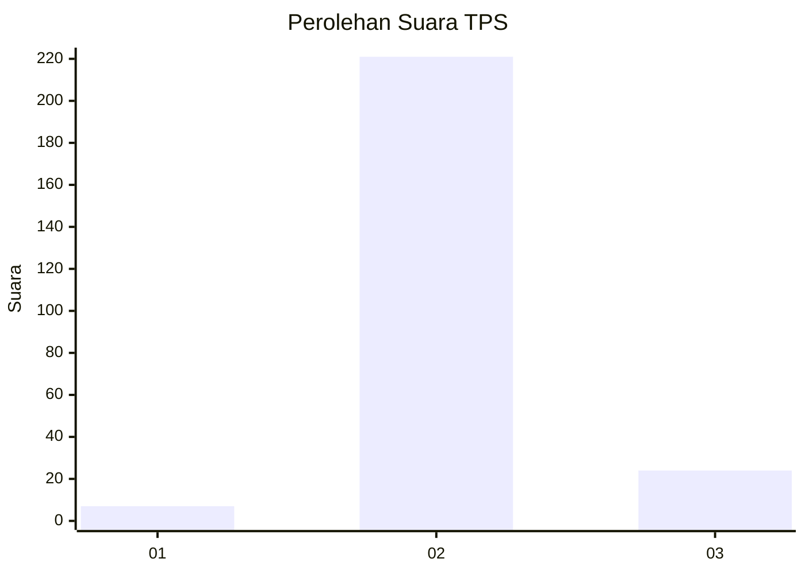
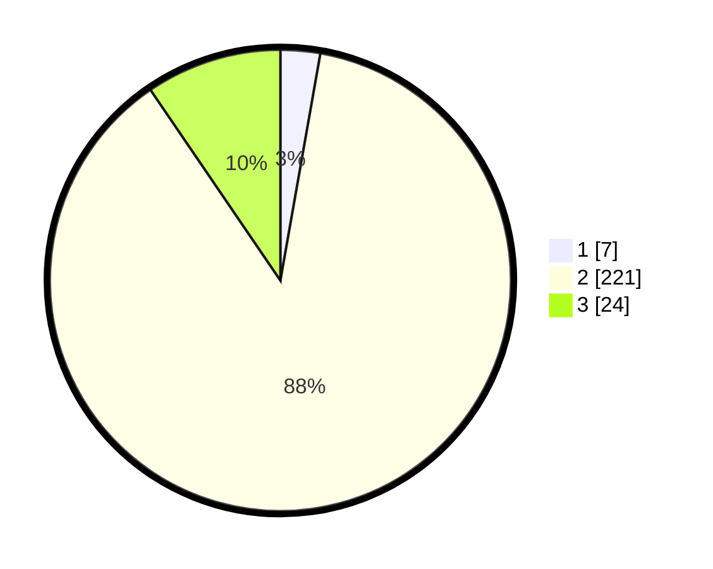

# Hasil

## Grafik

## Tabel

| No. | Nama Paslon    | Suara | Suara (raw) | Persentase |
|:--- |:-------------- | -----:| -----------:| ----------:|
| 1   | ANIES MUHAIMIN | 7     | [7][p-1]    | 2,78       |
| 2   | PRABOWO GIBRAN | 221   | [221][p-2]  | 87,70      |
| 3   | GANJAR MAHFUD  | 24    | [24][p-3]   | 9,52       |

[p-1]: https://github.com/gigit-pemilu/pemilu-2024-35-jawa-timur/blob/main/pilpres/hitung-suara/sub/35-jawa-timur/sub/22-bojonegoro/sub/12-sumberejo/sub/2017-karangdinoyo/sub/004-tps/sub/paslon-1.txt
[p-2]: https://github.com/gigit-pemilu/pemilu-2024-35-jawa-timur/blob/main/pilpres/hitung-suara/sub/35-jawa-timur/sub/22-bojonegoro/sub/12-sumberejo/sub/2017-karangdinoyo/sub/004-tps/sub/paslon-2.txt
[p-3]: https://github.com/gigit-pemilu/pemilu-2024-35-jawa-timur/blob/main/pilpres/hitung-suara/sub/35-jawa-timur/sub/22-bojonegoro/sub/12-sumberejo/sub/2017-karangdinoyo/sub/004-tps/sub/paslon-3.txt

## Foto C Plano

https://sirekap-obj-formc.kpu.go.id/4587/pemilu/ppwp/35/22/12/20/17/3522122017004-20240214-214038--a0726172-0106-457d-8b04-c6829c66707c.jpg

https://sirekap-obj-formc.kpu.go.id/4587/pemilu/ppwp/35/22/12/20/17/3522122017004-20240214-214103--7cca325b-af87-43d7-ba2d-c87134cea246.jpg

https://sirekap-obj-formc.kpu.go.id/4587/pemilu/ppwp/35/22/12/20/17/3522122017004-20240214-214124--1d01ea96-86ff-4f45-9192-c8ce44427aa5.jpg

## Metadata

| Key        | Value               |
| ---------- | ------------------- |
| Time Stamp | 2024-02-24 22:31:28 |

