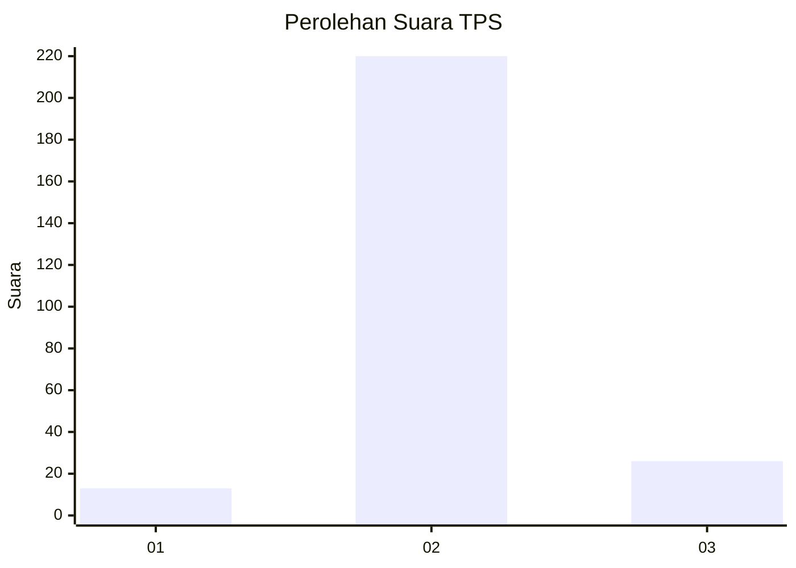
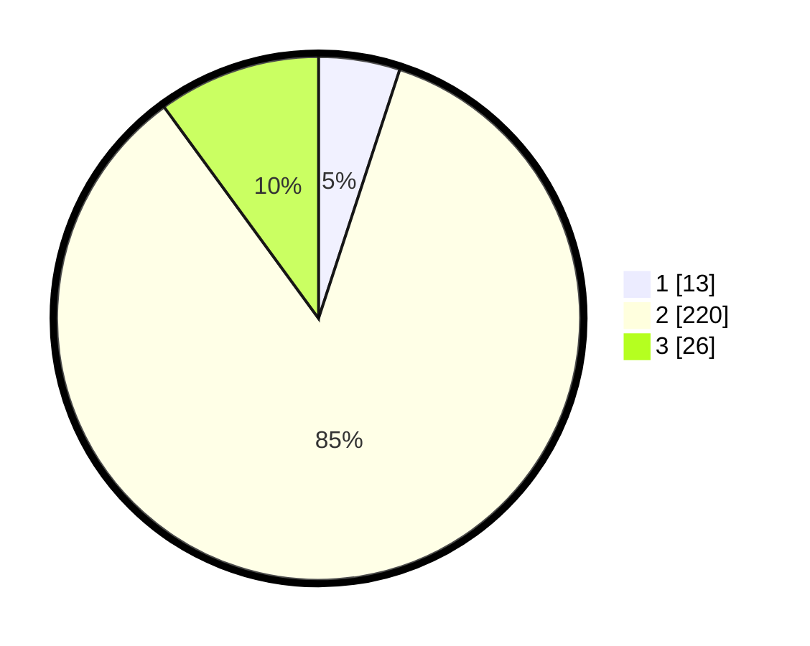

# Hasil

## Grafik

## Tabel

| No. | Nama Paslon    | Suara | Suara (raw) | Persentase |
|:--- |:-------------- | -----:| -----------:| ----------:|
| 1   | ANIES MUHAIMIN | 13    | [13][p-1]   | 5,02       |
| 2   | PRABOWO GIBRAN | 220   | [220][p-2]  | 84,94      |
| 3   | GANJAR MAHFUD  | 26    | [26][p-3]   | 10,04      |

[p-1]: https://github.com/gigit-pemilu/pemilu-2024-35-jawa-timur/blob/main/pilpres/hitung-suara/sub/35-jawa-timur/sub/22-bojonegoro/sub/12-sumberejo/sub/2018-butoh/sub/002-tps/sub/paslon-1.txt
[p-2]: https://github.com/gigit-pemilu/pemilu-2024-35-jawa-timur/blob/main/pilpres/hitung-suara/sub/35-jawa-timur/sub/22-bojonegoro/sub/12-sumberejo/sub/2018-butoh/sub/002-tps/sub/paslon-2.txt
[p-3]: https://github.com/gigit-pemilu/pemilu-2024-35-jawa-timur/blob/main/pilpres/hitung-suara/sub/35-jawa-timur/sub/22-bojonegoro/sub/12-sumberejo/sub/2018-butoh/sub/002-tps/sub/paslon-3.txt

## Foto C Plano

https://sirekap-obj-formc.kpu.go.id/5669/pemilu/ppwp/35/22/12/20/18/3522122018002-20240214-212412--b3cba2c5-c62f-4a75-a2fc-400451f19bfa.jpg

https://sirekap-obj-formc.kpu.go.id/5669/pemilu/ppwp/35/22/12/20/18/3522122018002-20240214-212931--0f079001-8a0f-48dd-b8b7-de65a4782650.jpg

https://sirekap-obj-formc.kpu.go.id/5669/pemilu/ppwp/35/22/12/20/18/3522122018002-20240214-213236--10533609-a2a6-4b43-836d-4b4ce30b6854.jpg

## Metadata

| Key        | Value               |
| ---------- | ------------------- |
| Time Stamp | 2024-02-25 15:00:00 |

