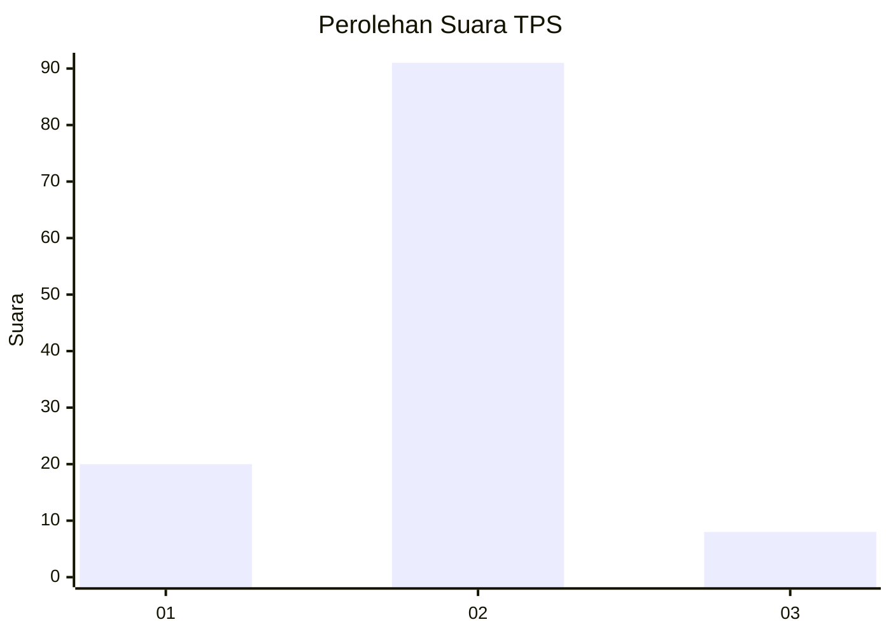
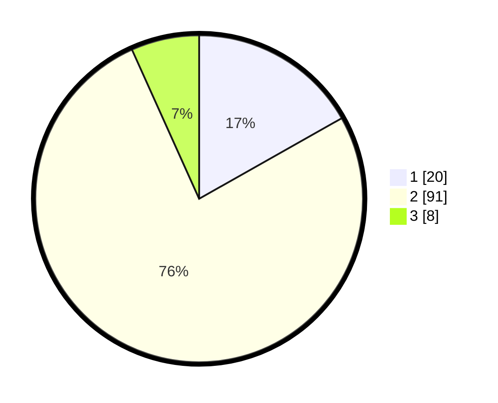

# Hasil

## Grafik

## Tabel

| No. | Nama Paslon    | Suara | Suara (raw) | Persentase |
|:--- |:-------------- | -----:| -----------:| ----------:|
| 1   | ANIES MUHAIMIN | 20    | [20][p-1]   | 16,81      |
| 2   | PRABOWO GIBRAN | 91    | [91][p-2]   | 76,47      |
| 3   | GANJAR MAHFUD  | 8     | [8][p-3]    | 6,72       |

[p-1]: https://github.com/gigit-pemilu/pemilu-2024/blob/main/pilpres/hitung-suara/sub/35-jawa-timur/sub/22-bojonegoro/sub/12-sumberejo/sub/2018-butoh/sub/008-tps/sub/paslon-1.txt
[p-2]: https://github.com/gigit-pemilu/pemilu-2024/blob/main/pilpres/hitung-suara/sub/35-jawa-timur/sub/22-bojonegoro/sub/12-sumberejo/sub/2018-butoh/sub/008-tps/sub/paslon-2.txt
[p-3]: https://github.com/gigit-pemilu/pemilu-2024/blob/main/pilpres/hitung-suara/sub/35-jawa-timur/sub/22-bojonegoro/sub/12-sumberejo/sub/2018-butoh/sub/008-tps/sub/paslon-3.txt

## Foto C Plano

https://sirekap-obj-formc.kpu.go.id/dd41/pemilu/ppwp/35/22/12/20/18/3522122018008-20240215-035911--ba16b1f6-1cdf-4367-910c-ed31aa3930c6.jpg

https://sirekap-obj-formc.kpu.go.id/dd41/pemilu/ppwp/35/22/12/20/18/3522122018008-20240215-040202--6ca3810d-4a3e-434a-9bff-580c3a2bcd05.jpg

https://sirekap-obj-formc.kpu.go.id/dd41/pemilu/ppwp/35/22/12/20/18/3522122018008-20240215-040317--aa43dd54-5240-46c2-947c-1657aa8a60e3.jpg

## Metadata

| Key        | Value               |
| ---------- | ------------------- |
| Time Stamp | 2024-02-25 15:00:00 |

