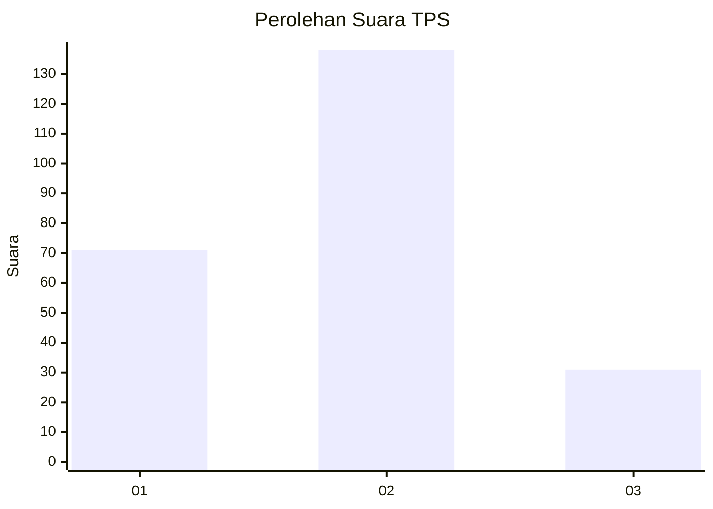
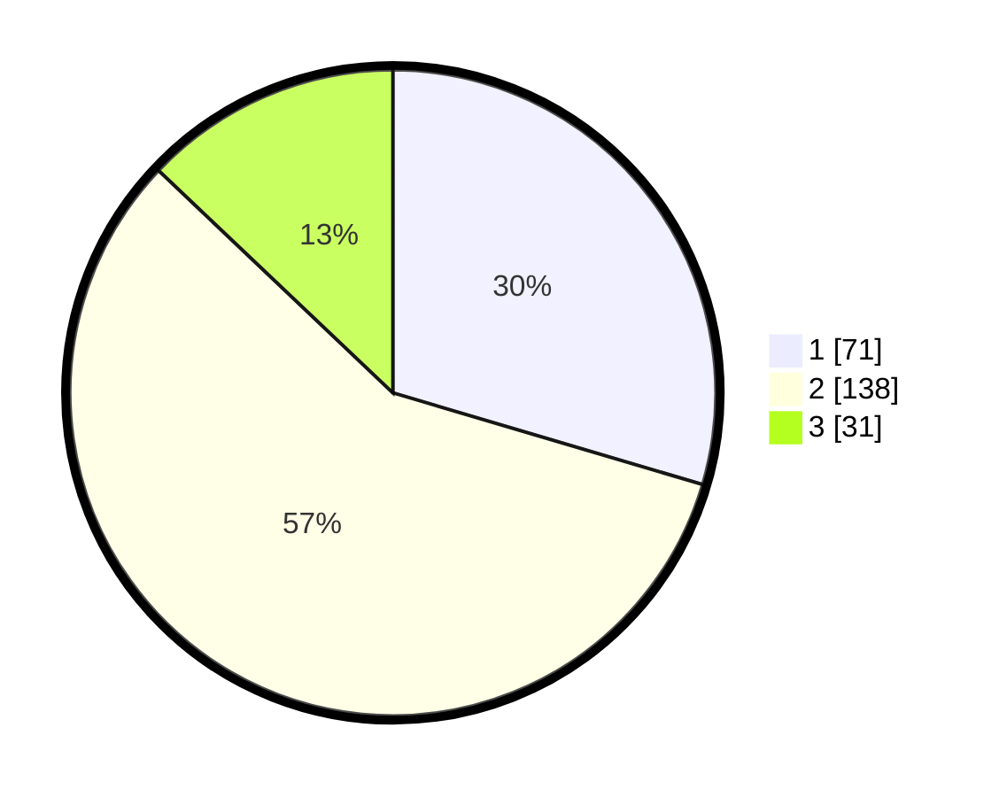

# Hasil

## Grafik

## Tabel

| No. | Nama Paslon    | Suara | Suara (raw) | Persentase |
|:--- |:-------------- | -----:| -----------:| ----------:|
| 1   | ANIES MUHAIMIN | 71    | [71][p-1]   | 29,58      |
| 2   | PRABOWO GIBRAN | 138   | [138][p-2]  | 57,50      |
| 3   | GANJAR MAHFUD  | 31    | [31][p-3]   | 12,92      |

[p-1]: https://github.com/gigit-pemilu/pemilu-2024-35-jawa-timur/blob/main/pilpres/hitung-suara/sub/35-jawa-timur/sub/22-bojonegoro/sub/12-sumberejo/sub/2021-sumuragung/sub/015-tps/sub/paslon-1.txt
[p-2]: https://github.com/gigit-pemilu/pemilu-2024-35-jawa-timur/blob/main/pilpres/hitung-suara/sub/35-jawa-timur/sub/22-bojonegoro/sub/12-sumberejo/sub/2021-sumuragung/sub/015-tps/sub/paslon-2.txt
[p-3]: https://github.com/gigit-pemilu/pemilu-2024-35-jawa-timur/blob/main/pilpres/hitung-suara/sub/35-jawa-timur/sub/22-bojonegoro/sub/12-sumberejo/sub/2021-sumuragung/sub/015-tps/sub/paslon-3.txt

## Foto C Plano

https://sirekap-obj-formc.kpu.go.id/ff40/pemilu/ppwp/35/22/12/20/21/3522122021015-20240215-081210--fc5aca95-122c-4d05-94fb-e61b32703d3b.jpg

https://sirekap-obj-formc.kpu.go.id/ff40/pemilu/ppwp/35/22/12/20/21/3522122021015-20240214-222236--9631a58d-d761-459c-a589-b0422663a1ab.jpg

https://sirekap-obj-formc.kpu.go.id/ff40/pemilu/ppwp/35/22/12/20/21/3522122021015-20240214-222811--f2d97f70-5926-411f-98a6-58fcc1fab0df.jpg

## Metadata

| Key        | Value               |
| ---------- | ------------------- |
| Time Stamp | 2024-02-25 22:00:00 |

