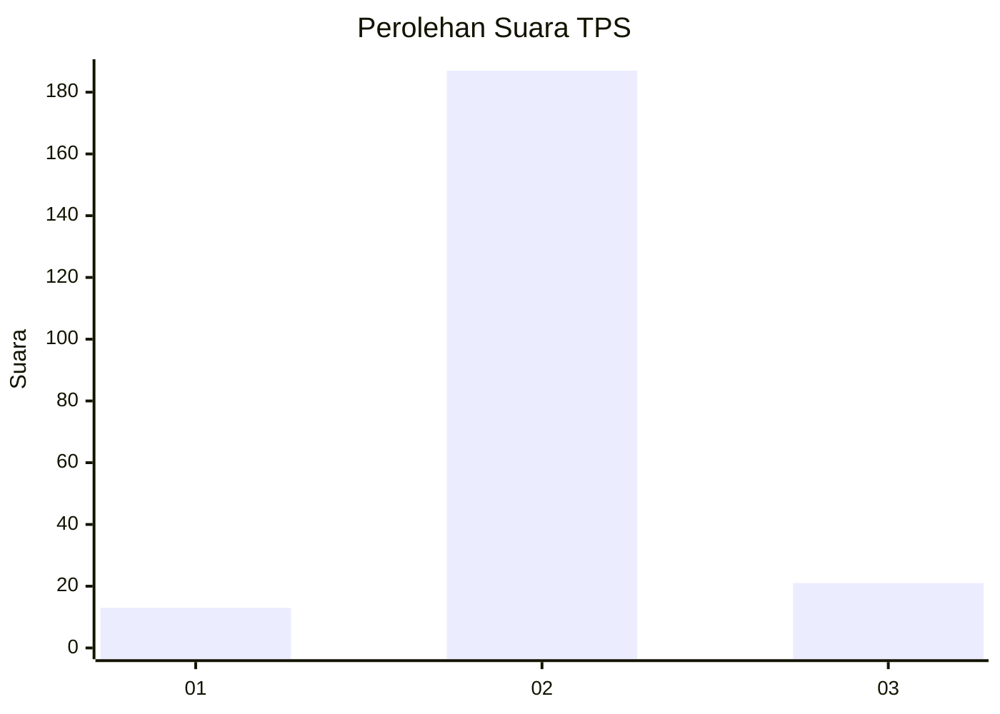
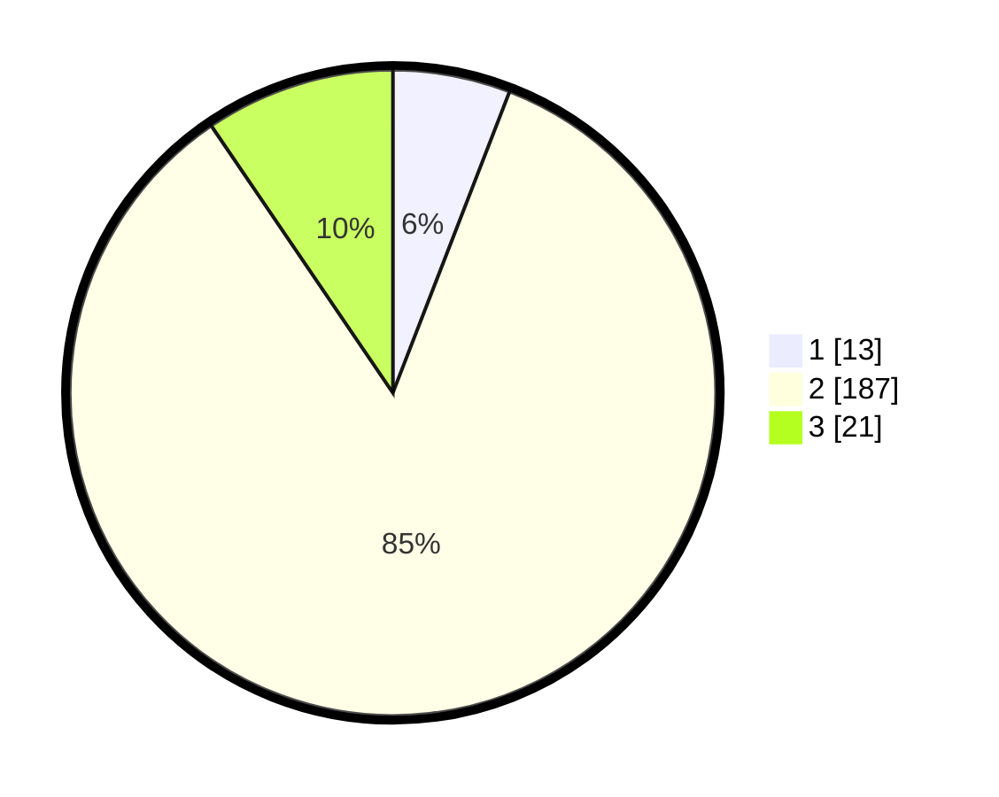

# Hasil

## Grafik

## Tabel

| No. | Nama Paslon    | Suara | Suara (raw) | Persentase |
|:--- |:-------------- | -----:| -----------:| ----------:|
| 1   | ANIES MUHAIMIN | 13    | [13][p-1]   | 5,88       |
| 2   | PRABOWO GIBRAN | 187   | [187][p-2]  | 84,62      |
| 3   | GANJAR MAHFUD  | 21    | [21][p-3]   | 9,50       |

[p-1]: https://github.com/gigit-pemilu/pemilu-2024/blob/main/pilpres/hitung-suara/sub/35-jawa-timur/sub/22-bojonegoro/sub/12-sumberejo/sub/2025-sumberharjo/sub/001-tps/sub/paslon-1.txt
[p-2]: https://github.com/gigit-pemilu/pemilu-2024/blob/main/pilpres/hitung-suara/sub/35-jawa-timur/sub/22-bojonegoro/sub/12-sumberejo/sub/2025-sumberharjo/sub/001-tps/sub/paslon-2.txt
[p-3]: https://github.com/gigit-pemilu/pemilu-2024/blob/main/pilpres/hitung-suara/sub/35-jawa-timur/sub/22-bojonegoro/sub/12-sumberejo/sub/2025-sumberharjo/sub/001-tps/sub/paslon-3.txt

## Foto C Plano

https://sirekap-obj-formc.kpu.go.id/48ab/pemilu/ppwp/35/22/12/20/25/3522122025001-20240214-230407--f4916778-98ee-4460-ae32-40daf94e99d0.jpg

https://sirekap-obj-formc.kpu.go.id/48ab/pemilu/ppwp/35/22/12/20/25/3522122025001-20240214-202840--6ea0c9f6-e3e2-47e5-9959-3ae0cc6d5055.jpg

https://sirekap-obj-formc.kpu.go.id/48ab/pemilu/ppwp/35/22/12/20/25/3522122025001-20240214-211006--b9d21923-456d-417a-a6a6-997c8d580d3f.jpg

## Metadata

| Key        | Value               |
| ---------- | ------------------- |
| Time Stamp | 2024-02-17 16:52:47 |

