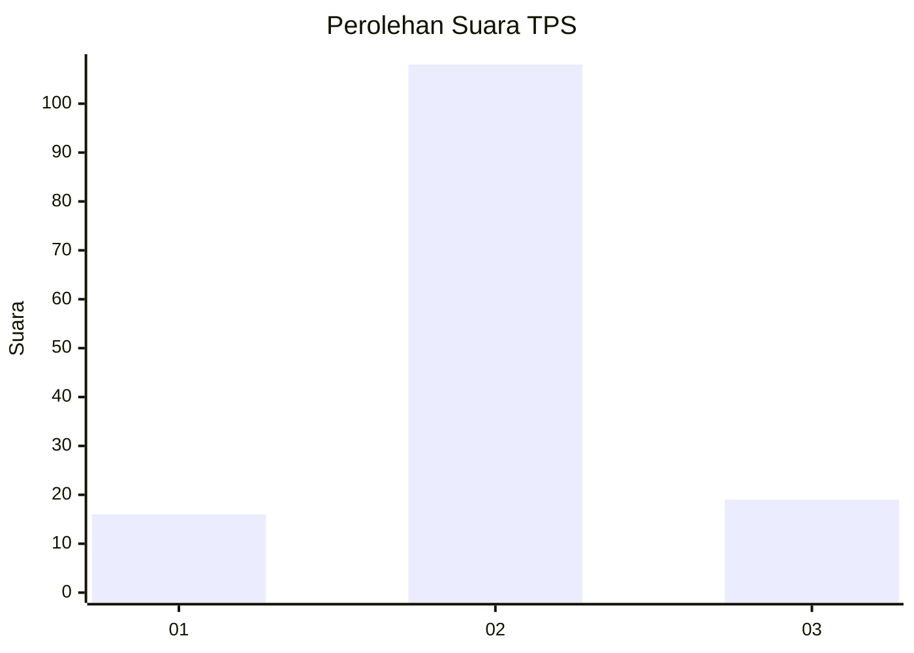
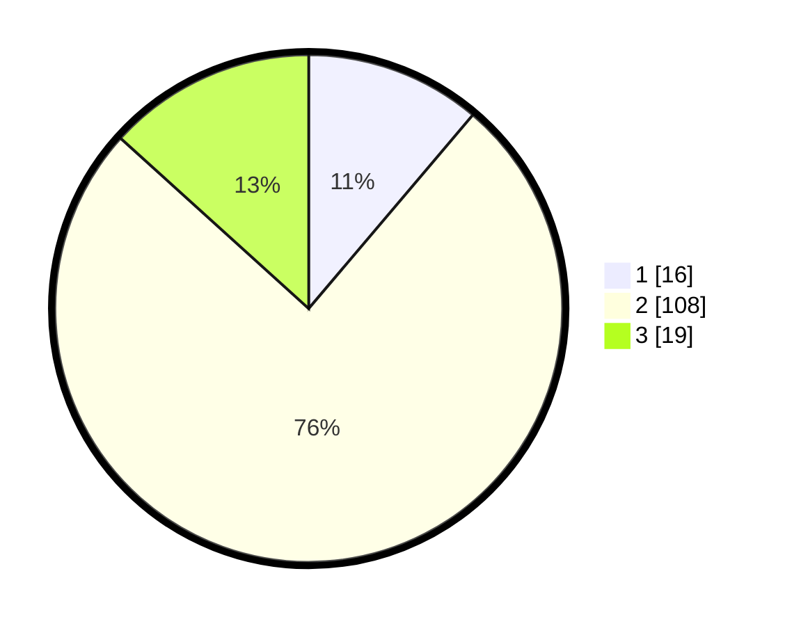

# Hasil

## Grafik

## Tabel

| No. | Nama Paslon    | Suara | Suara (raw) | Persentase |
|:--- |:-------------- | -----:| -----------:| ----------:|
| 1   | ANIES MUHAIMIN | 16    | [16][p-1]   | 11,19      |
| 2   | PRABOWO GIBRAN | 108   | [108][p-2]  | 75,52      |
| 3   | GANJAR MAHFUD  | 19    | [19][p-3]   | 13,29      |

[p-1]: https://github.com/gigit-pemilu/pemilu-2024/blob/main/pilpres/hitung-suara/sub/35-jawa-timur/sub/22-bojonegoro/sub/12-sumberejo/sub/2025-sumberharjo/sub/005-tps/sub/paslon-1.txt
[p-2]: https://github.com/gigit-pemilu/pemilu-2024/blob/main/pilpres/hitung-suara/sub/35-jawa-timur/sub/22-bojonegoro/sub/12-sumberejo/sub/2025-sumberharjo/sub/005-tps/sub/paslon-2.txt
[p-3]: https://github.com/gigit-pemilu/pemilu-2024/blob/main/pilpres/hitung-suara/sub/35-jawa-timur/sub/22-bojonegoro/sub/12-sumberejo/sub/2025-sumberharjo/sub/005-tps/sub/paslon-3.txt

## Foto C Plano

https://sirekap-obj-formc.kpu.go.id/7810/pemilu/ppwp/35/22/12/20/25/3522122025005-20240218-134440--db88588e-129d-4129-96e0-06ad03c1c19a.jpg

https://sirekap-obj-formc.kpu.go.id/7810/pemilu/ppwp/35/22/12/20/25/3522122025005-20240218-134520--69053b41-7212-4b92-8fa8-65d7488d62e4.jpg

https://sirekap-obj-formc.kpu.go.id/7810/pemilu/ppwp/35/22/12/20/25/3522122025005-20240218-134546--94bbcb7a-6c6d-411f-b461-3d0230f4a448.jpg

## Metadata

| Key        | Value               |
| ---------- | ------------------- |
| Time Stamp | 2024-02-24 22:31:28 |

