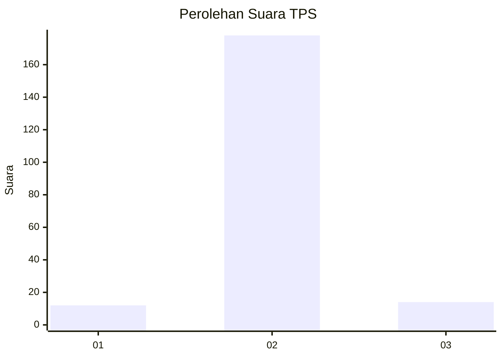
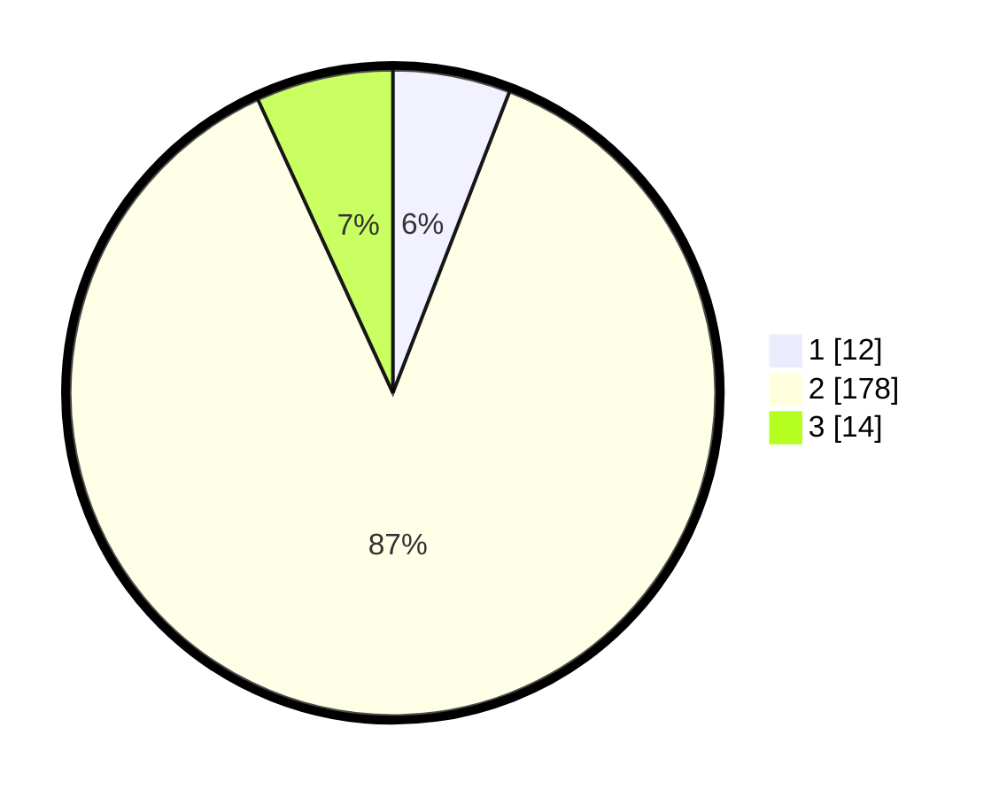

# Hasil

## Grafik

## Tabel

| No. | Nama Paslon    | Suara | Suara (raw) | Persentase |
|:--- |:-------------- | -----:| -----------:| ----------:|
| 1   | ANIES MUHAIMIN | 12    | [12][p-1]   | 5,88       |
| 2   | PRABOWO GIBRAN | 178   | [178][p-2]  | 87,25      |
| 3   | GANJAR MAHFUD  | 14    | [14][p-3]   | 6,86       |

[p-1]: https://github.com/gigit-pemilu/pemilu-2024-35-jawa-timur/blob/main/pilpres/hitung-suara/sub/35-jawa-timur/sub/22-bojonegoro/sub/12-sumberejo/sub/2025-sumberharjo/sub/010-tps/sub/paslon-1.txt
[p-2]: https://github.com/gigit-pemilu/pemilu-2024-35-jawa-timur/blob/main/pilpres/hitung-suara/sub/35-jawa-timur/sub/22-bojonegoro/sub/12-sumberejo/sub/2025-sumberharjo/sub/010-tps/sub/paslon-2.txt
[p-3]: https://github.com/gigit-pemilu/pemilu-2024-35-jawa-timur/blob/main/pilpres/hitung-suara/sub/35-jawa-timur/sub/22-bojonegoro/sub/12-sumberejo/sub/2025-sumberharjo/sub/010-tps/sub/paslon-3.txt

## Foto C Plano

https://sirekap-obj-formc.kpu.go.id/b404/pemilu/ppwp/35/22/12/20/25/3522122025010-20240214-191717--2a22b261-0612-4fbb-bdc2-56658d0535e0.jpg

https://sirekap-obj-formc.kpu.go.id/b404/pemilu/ppwp/35/22/12/20/25/3522122025010-20240218-135048--1049cafb-a652-4bb0-8371-acf46fa8c825.jpg

https://sirekap-obj-formc.kpu.go.id/b404/pemilu/ppwp/35/22/12/20/25/3522122025010-20240214-191303--1cefb7ef-8894-4790-89a2-55020b9a2978.jpg

## Metadata

| Key        | Value               |
| ---------- | ------------------- |
| Time Stamp | 2024-02-21 17:00:00 |

## DATA PEMILIH TETAP

Jumlah pemilih dalam DPT: **265**.
 * L: **148**.
 * P: **224**.

## DATA PENGGUNA HAK PILIH

Jumlah pengguna hak pilih dalam DPT: **203**.
 * L: **97**.
 * P: **276**.

Jumlah pengguna hak pilih dalam DPTb: **888**.
 * L: **888**.
 * P: **888**.

Jumlah pengguna hak pilih dalam DPK: **880**.
 * L: **888**.
 * P: **888**.

Jumlah pengguna hak pilih: **213**.
 * L: **823**.
 * P: **886**.

## JUMLAH SUARA SAH DAN TIDAK SAH

JUMLAH SELURUH SUARA SAH: **204**.

JUMLAH SUARA TIDAK SAH: **9**.

JUMLAH SELURUH SUARA SAH DAN SUARA TIDAK SAH: **213**.

