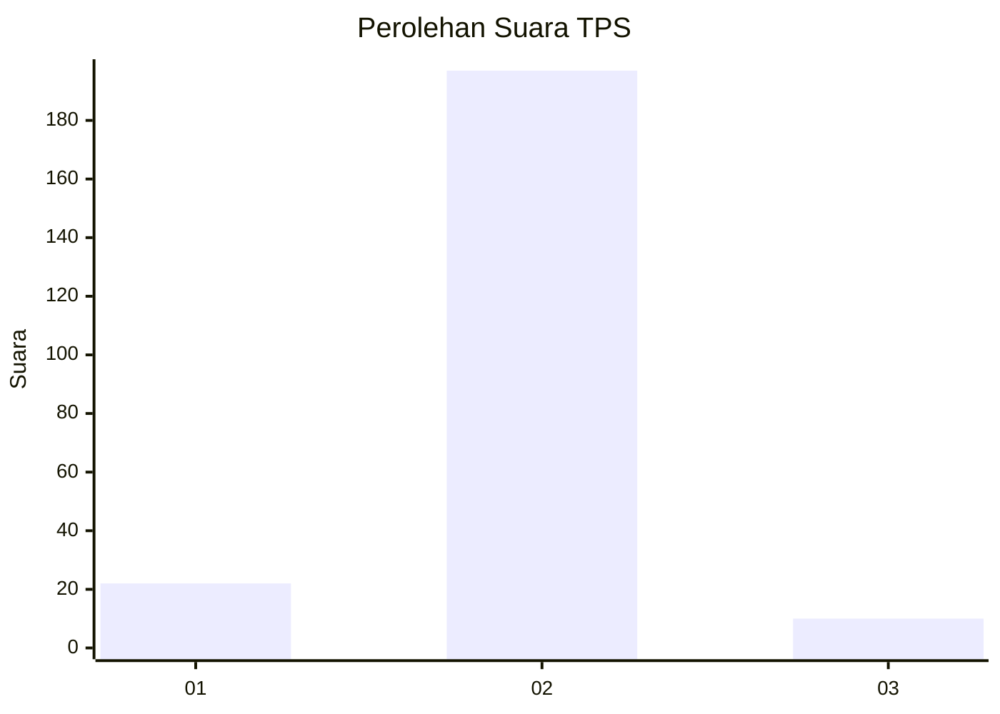
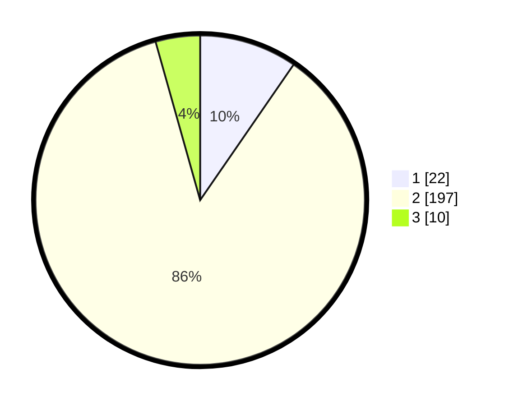

# Hasil

## Grafik

## Tabel

| No. | Nama Paslon    | Suara | Suara (raw) | Persentase |
|:--- |:-------------- | -----:| -----------:| ----------:|
| 1   | ANIES MUHAIMIN | 22    | [22][p-1]   | 9,61       |
| 2   | PRABOWO GIBRAN | 197   | [197][p-2]  | 86,03      |
| 3   | GANJAR MAHFUD  | 10    | [10][p-3]   | 4,37       |

[p-1]: https://github.com/gigit-pemilu/pemilu-2024/blob/main/pilpres/hitung-suara/sub/35-jawa-timur/sub/22-bojonegoro/sub/12-sumberejo/sub/2026-margoagung/sub/003-tps/sub/paslon-1.txt
[p-2]: https://github.com/gigit-pemilu/pemilu-2024/blob/main/pilpres/hitung-suara/sub/35-jawa-timur/sub/22-bojonegoro/sub/12-sumberejo/sub/2026-margoagung/sub/003-tps/sub/paslon-2.txt
[p-3]: https://github.com/gigit-pemilu/pemilu-2024/blob/main/pilpres/hitung-suara/sub/35-jawa-timur/sub/22-bojonegoro/sub/12-sumberejo/sub/2026-margoagung/sub/003-tps/sub/paslon-3.txt

## Foto C Plano

https://sirekap-obj-formc.kpu.go.id/c8ee/pemilu/ppwp/35/22/12/20/26/3522122026003-20240216-001505--6449306c-3ace-433c-b2ee-d787d4663c80.jpg

https://sirekap-obj-formc.kpu.go.id/c8ee/pemilu/ppwp/35/22/12/20/26/3522122026003-20240216-001719--78467bd1-802a-4ead-ac22-adc247eed597.jpg

https://sirekap-obj-formc.kpu.go.id/c8ee/pemilu/ppwp/35/22/12/20/26/3522122026003-20240216-001836--c3a84a1f-b25a-40bc-9a44-cc38a17c7a6d.jpg

## Metadata

| Key        | Value               |
| ---------- | ------------------- |
| Time Stamp | 2024-02-24 23:00:00 |

