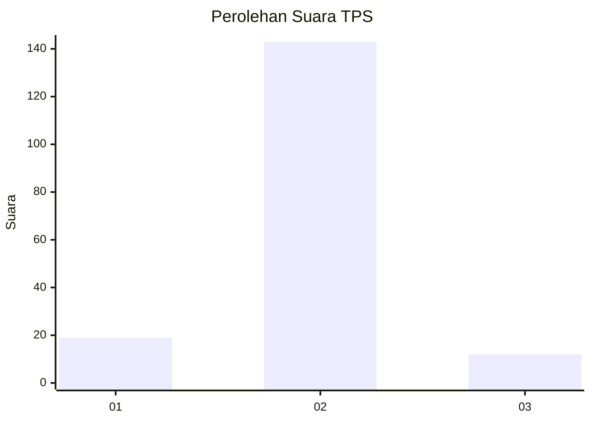
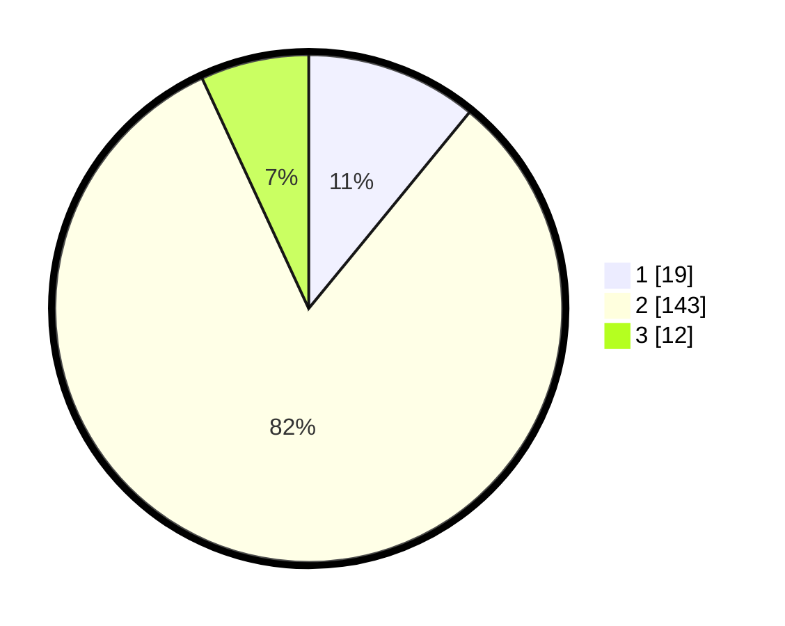

# Hasil

## Grafik

## Tabel

| No. | Nama Paslon    | Suara | Suara (raw) | Persentase |
|:--- |:-------------- | -----:| -----------:| ----------:|
| 1   | ANIES MUHAIMIN | 19    | [19][p-1]   | 10,92      |
| 2   | PRABOWO GIBRAN | 143   | [143][p-2]  | 82,18      |
| 3   | GANJAR MAHFUD  | 12    | [12][p-3]   | 6,90       |

[p-1]: https://github.com/gigit-pemilu/pemilu-2024-35-jawa-timur/blob/main/pilpres/hitung-suara/sub/35-jawa-timur/sub/22-bojonegoro/sub/12-sumberejo/sub/2026-margoagung/sub/004-tps/sub/paslon-1.txt
[p-2]: https://github.com/gigit-pemilu/pemilu-2024-35-jawa-timur/blob/main/pilpres/hitung-suara/sub/35-jawa-timur/sub/22-bojonegoro/sub/12-sumberejo/sub/2026-margoagung/sub/004-tps/sub/paslon-2.txt
[p-3]: https://github.com/gigit-pemilu/pemilu-2024-35-jawa-timur/blob/main/pilpres/hitung-suara/sub/35-jawa-timur/sub/22-bojonegoro/sub/12-sumberejo/sub/2026-margoagung/sub/004-tps/sub/paslon-3.txt

## Foto C Plano

https://sirekap-obj-formc.kpu.go.id/3455/pemilu/ppwp/35/22/12/20/26/3522122026004-20240216-002032--2ee871ff-f257-4f38-9d5e-02ff6a9b352b.jpg

https://sirekap-obj-formc.kpu.go.id/3455/pemilu/ppwp/35/22/12/20/26/3522122026004-20240216-002202--fd5cd050-2f66-462f-9558-3ff9e9001fc8.jpg

https://sirekap-obj-formc.kpu.go.id/3455/pemilu/ppwp/35/22/12/20/26/3522122026004-20240216-002244--2d7daa7e-b351-4aed-9355-e37c9286ef69.jpg

## Metadata

| Key        | Value               |
| ---------- | ------------------- |
| Time Stamp | 2024-02-25 15:00:00 |

