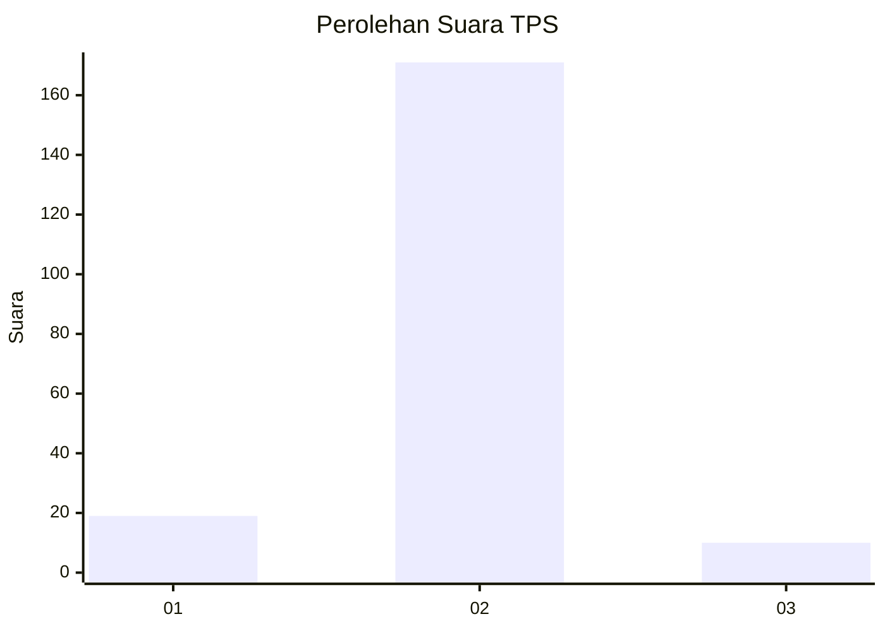
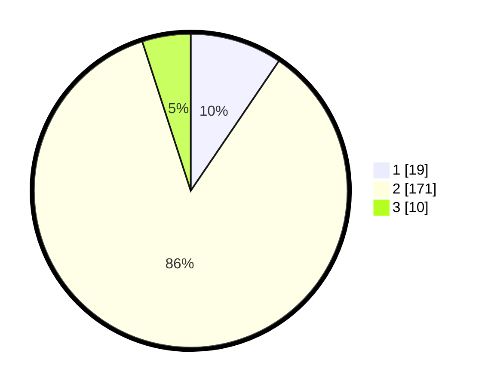

# Hasil

## Grafik

## Tabel

| No. | Nama Paslon    | Suara | Suara (raw) | Persentase |
|:--- |:-------------- | -----:| -----------:| ----------:|
| 1   | ANIES MUHAIMIN | 19    | [19][p-1]   | 9,50       |
| 2   | PRABOWO GIBRAN | 171   | [171][p-2]  | 85,50      |
| 3   | GANJAR MAHFUD  | 10    | [10][p-3]   | 5,00       |

[p-1]: https://github.com/gigit-pemilu/pemilu-2024/blob/main/pilpres/hitung-suara/sub/35-jawa-timur/sub/22-bojonegoro/sub/12-sumberejo/sub/2026-margoagung/sub/007-tps/sub/paslon-1.txt
[p-2]: https://github.com/gigit-pemilu/pemilu-2024/blob/main/pilpres/hitung-suara/sub/35-jawa-timur/sub/22-bojonegoro/sub/12-sumberejo/sub/2026-margoagung/sub/007-tps/sub/paslon-2.txt
[p-3]: https://github.com/gigit-pemilu/pemilu-2024/blob/main/pilpres/hitung-suara/sub/35-jawa-timur/sub/22-bojonegoro/sub/12-sumberejo/sub/2026-margoagung/sub/007-tps/sub/paslon-3.txt

## Foto C Plano

https://sirekap-obj-formc.kpu.go.id/cc6e/pemilu/ppwp/35/22/12/20/26/3522122026007-20240216-000427--9948888d-2475-4049-9cc1-e981e05ddeae.jpg

https://sirekap-obj-formc.kpu.go.id/cc6e/pemilu/ppwp/35/22/12/20/26/3522122026007-20240216-000540--a29d726d-09b6-4549-8140-9fff3aec789a.jpg

https://sirekap-obj-formc.kpu.go.id/cc6e/pemilu/ppwp/35/22/12/20/26/3522122026007-20240216-000656--df58222d-7320-4e14-8e6c-2ce35fc6cf17.jpg

## Metadata

| Key        | Value               |
| ---------- | ------------------- |
| Time Stamp | 2024-02-24 22:31:28 |

