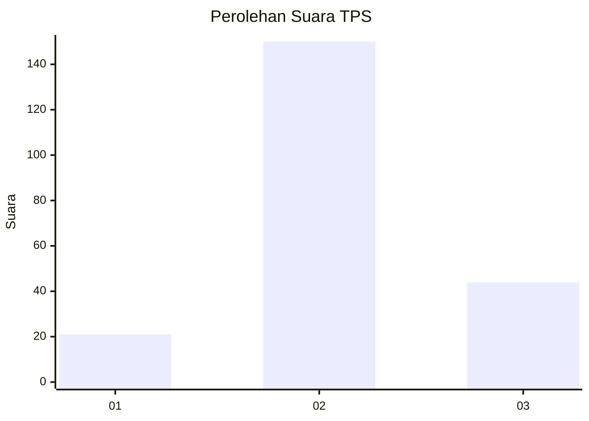
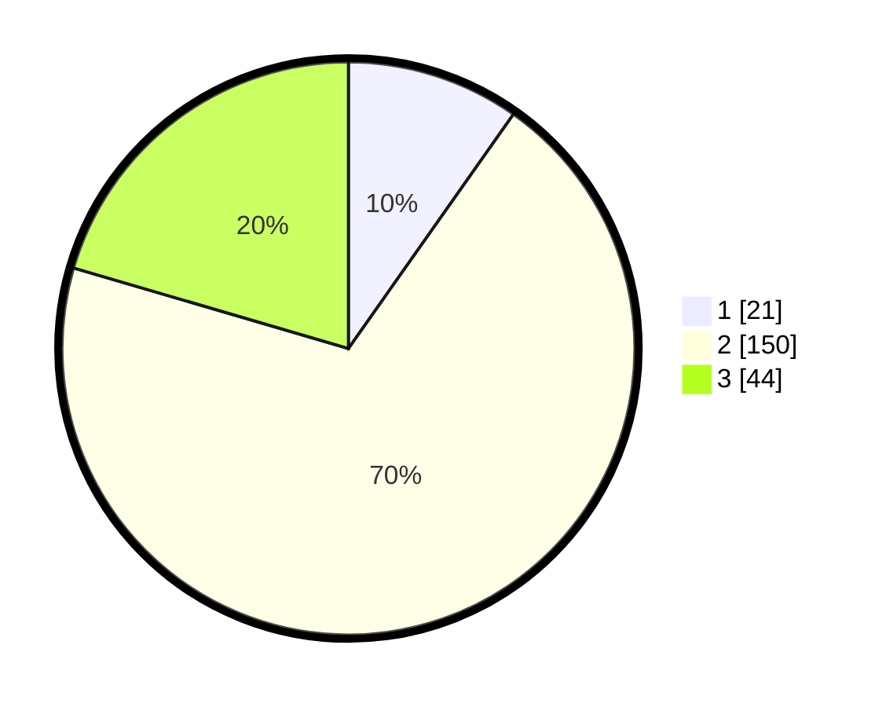

# Hasil

## Grafik

## Tabel

| No. | Nama Paslon    | Suara | Suara (raw) | Persentase |
|:--- |:-------------- | -----:| -----------:| ----------:|
| 1   | ANIES MUHAIMIN | 21    | [21][p-1]   | 9,77       |
| 2   | PRABOWO GIBRAN | 150   | [150][p-2]  | 69,77      |
| 3   | GANJAR MAHFUD  | 44    | [44][p-3]   | 20,47      |

[p-1]: https://github.com/gigit-pemilu/pemilu-2024-35-jawa-timur/blob/main/pilpres/hitung-suara/sub/35-jawa-timur/sub/22-bojonegoro/sub/13-balen/sub/2001-sidobandung/sub/005-tps/sub/paslon-1.txt
[p-2]: https://github.com/gigit-pemilu/pemilu-2024-35-jawa-timur/blob/main/pilpres/hitung-suara/sub/35-jawa-timur/sub/22-bojonegoro/sub/13-balen/sub/2001-sidobandung/sub/005-tps/sub/paslon-2.txt
[p-3]: https://github.com/gigit-pemilu/pemilu-2024-35-jawa-timur/blob/main/pilpres/hitung-suara/sub/35-jawa-timur/sub/22-bojonegoro/sub/13-balen/sub/2001-sidobandung/sub/005-tps/sub/paslon-3.txt

## Foto C Plano

https://sirekap-obj-formc.kpu.go.id/7805/pemilu/ppwp/35/22/13/20/01/3522132001005-20240214-141530--74b854b8-53d8-4d7c-92e3-32772f386309.jpg

https://sirekap-obj-formc.kpu.go.id/7805/pemilu/ppwp/35/22/13/20/01/3522132001005-20240214-141615--e658c66d-345d-4269-a232-5ef825e7db09.jpg

https://sirekap-obj-formc.kpu.go.id/7805/pemilu/ppwp/35/22/13/20/01/3522132001005-20240214-235437--a33191a6-7b98-4ac9-9bbc-dcc02667c3d0.jpg

## Metadata

| Key        | Value               |
| ---------- | ------------------- |
| Time Stamp | 2024-02-15 05:00:24 |

