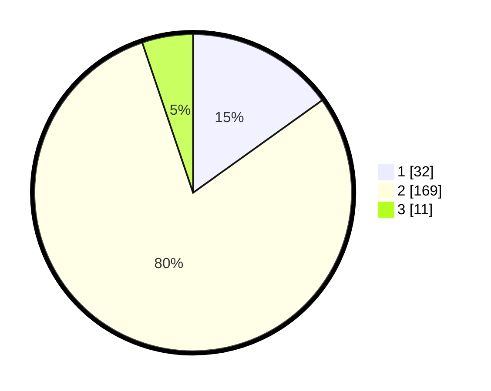

# Hasil

## Grafik

## Tabel

| No. | Nama Paslon    | Suara | Suara (raw) | Persentase |
|:--- |:-------------- | -----:| -----------:| ----------:|
| 1   | ANIES MUHAIMIN | 32    | [32][p-1]   | 15,09      |
| 2   | PRABOWO GIBRAN | 169   | [169][p-2]  | 79,72      |
| 3   | GANJAR MAHFUD  | 11    | [11][p-3]   | 5,19       |

[p-1]: https://github.com/gigit-pemilu/pemilu-2024/blob/main/pilpres/hitung-suara/sub/35-jawa-timur/sub/22-bojonegoro/sub/13-balen/sub/2003-kenep/sub/005-tps/sub/paslon-1.txt
[p-2]: https://github.com/gigit-pemilu/pemilu-2024/blob/main/pilpres/hitung-suara/sub/35-jawa-timur/sub/22-bojonegoro/sub/13-balen/sub/2003-kenep/sub/005-tps/sub/paslon-2.txt
[p-3]: https://github.com/gigit-pemilu/pemilu-2024/blob/main/pilpres/hitung-suara/sub/35-jawa-timur/sub/22-bojonegoro/sub/13-balen/sub/2003-kenep/sub/005-tps/sub/paslon-3.txt

## Foto C Plano

https://sirekap-obj-formc.kpu.go.id/7b6c/pemilu/ppwp/35/22/13/20/03/3522132003005-20240215-004604--a32fdade-ec63-4e33-8a08-ba743d669ba7.jpg

https://sirekap-obj-formc.kpu.go.id/7b6c/pemilu/ppwp/35/22/13/20/03/3522132003005-20240215-004712--dfb8ba78-1ea2-4d56-883f-27c2a1ca858e.jpg

https://sirekap-obj-formc.kpu.go.id/7b6c/pemilu/ppwp/35/22/13/20/03/3522132003005-20240215-004813--11308c2d-d5c0-41bb-8cc1-4ab1e2df2812.jpg

## Metadata

| Key        | Value               |
| ---------- | ------------------- |
| Time Stamp | 2024-02-19 19:00:00 |

