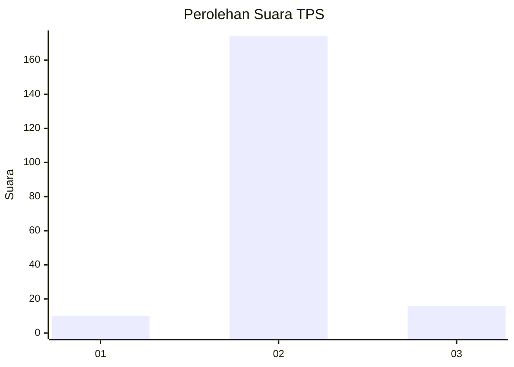
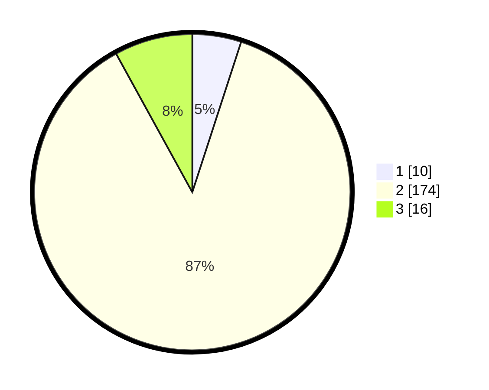

# Hasil

## Grafik

## Tabel

| No. | Nama Paslon    | Suara | Suara (raw) | Persentase |
|:--- |:-------------- | -----:| -----------:| ----------:|
| 1   | ANIES MUHAIMIN | 10    | [10][p-1]   | 5,00       |
| 2   | PRABOWO GIBRAN | 174   | [174][p-2]  | 87,00      |
| 3   | GANJAR MAHFUD  | 16    | [16][p-3]   | 8,00       |

[p-1]: https://github.com/gigit-pemilu/pemilu-2024-35-jawa-timur/blob/main/pilpres/hitung-suara/sub/35-jawa-timur/sub/22-bojonegoro/sub/13-balen/sub/2004-pohbogo/sub/002-tps/sub/paslon-1.txt
[p-2]: https://github.com/gigit-pemilu/pemilu-2024-35-jawa-timur/blob/main/pilpres/hitung-suara/sub/35-jawa-timur/sub/22-bojonegoro/sub/13-balen/sub/2004-pohbogo/sub/002-tps/sub/paslon-2.txt
[p-3]: https://github.com/gigit-pemilu/pemilu-2024-35-jawa-timur/blob/main/pilpres/hitung-suara/sub/35-jawa-timur/sub/22-bojonegoro/sub/13-balen/sub/2004-pohbogo/sub/002-tps/sub/paslon-3.txt

## Foto C Plano

https://sirekap-obj-formc.kpu.go.id/4630/pemilu/ppwp/35/22/13/20/04/3522132004002-20240215-022012--ccdd5100-071c-4999-a031-6d722f9cbb58.jpg

https://sirekap-obj-formc.kpu.go.id/4630/pemilu/ppwp/35/22/13/20/04/3522132004002-20240215-022153--f64e500b-8319-4cff-bcbc-890d791e073b.jpg

https://sirekap-obj-formc.kpu.go.id/4630/pemilu/ppwp/35/22/13/20/04/3522132004002-20240215-022322--e8e91fd1-cb16-4d85-b609-9a087cedc64c.jpg

## Metadata

| Key        | Value               |
| ---------- | ------------------- |
| Time Stamp | 2024-02-15 15:00:29 |

