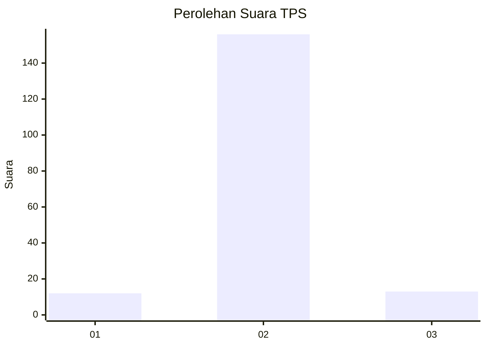
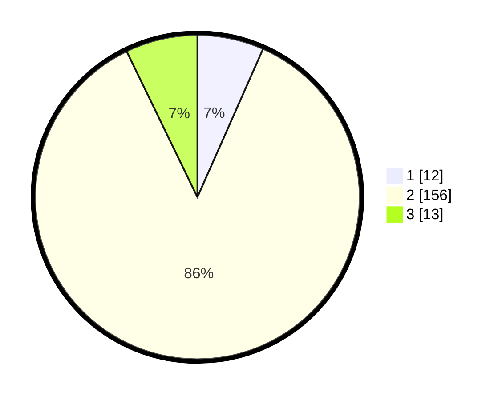

# Hasil

## Grafik

## Tabel

| No. | Nama Paslon    | Suara | Suara (raw) | Persentase |
|:--- |:-------------- | -----:| -----------:| ----------:|
| 1   | ANIES MUHAIMIN | 12    | [12][p-1]   | 6,63       |
| 2   | PRABOWO GIBRAN | 156   | [156][p-2]  | 86,19      |
| 3   | GANJAR MAHFUD  | 13    | [13][p-3]   | 7,18       |

[p-1]: https://github.com/gigit-pemilu/pemilu-2024/blob/main/pilpres/hitung-suara/sub/35-jawa-timur/sub/22-bojonegoro/sub/13-balen/sub/2004-pohbogo/sub/005-tps/sub/paslon-1.txt
[p-2]: https://github.com/gigit-pemilu/pemilu-2024/blob/main/pilpres/hitung-suara/sub/35-jawa-timur/sub/22-bojonegoro/sub/13-balen/sub/2004-pohbogo/sub/005-tps/sub/paslon-2.txt
[p-3]: https://github.com/gigit-pemilu/pemilu-2024/blob/main/pilpres/hitung-suara/sub/35-jawa-timur/sub/22-bojonegoro/sub/13-balen/sub/2004-pohbogo/sub/005-tps/sub/paslon-3.txt

## Foto C Plano

https://sirekap-obj-formc.kpu.go.id/1ca6/pemilu/ppwp/35/22/13/20/04/3522132004005-20240215-042015--075811f0-6edc-489e-a0b8-5b120ed4a86e.jpg

https://sirekap-obj-formc.kpu.go.id/1ca6/pemilu/ppwp/35/22/13/20/04/3522132004005-20240214-224028--9d2267d4-d7a3-4b14-9ad8-0ef94601aeed.jpg

https://sirekap-obj-formc.kpu.go.id/1ca6/pemilu/ppwp/35/22/13/20/04/3522132004005-20240214-224114--edc92c2c-5afd-4c8d-91c8-a2ea22d41afe.jpg

## Metadata

| Key        | Value               |
| ---------- | ------------------- |
| Time Stamp | 2024-02-15 22:00:27 |

