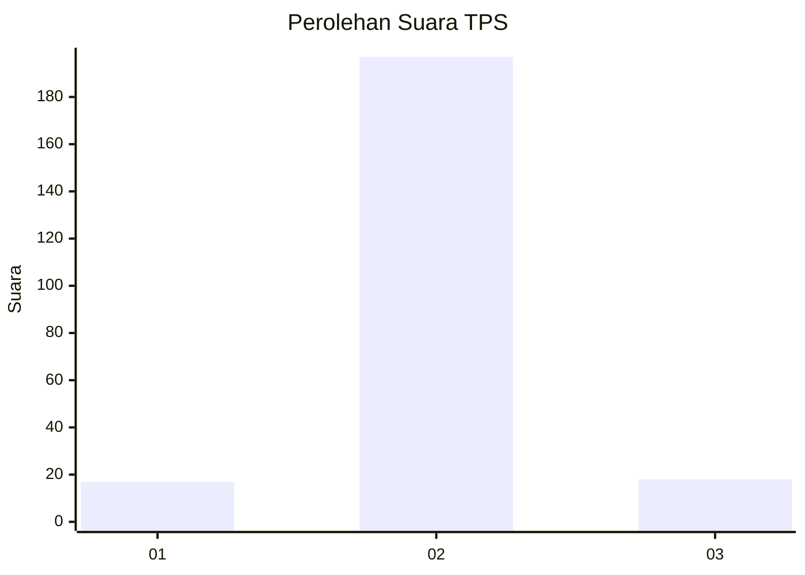
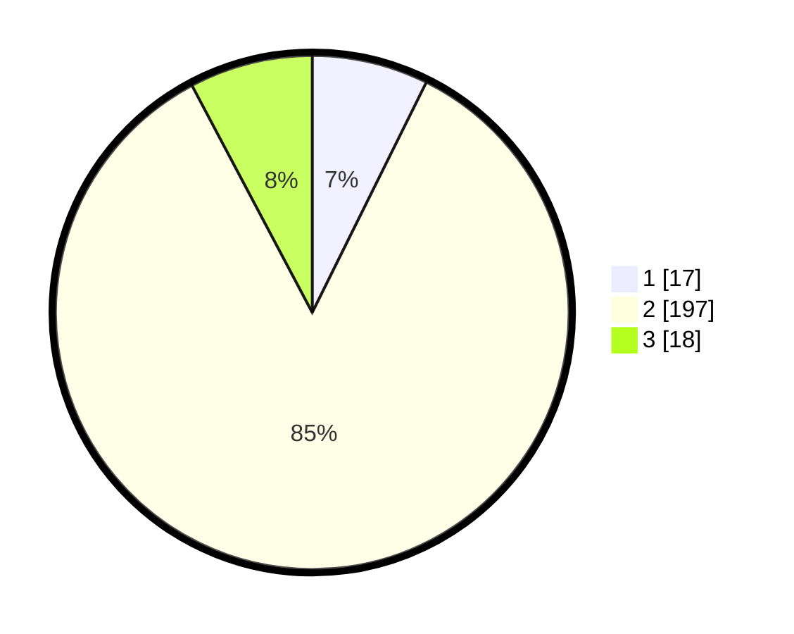

# Hasil

## Grafik

## Tabel

| No. | Nama Paslon    | Suara | Suara (raw) | Persentase |
|:--- |:-------------- | -----:| -----------:| ----------:|
| 1   | ANIES MUHAIMIN | 17    | [17][p-1]   | 7,33       |
| 2   | PRABOWO GIBRAN | 197   | [197][p-2]  | 84,91      |
| 3   | GANJAR MAHFUD  | 18    | [18][p-3]   | 7,76       |

[p-1]: https://github.com/gigit-pemilu/pemilu-2024/blob/main/pilpres/hitung-suara/sub/35-jawa-timur/sub/22-bojonegoro/sub/13-balen/sub/2011-sobontoro/sub/003-tps/sub/paslon-1.txt
[p-2]: https://github.com/gigit-pemilu/pemilu-2024/blob/main/pilpres/hitung-suara/sub/35-jawa-timur/sub/22-bojonegoro/sub/13-balen/sub/2011-sobontoro/sub/003-tps/sub/paslon-2.txt
[p-3]: https://github.com/gigit-pemilu/pemilu-2024/blob/main/pilpres/hitung-suara/sub/35-jawa-timur/sub/22-bojonegoro/sub/13-balen/sub/2011-sobontoro/sub/003-tps/sub/paslon-3.txt

## Foto C Plano

https://sirekap-obj-formc.kpu.go.id/0edf/pemilu/ppwp/35/22/13/20/11/3522132011003-20240215-123543--937e1272-93c8-4fa4-9797-8138366317a9.jpg

https://sirekap-obj-formc.kpu.go.id/0edf/pemilu/ppwp/35/22/13/20/11/3522132011003-20240215-123621--f4268919-9352-4f59-87fe-5c7de394c92a.jpg

https://sirekap-obj-formc.kpu.go.id/0edf/pemilu/ppwp/35/22/13/20/11/3522132011003-20240215-123715--cf9f5722-904f-4eef-91d0-8878cc57733e.jpg

## Metadata

| Key        | Value               |
| ---------- | ------------------- |
| Time Stamp | 2024-02-20 00:00:00 |

