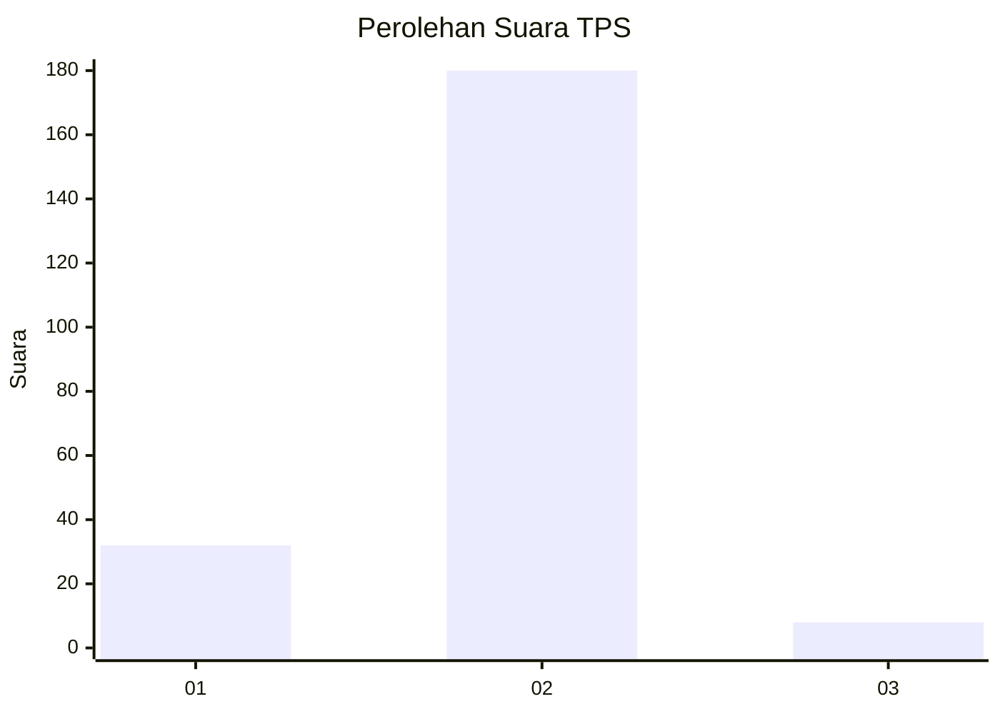
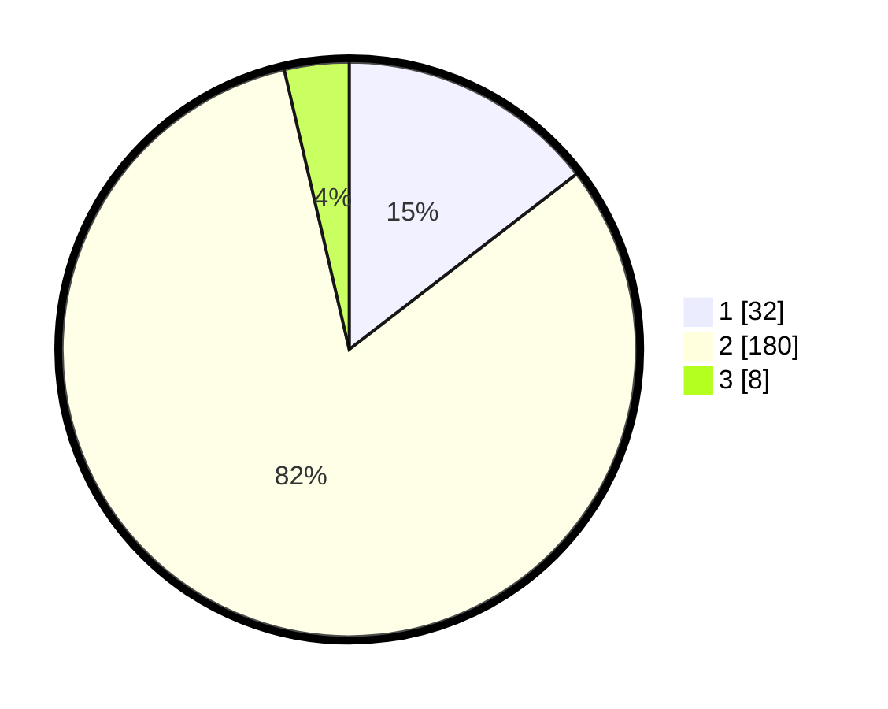

# Hasil

## Grafik

## Tabel

| No. | Nama Paslon    | Suara | Suara (raw) | Persentase |
|:--- |:-------------- | -----:| -----------:| ----------:|
| 1   | ANIES MUHAIMIN | 32    | [32][p-1]   | 14,55      |
| 2   | PRABOWO GIBRAN | 180   | [180][p-2]  | 81,82      |
| 3   | GANJAR MAHFUD  | 8     | [8][p-3]    | 3,64       |

[p-1]: https://github.com/gigit-pemilu/pemilu-2024/blob/main/pilpres/hitung-suara/sub/35-jawa-timur/sub/22-bojonegoro/sub/13-balen/sub/2020-kedungbondo/sub/002-tps/sub/paslon-1.txt
[p-2]: https://github.com/gigit-pemilu/pemilu-2024/blob/main/pilpres/hitung-suara/sub/35-jawa-timur/sub/22-bojonegoro/sub/13-balen/sub/2020-kedungbondo/sub/002-tps/sub/paslon-2.txt
[p-3]: https://github.com/gigit-pemilu/pemilu-2024/blob/main/pilpres/hitung-suara/sub/35-jawa-timur/sub/22-bojonegoro/sub/13-balen/sub/2020-kedungbondo/sub/002-tps/sub/paslon-3.txt

## Foto C Plano

https://sirekap-obj-formc.kpu.go.id/6456/pemilu/ppwp/35/22/13/20/20/3522132020002-20240215-020150--2682ab4e-98b9-40b7-86c3-3a1e729687a0.jpg

https://sirekap-obj-formc.kpu.go.id/6456/pemilu/ppwp/35/22/13/20/20/3522132020002-20240215-014124--1fae2628-f0ed-42ca-893a-b3e1cd7c6a00.jpg

https://sirekap-obj-formc.kpu.go.id/6456/pemilu/ppwp/35/22/13/20/20/3522132020002-20240216-133033--0801c0a1-cea6-471c-a76f-69fb542b9e84.jpg

## Metadata

| Key        | Value               |
| ---------- | ------------------- |
| Time Stamp | 2024-02-16 14:00:34 |

