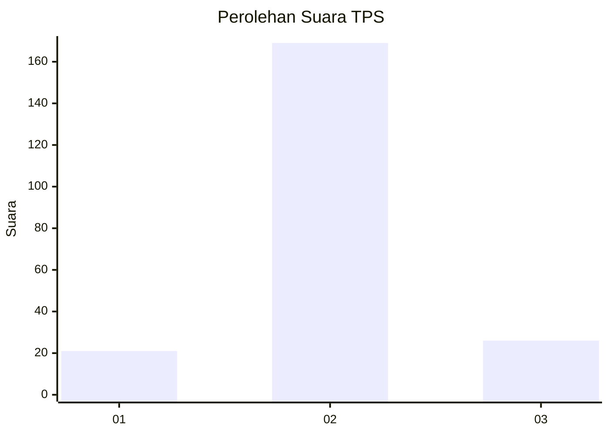
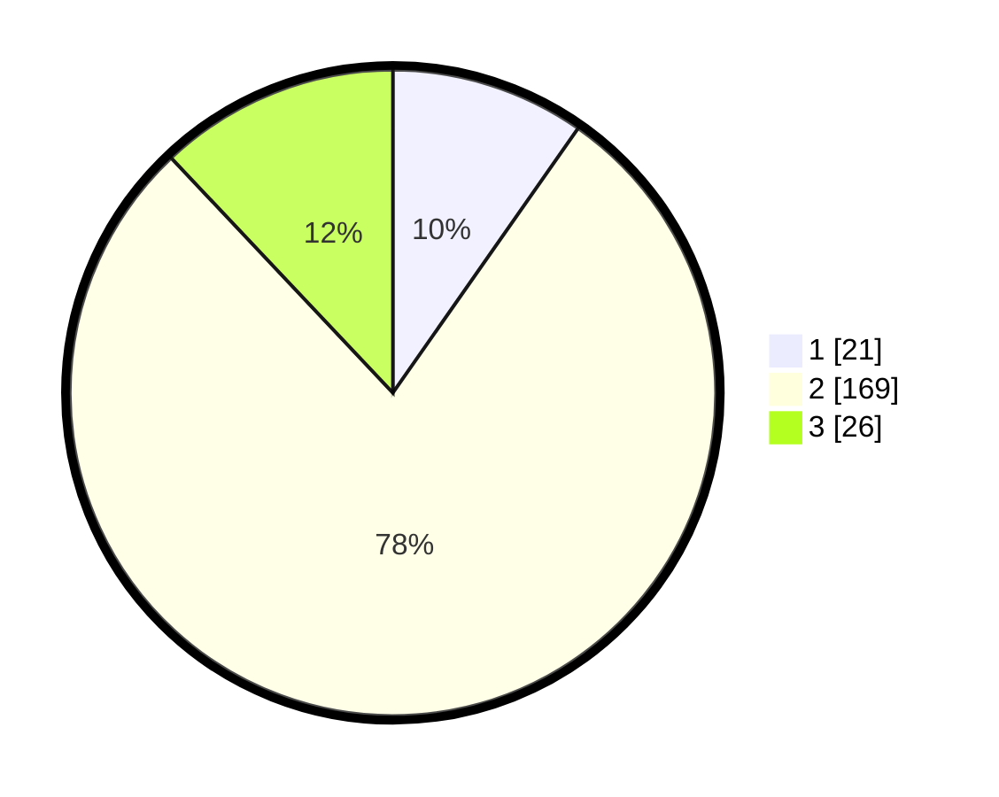

# Hasil

## Grafik

## Tabel

| No. | Nama Paslon    | Suara | Suara (raw) | Persentase |
|:--- |:-------------- | -----:| -----------:| ----------:|
| 1   | ANIES MUHAIMIN | 21    | [21][p-1]   | 9,72       |
| 2   | PRABOWO GIBRAN | 169   | [169][p-2]  | 78,24      |
| 3   | GANJAR MAHFUD  | 26    | [26][p-3]   | 12,04      |

[p-1]: https://github.com/gigit-pemilu/pemilu-2024/blob/main/pilpres/hitung-suara/sub/35-jawa-timur/sub/22-bojonegoro/sub/13-balen/sub/2020-kedungbondo/sub/006-tps/sub/paslon-1.txt
[p-2]: https://github.com/gigit-pemilu/pemilu-2024/blob/main/pilpres/hitung-suara/sub/35-jawa-timur/sub/22-bojonegoro/sub/13-balen/sub/2020-kedungbondo/sub/006-tps/sub/paslon-2.txt
[p-3]: https://github.com/gigit-pemilu/pemilu-2024/blob/main/pilpres/hitung-suara/sub/35-jawa-timur/sub/22-bojonegoro/sub/13-balen/sub/2020-kedungbondo/sub/006-tps/sub/paslon-3.txt

## Foto C Plano

https://sirekap-obj-formc.kpu.go.id/c0a6/pemilu/ppwp/35/22/13/20/20/3522132020006-20240216-150242--a218046e-75b6-4da8-8770-d473293825cd.jpg

https://sirekap-obj-formc.kpu.go.id/c0a6/pemilu/ppwp/35/22/13/20/20/3522132020006-20240216-150533--e0aa50a4-7b84-4e1c-ac76-2b6e5b775bd1.jpg

https://sirekap-obj-formc.kpu.go.id/c0a6/pemilu/ppwp/35/22/13/20/20/3522132020006-20240216-150654--6af8ad52-ce87-4fec-a7ec-a3584c574013.jpg

## Metadata

| Key        | Value               |
| ---------- | ------------------- |
| Time Stamp | 2024-02-20 00:00:00 |

