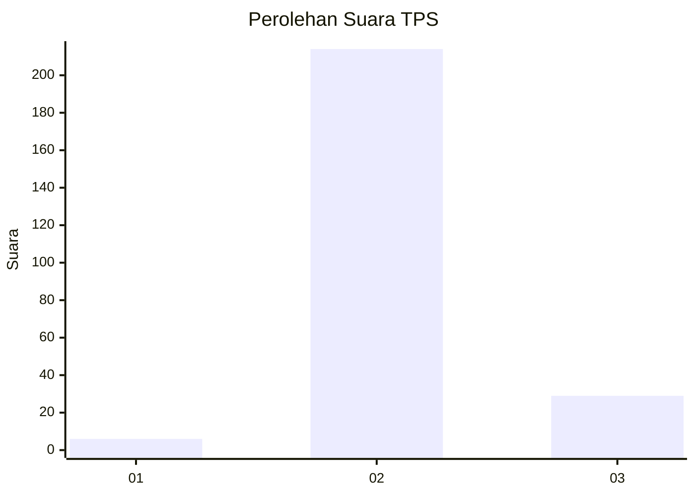
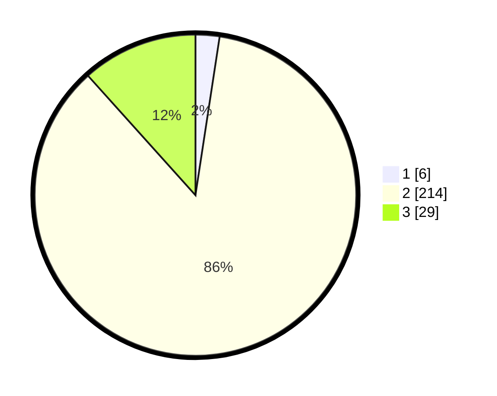

# Hasil

## Grafik

## Tabel

| No. | Nama Paslon    | Suara | Suara (raw) | Persentase |
|:--- |:-------------- | -----:| -----------:| ----------:|
| 1   | ANIES MUHAIMIN | 6     | [6][p-1]    | 2,41       |
| 2   | PRABOWO GIBRAN | 214   | [214][p-2]  | 85,94      |
| 3   | GANJAR MAHFUD  | 29    | [29][p-3]   | 11,65      |

[p-1]: https://github.com/gigit-pemilu/pemilu-2024-35-jawa-timur/blob/main/pilpres/hitung-suara/sub/35-jawa-timur/sub/22-bojonegoro/sub/13-balen/sub/2020-kedungbondo/sub/011-tps/sub/paslon-1.txt
[p-2]: https://github.com/gigit-pemilu/pemilu-2024-35-jawa-timur/blob/main/pilpres/hitung-suara/sub/35-jawa-timur/sub/22-bojonegoro/sub/13-balen/sub/2020-kedungbondo/sub/011-tps/sub/paslon-2.txt
[p-3]: https://github.com/gigit-pemilu/pemilu-2024-35-jawa-timur/blob/main/pilpres/hitung-suara/sub/35-jawa-timur/sub/22-bojonegoro/sub/13-balen/sub/2020-kedungbondo/sub/011-tps/sub/paslon-3.txt

## Foto C Plano

https://sirekap-obj-formc.kpu.go.id/b145/pemilu/ppwp/35/22/13/20/20/3522132020011-20240214-215325--72012047-5bb2-42ab-9a0c-133f15d2fd95.jpg

https://sirekap-obj-formc.kpu.go.id/b145/pemilu/ppwp/35/22/13/20/20/3522132020011-20240214-215430--3dd42188-e2d5-4a56-99fe-926be93b35f7.jpg

https://sirekap-obj-formc.kpu.go.id/b145/pemilu/ppwp/35/22/13/20/20/3522132020011-20240214-215514--b4d7a132-608f-47c5-8de7-738de8d700d2.jpg

## Metadata

| Key        | Value               |
| ---------- | ------------------- |
| Time Stamp | 2024-02-20 01:00:00 |

