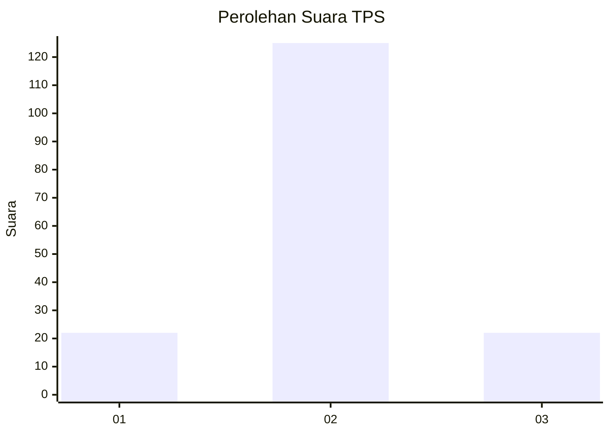
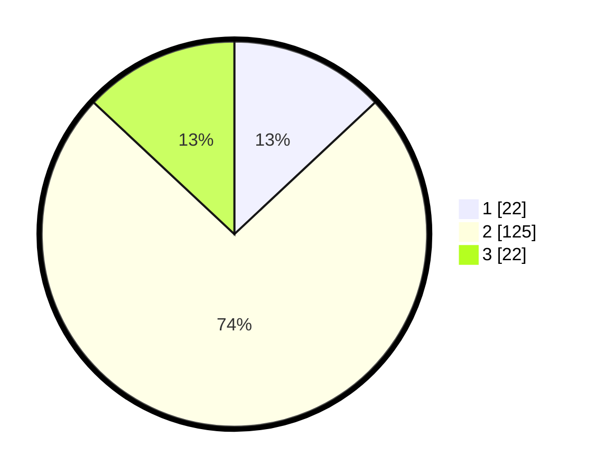

# Hasil

## Grafik

## Tabel

| No. | Nama Paslon    | Suara | Suara (raw) | Persentase |
|:--- |:-------------- | -----:| -----------:| ----------:|
| 1   | ANIES MUHAIMIN | 22    | [22][p-1]   | 13,02      |
| 2   | PRABOWO GIBRAN | 125   | [125][p-2]  | 73,96      |
| 3   | GANJAR MAHFUD  | 22    | [22][p-3]   | 13,02      |

[p-1]: https://github.com/gigit-pemilu/pemilu-2024/blob/main/pilpres/hitung-suara/sub/35-jawa-timur/sub/22-bojonegoro/sub/13-balen/sub/2023-mulyorejo/sub/002-tps/sub/paslon-1.txt
[p-2]: https://github.com/gigit-pemilu/pemilu-2024/blob/main/pilpres/hitung-suara/sub/35-jawa-timur/sub/22-bojonegoro/sub/13-balen/sub/2023-mulyorejo/sub/002-tps/sub/paslon-2.txt
[p-3]: https://github.com/gigit-pemilu/pemilu-2024/blob/main/pilpres/hitung-suara/sub/35-jawa-timur/sub/22-bojonegoro/sub/13-balen/sub/2023-mulyorejo/sub/002-tps/sub/paslon-3.txt

## Foto C Plano

https://sirekap-obj-formc.kpu.go.id/4fd2/pemilu/ppwp/35/22/13/20/23/3522132023002-20240215-101450--be6182dc-7fbd-4c94-b300-5070a19ff716.jpg

https://sirekap-obj-formc.kpu.go.id/4fd2/pemilu/ppwp/35/22/13/20/23/3522132023002-20240215-003256--eb026d3f-c0f2-4d16-9902-75739392e0d4.jpg

https://sirekap-obj-formc.kpu.go.id/4fd2/pemilu/ppwp/35/22/13/20/23/3522132023002-20240215-003406--61c7b78e-2537-445f-93f9-7b681c996180.jpg

## Metadata

| Key        | Value               |
| ---------- | ------------------- |
| Time Stamp | 2024-02-20 01:00:00 |

